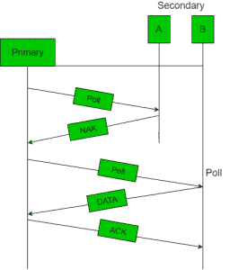
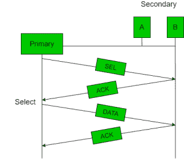

# 计算机网络中的受控访问协议

> 原文:[https://www . geesforgeks . org/受控访问-计算机网络中的协议/](https://www.geeksforgeeks.org/controlled-access-protocols-in-computer-network/)

在受控访问中，各站互相寻找信息，以找到哪个站有权发送。它一次只允许一个节点发送，以避免共享介质上的消息冲突。
三种受控接入方式为:

1.  保留
2.  投票
3.  令牌传递

## 保留

*   在预约方法中，站需要在发送数据之前进行预约。
*   时间线有两种周期:
    1.  固定时间长度的预约间隔
    2.  可变帧的数据传输周期。
*   如果有 M 个站，预留间隔分为 M 个时隙，每个站有一个时隙。
*   假设站 1 有一帧要发送，它在时隙 1 期间发送 1 比特。在这个时隙期间，不允许其他站发送。
*   一般来说，第 I<sup>站可以通过在第 I<sup>时隙中插入 1 比特来宣布它有帧要发送。检查完所有 N 个时隙后，每个站都知道哪些站希望发送。</sup></sup>
*   已经预留时隙的站按照这个顺序传送它们的帧。
*   在数据传输周期之后，下一个预留间隔开始。
*   既然大家都同意谁下一个去，就永远不会有任何碰撞。

下图显示了五个站点和一个五时隙预留帧的情况。在第一个间隔中，只有站点 1、3 和 4 进行了预订。在第二个间隔中，只有站 1 进行了预订。


## 投票

*   轮询过程类似于课堂点名。就像老师一样，控制器依次向每个节点发送消息。
*   在这种情况下，一个充当主站(控制器)，其他的是次站。所有数据交换必须通过控制器进行。
*   控制器发送的消息包含被选择用于授权访问的节点的地址。
*   虽然所有节点都接收到消息，但被寻址的节点会响应消息并发送数据(如果有)。如果没有数据，通常会发回“轮询拒绝”(NAK)消息。
*   问题包括轮询消息的高开销和对控制器可靠性的高度依赖。





 **让 T <sub>轮询</sub>为轮询时间，T <sub>t</sub> 为数据传输所需时间。然后，**

```
 Efficiency = T<sub>t</sub>/(T<sub>t</sub> + T<sub>poll</sub>)
```

## **令牌传递**

*   **在令牌传递方案中，站点以环的形式相互逻辑连接，站点的访问由令牌控制。**
*   **令牌是一种特殊的位模式或小消息，它以某种预定义的顺序从一个站循环到下一个站。**
*   **在令牌环中，令牌从一个站点传递到环中的另一个相邻站点，而在令牌总线的情况下，每个站点
    使用总线以某种预定义的顺序将令牌发送到下一个站点。**
*   **在这两种情况下，令牌都表示发送的权限。如果一个站点在收到令牌时有一个帧排队等待传输，它可以在将令牌传递给下一个站点之前发送该帧。如果它没有排队的帧，它会简单地传递令牌。**
*   **发送帧后，每个站必须等待所有 N 个站(包括它自己)将令牌发送给它们的邻居，并等待其他 N–1 个站发送帧(如果它们有一个)。**
*   **存在诸如令牌复制或令牌丢失或插入新站、移除站的问题，需要解决这些问题以使该方案正确和可靠地运行。**

****

****性能**
令牌环的性能可以通过 2 个参数得出:-**

1.  ****延迟**，这是数据包准备就绪和送达之间的时间度量。因此，将令牌发送到下一站所需的平均时间(延迟)= a/N。**
2.  ****吞吐量**，这是衡量成功流量的指标。**

```
 Throughput, S = 1/(1 + a/N) for a<1 
```

**和**

```
 S = 1/{a(1 + 1/N)} for a>1\.  
       where N = number of stations
             a = T<sub>p</sub>/T<sub>t</sub> 
(T<sub>p</sub> = propagation delay and T<sub>t</sub> = transmission delay) 
```