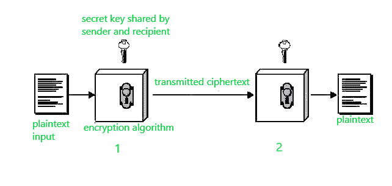

# 常规加密

> 原文:[https://www.geeksforgeeks.org/conventional-encryption/](https://www.geeksforgeeks.org/conventional-encryption/)

**常规加密**是一种密码系统，使用发送方加密消息和接收方解密消息使用的相同密钥。在公钥加密发展之前，它是唯一一种被使用的加密类型。

由于其简单性，它仍然是两种加密系统中的首选。这是一个相对较快的过程，因为它使用单个密钥进行加密和解密。在这种加密模型中，发送方使用接收方的密钥加密明文，接收方随后可以使用该密钥解密密文。下图说明了这个概念。

假设 A 想给 B 发送一条消息，这条消息被称为明文。现在，为了避免黑客读取明文，使用一种算法和一个密钥(在 1)对明文进行加密。这种加密的明文称为密文。使用相同的密钥和反向运行的加密算法(at 2)，B 可以获得 A 的明文，从而读取消息并保持安全性。

这种技术中使用的思想非常古老，这就是为什么这种模型被称为传统加密。

**常规加密主要有 5 个成分:**

1.  **纯文本–**
    是给算法作为输入的原始数据。

2.  **加密算法–**
    该加密算法对明文进行各种变换，将其转换为密文。

3.  **密钥–**
    密钥也是算法的输入。加密算法将根据当时使用的密钥产生不同的输出。

4.  密文**–**
    它包含加密信息，因为它包含一种原始明文，如果没有适当的密码解密，人类或计算机无法读取。它是算法的输出。

5.  **解密算法–**
    这是用来反向运行加密算法的。密文和密钥在这里输入，它产生纯文本作为输出。

**常规加密的安全使用要求:**

1.  我们需要一个强大的加密算法。
2.  发送方和接收方必须以安全的方式获得秘密密钥的副本，并且必须保证密钥的安全。

**常规加密的优势:**

1.  **简单–**
    这种类型的加密很容易实现。

2.  **使用更少的计算机资源–**
    与公钥加密相比，传统加密不需要大量的计算机资源。

3.  **快速–**
    常规加密比非对称密钥加密快得多。

**常规加密模型的缺点:**

1.  无法保证消息的来源和真实性，因为发送方和接收方使用相同的密钥，因此无法验证消息是否来自特定用户。
2.  与公钥加密相比，它的安全性不高。
3.  如果接收者丢失了密钥，他/她就无法解密消息，从而使整个过程变得无用。
4.  该方案不能很好地适用于大量用户，因为发送方和接收方必须在传输前就秘密密钥达成一致。