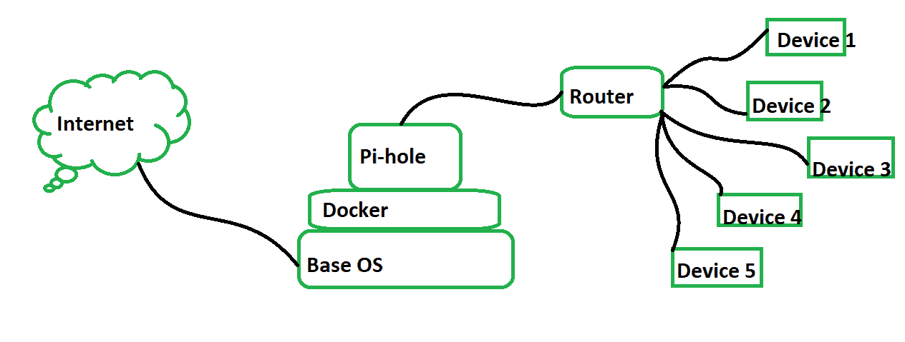
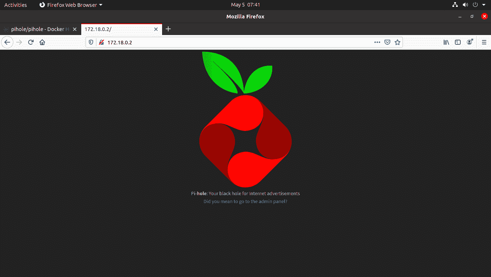
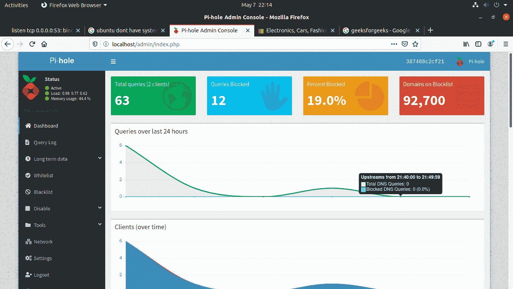
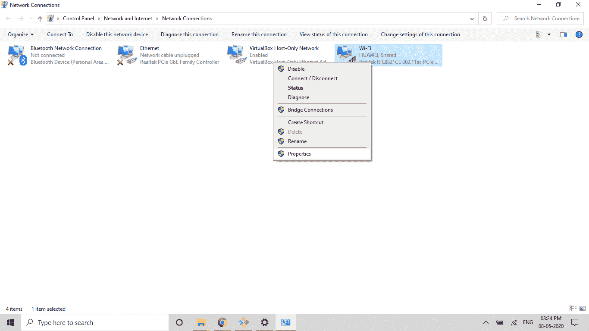
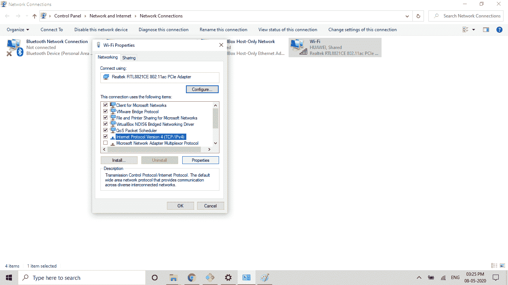
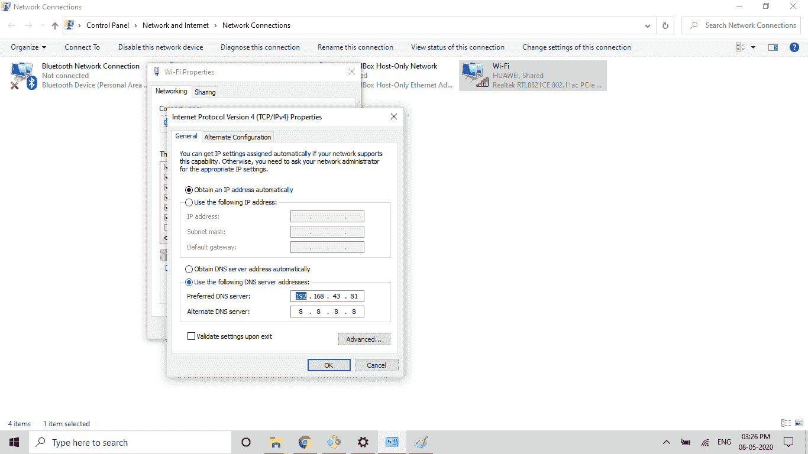

# 使用 Pi-hole 和 Docker 创建您自己的安全家庭网络

> 原文:[https://www . geeksforgeeks . org/create-your-your-your-secure-home-network-use-pi-hole-and-docker/](https://www.geeksforgeeks.org/create-your-own-secure-home-network-using-pi-hole-and-docker/)

Pi-hole 是一个基于 Linux 的网络应用程序，它被用来屏蔽你网络中不需要的广告，还能屏蔽互联网跟踪系统。这是非常简单的使用，最适合家庭和小型办公室网络。这是完全免费和开源的。它还允许您管理您的可访问性和阻止列表。它有一个非常体面的图形方式来显示网络查询。Docker 是一个研究集装箱化技术的工具。这用于启动不同需求的容器，如网络服务器、域名系统等。要了解更多关于 docker 的信息，你可以在 GeeksForGeeks 上查看 [**，要在 docker 上启动你自己的网络服务器，你可以在这里**](https://www.geeksforgeeks.org/containerization-using-docker/)**[](https://www.geeksforgeeks.org/setup-web-server-over-docker-container-in-linux/)**上查看。****

## **体系结构**

****

## **如何设置 pi-hole 和 Docker？**

****第一步**
打开你的终端，启动码头工人** 

```
sudo systemctl start docker
```

**输入命令从码头工人中心
下载 pihole**

```
sudo docker pull pihole/pihole
```

****第二步:如果你没有使用 Ubuntu**
就跳过这一步**

```
sudo systemctl stop systemd-resolved.service
```

```
sudo systemctl disable systemd-resolved.service 
```

****第三步**
把域名系统换成别的东西，比如谷歌** 

```
sudo nano /etc/resolv.conf
```

**设置域名系统 8.8.8.8 并保存。**

****第 4 步**
复制此代码** 

```
version: "3"

services:
  pihole:
    container_name: pihole
    image: pihole/pihole:latest
    ports:
      - "53:53/tcp"
      - "53:53/udp"
      - "67:67/udp"
      - "80:80/tcp"
      - "443:443/tcp"
    environment:
      TZ: 'Asia/Kolkata' #this is the time zone
    volumes:
       - './etc-pihole/:/etc/pihole/'
       - './etc-dnsmasq.d/:/etc/dnsmasq.d/'
    dns:
      - 127.0.0.1
      - 1.1.1.1
    cap_add:
      - NET_ADMIN
    restart: unless-stopped
```

**打开文件** 

```
sudo nano docker-compose.yml
```

**复制粘贴上面的代码并保存文件。**

****步骤 4**
运行编写文件启动 pihole** 

```
sudo docker-compose up -d
```

****第五步**
进入 pihole 容器** 

```
sudo docker exec -it pihole bash
```

**更改 pihole 密码** 

```
pihole -a -p
```

```
exit
```

****步骤 7**
进入浏览器搜索** 

```
http://localhost/admin/
```

**或者
使用 IP 并将 IP 复制粘贴到浏览器** 

```
ifconfig
```

**

浏览器 pihole 中的 Ip** 

****步骤 8**
使用密码
登录**

****

**一切都准备好了。** 

## **现在使用 pihole 作为您的域名系统，而不是任何其他的。**

**转到您的窗口中的 dns 设置…
设置–>网络和互联网–>以太网(如果您连接到以太网)或 wifi(如果您的笔记本电脑连接到 WiFi)–>更改适配器选项–>右键单击 WiFi 或以太网，然后转到属性–>选择 IP v4–>属性–>将 DNS 更改为 pihole 的 IP。
**WIFI 设置**** 

****

**选择 IPv4** 

****

**将域名系统从自动获取域名系统更改为使用以下域名系统服务器，并将 ip 写入框中。第二，你可以写任何像 8.8.8.8 这样的域名系统**

****

**家庭路由器中可以使用与域名系统相同的π孔 IP。**