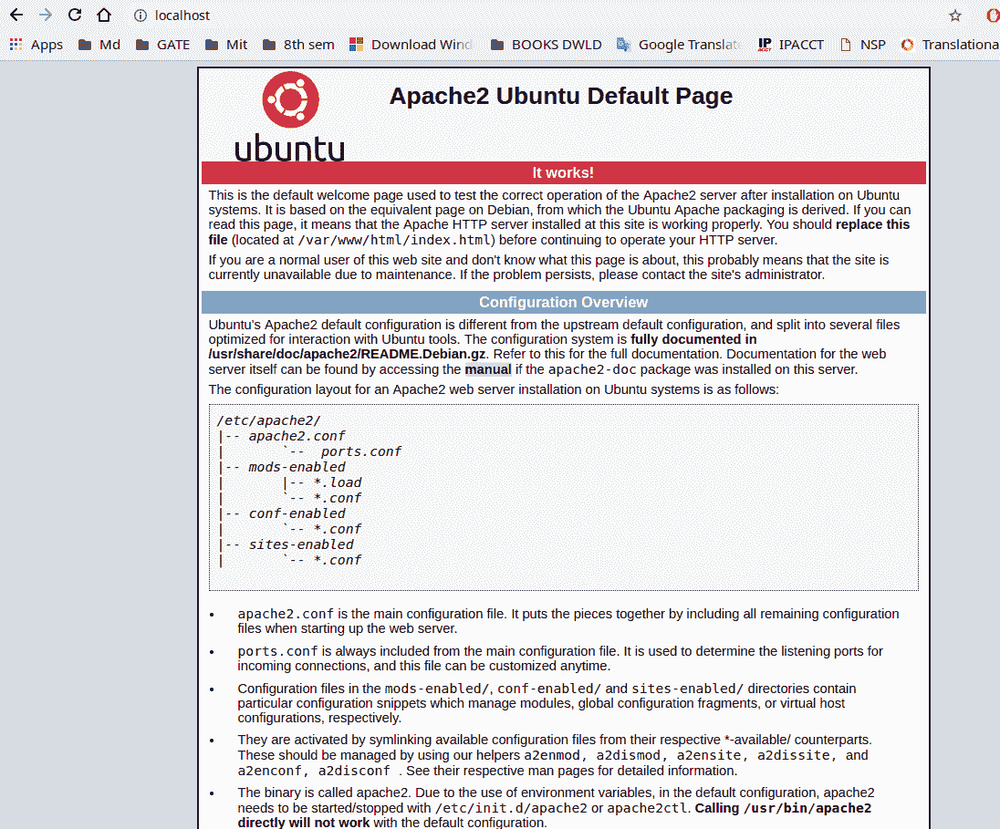
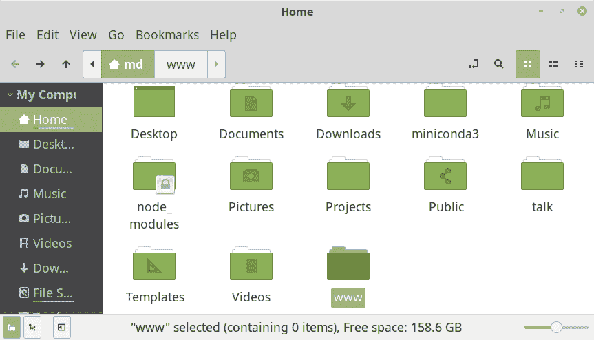
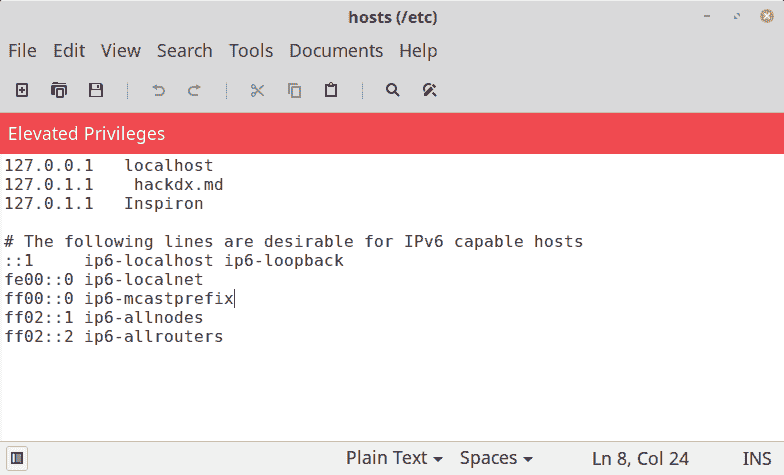
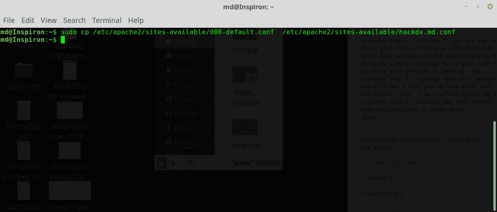
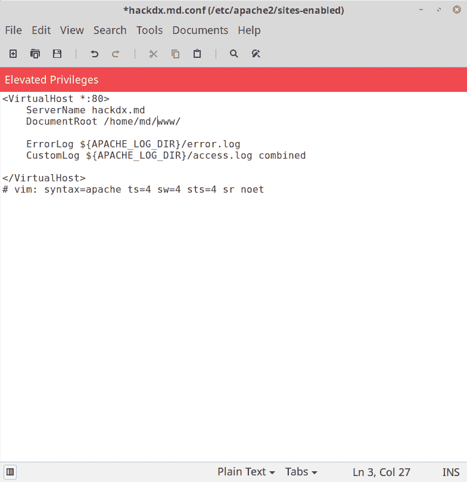
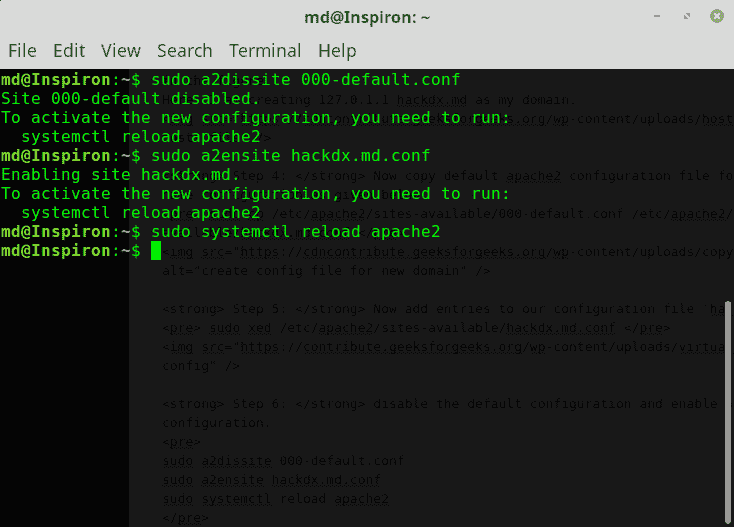
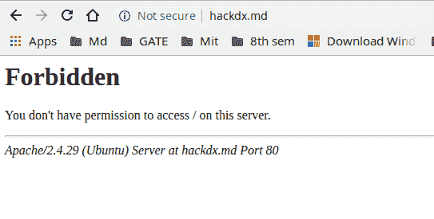
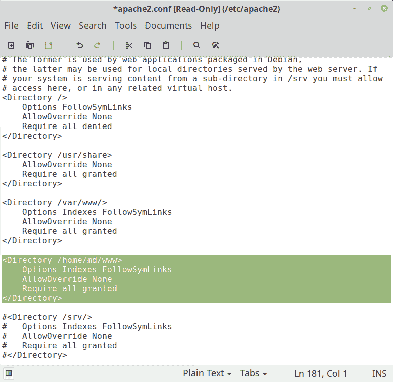
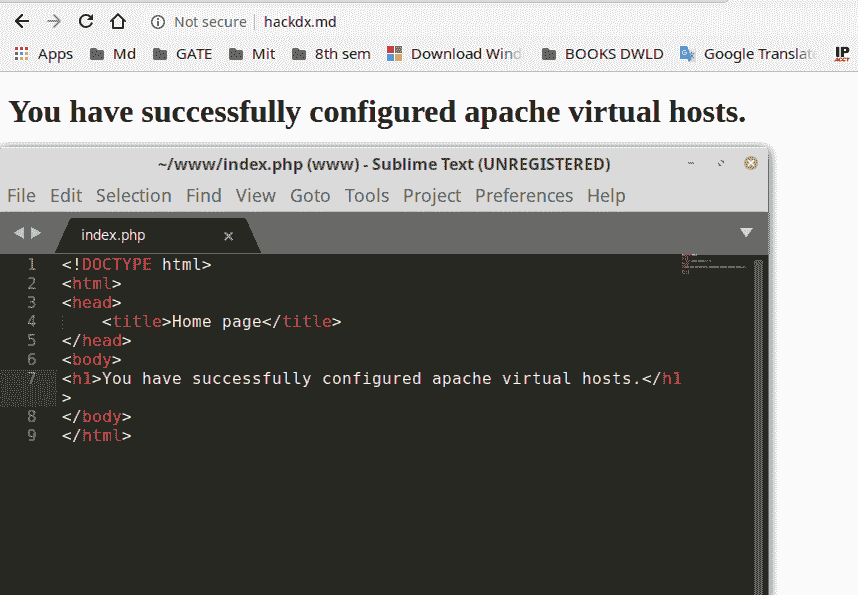

# 在 Ubuntu 中创建自定义域名而不是本地主机

> 原文:[https://www . geesforgeks . org/creating-custom-domain-name-而不是-localhost-in-ubuntu/](https://www.geeksforgeeks.org/creating-custom-domain-name-instead-of-localhost-in-ubuntu/)

在 ubuntu 中，默认情况下，本地服务器被称为“localhost”。但是，您也可以为您的本地服务器创建一个自定义域名，而不是使用 **localhost** 。本文解释了**创建自己的自定义域名而不是使用本地主机**的过程。这里的‘hackdx . MD’是作为我们的域创建的，可以根据需要来取。

**注:**本文以 **Linux 用户**为重点编写，但流程与 windows 用户类似，只是做了一些小改动。

以下是在 **Ubuntu** 中创建自己的自定义域名而不是使用 localhost 的步骤:

*   **Step 1:** If you are new to Linux you can **install apache server and PHP** as given below otherwise skip this step. Apache is used to host PHP script. If you have already installed then also skip this step.

    > **sudo apt-get 更新
    > sudo apt-get 安装 Apache 2 PHP
    > T3】**

    您可以通过在浏览器中键入“localhost”来检查您的服务器。如果你得到 apache ubuntu 默认页面，即你已经成功安装了 apache2 服务器。

    

*   **Step 2:** **Create a folder which you want to use as root directory of your server**. Here I am using /home/md/www as my root directory. You can name it anything you like, naming www is not mandatory.

    

*   **Step 3:** Now one of important step to **create domain name in your hosts file under ‘/etc/hosts’**. Open your terminal and type the following.
    *   如果尚未安装，请使用:

        > **sudo 进行安装易于安装固定**

    *   然后执行此命令编辑主机文件

        > **sudo/etc/hosts**

    *   如图所示，在本地主机 IP 前面输入您的域名。这里我们使用的是 hackdx.md，所以我们写的是‘127 . 0 . 1 . 1 hackdx . MD’。现在，您可以通过在浏览器中键入 hackdx.md 来查看默认的 apache 页面。

    

*   **Step 4:** Now **copy default apache2 configuration file for your new domain name configuration** as given below. You can do for as many domain as you want. This step is required so that you can see your newly created domain at hachdx.md or your own domain. You can also add in default conf but creating new file is recommended as you may mess up with original default file.

    这可以通过以下命令完成:

    > **sudo CP/etc/Apache 2/sites-available/000-default . conf/etc/Apache 2/sites-available/hackdx . MD . conf**

    

*   **Step 5:** Now **add entries to our configuration file** ‘hackdx.md.conf’ as given in the figure. We are creating /home/md/www as root directory and giving hacdx.md as domain name or server name. All different domain can also be added to this file if you want to create at a different location. Like /home/md/sample etc, a corresponding entry must exist in the /etc/hosts file.

    > **sudo xed/etc/Apache 2/sites-available/hackdx . MD . conf**

    

*   **Step 6:** **Disable the default configuration and enable our new configuration** for newly created domain hackdx.md.conf.

    > sudo a2 溶解 000-default . conf
    > sudo a2 教导 hackdx.md.conf
    > sudo 系统 ctl reload apache2

    

*   **Step 7:** **update apache2 config file** also in case you get forbidden error. You may get this error because apache2 is not recognizing new root document location /home/md/www, by adding these lines apache know about the root location.

    

    运行此命令编辑 apache2.conf

    > **sudo xed/etc/Apache 2/Apache 2 . conf**

    如图所示，将这些行添加到您的 apache2.conf 文件中。

    

*   **第 8 步:**最后，**重新加载 apcahe2 服务**把这个命令放到你的终端。

    > **苏多系统细胞毒性 T 淋巴细胞（cytotoxic lymphocyte 的缩写）重装 apache2**

*   **Step 9:** You are ready now check by typing your URL to the browser. You can test by writing a simple PHP script in www folder.

    

    现在你可以把你的文件放在 www 目录下，享受使用 PHP 服务器。