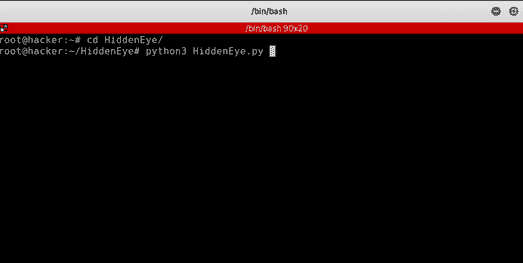
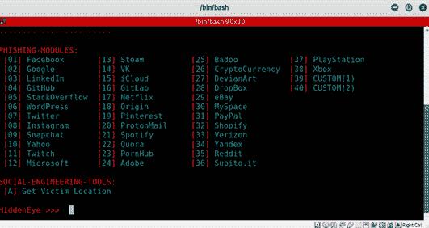
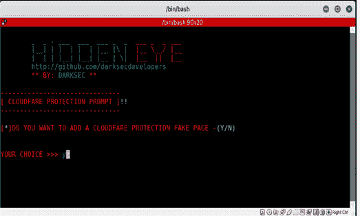
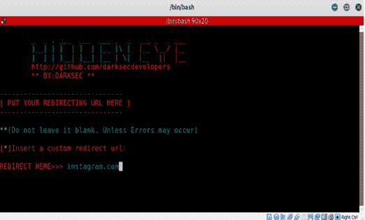
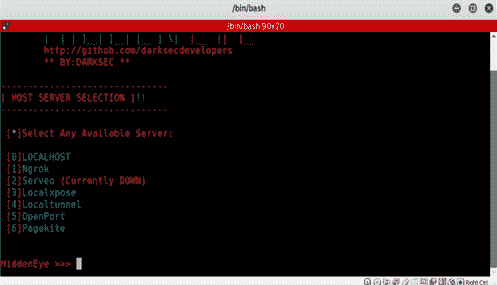
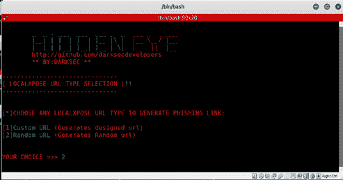
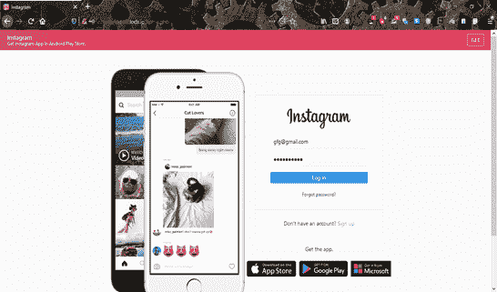

# 创建网站钓鱼页面

> 原文:[https://www . geeksforgeeks . org/creating-phishing-page-of-a-web/](https://www.geeksforgeeks.org/creating-phishing-page-of-a-website/)

先决条件–[网络钓鱼](https://www.geeksforgeeks.org/phishing-in-ethical-hacking/)

**网络钓鱼**是一种社会工程攻击，诱骗个人输入用户名、密码和信用卡详细信息等敏感信息。它可以由任何个人完成，只需要对 Kali Linux(或任何其他 Linux 发行版)有一个基本的要求。

**创建网络钓鱼页面的步骤:**

*   Open Kali Linux terminal and paste the following code :

    ```
    git clone https://github.com/DarkSecDevelopers/HiddenEye.git
    ```

*   Now perform the steps mentioned below :

    [](https://media.geeksforgeeks.org/wp-content/uploads/20200710131156/1.png) 

*   Now you can select the website which you want to clone.

    [](https://media.geeksforgeeks.org/wp-content/uploads/20200710131712/2.png) 

*   You can also add a keylogger or a Cloudflare Protection Page to make your cloned website look more legitimate.

    [](https://media.geeksforgeeks.org/wp-content/uploads/20200710131713/3.png) 

*   Now you have to enter the redirect URL, i.e. the URL which you want the user to be redirected to after performing a successful phishing attack. You also have to select a server of your choice and can make a legitimate-looking phishing URL or you can go with the random URL.

    [](https://media.geeksforgeeks.org/wp-content/uploads/20200710131714/4.png)

    [](https://media.geeksforgeeks.org/wp-content/uploads/20200710131715/5.jpg)

    [](https://media.geeksforgeeks.org/wp-content/uploads/20200710131716/6.png)

    [](https://media.geeksforgeeks.org/wp-content/uploads/20200710131720/7.png) 

*   You now have to deliver the phishing URL to your user and when he clicks on it and he will get redirected to your cloned website.

    [](https://media.geeksforgeeks.org/wp-content/uploads/20200801183327/9.png)

*   一旦用户输入详细信息，他将被重定向到我们选择的网址，我们将能够钓鱼用户的所有凭据。

[](https://media.geeksforgeeks.org/wp-content/uploads/20200710134235/10.png) 

预防措施:

*   切勿打开可疑的电子邮件附件。
*   不要点击可疑的电子邮件链接。
*   切勿通过电子邮件、电话或短信提供机密信息。
*   永远不要在社交媒体上公开发布你的个人数据，比如你的电子邮件地址或电话号码。
*   始终检查发件人希望您重定向到的网址的真实性。

要使用 PHP 创建脸书钓鱼网页，请参考。