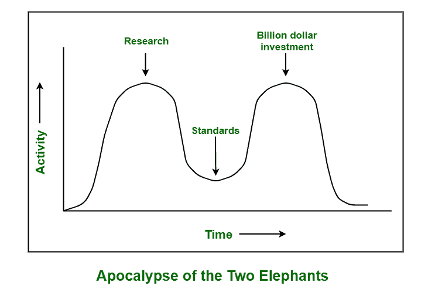

# 现场视察模型和协议评论

> 原文:[https://www . geesforgeks . org/OSI 模型和协议批判/](https://www.geeksforgeeks.org/critique-of-the-osi-model-and-protocols/)

[开放系统互连(OSI)](https://www.geeksforgeeks.org/layers-of-osi-model/) 模型是一种参考模型，用于描述和解释信息如何从一台计算机上的软件应用程序通过物理介质自由移动到另一台计算机上的软件应用程序。该模型总共由七层组成，每层执行特定的任务或特定的网络功能。

虽然，OSI 模型及其协议甚至 TCP/IP 模型及其协议在各个方面和方式上都不完善。有一些批评已经被注意到了，而且是针对他们俩的。关于现场视察模型，最引人注目和不幸的问题是，它可能是研究最多、被最广泛接受的网络结构，但它并不是真正实施和广泛使用的模型。发生这种情况的重要原因如下:

**1。不良时机:**
在 OSI 模型中，在波谷之间写标准是非常必要和重要的，也就是两头大象的启示录。标准的时间是非常关键的，因为有时标准甚至在研究完成之前就写得太早了。因此，现场视察模型没有被正确理解。这个时机被认为是不好的，因为这个模型是在大量的研究时间后完成的。正因为如此，标准被这些公司忽视了。

当现场视察出现时，这种模型在研究方面得到了完美的发布，但是当时 TCP/IP 模型已经从公司和制造商那里获得了巨额投资，他们不想投资现场视察模型。因此，没有使用现场视察技术的初始产品。虽然每个公司都在等待其他公司首先使用这种模型技术，但不幸的是，没有一家公司首先使用这种模型。这是现场视察从未发生的第一个原因。

**2。糟糕的技术:**
由于竞争已经广泛使用的 TCP/IP 协议，OSI 模型从未被考虑在内。这是因为现场视察模型及其协议有缺陷的第二个原因，这意味着它们在性质、性能或设计等方面都有根本的弱点或缺陷。选择现场视察模型所有七层背后的想法更多地是基于政治问题，而不是技术问题。层次更多的是政治而不是技术。

OSI 模型及其所有相关的服务定义和协议非常复杂。另一方面，其他两层，即数据链路层和网络层，都是过满的。文档也非常复杂，因此很难实现，甚至在操作或功能上效率也不高。错误和流量控制也是重复的，即在多层或每层中反复出现。另一方面，最严重和最糟糕的批评是，这种模式也是由沟通心态主导的。

**3。糟糕的实现:**
现场视察模型异常复杂，因此最初的实现非常缓慢、庞大且不明智。这是早期 OSI 成为低质量代名词的第三个原因。事实证明，将所有七层设计在一起只是为了解决问题，这并不是必要的。

另一方面，TCP/IP 的实现比 OSI 更可靠，这是因为人们很快就开始使用 TCP/IP，这导致了庞大的用户群体。简单地说，我们可以说复杂性导致了非常差或不好的实现。它非常复杂，需要有效和适当地实施。

**4。糟糕的政治:**
开放系统互连模型与 UNIX 无关。这是第四个原因，因为 TCP/IP 在很大程度上与 Unix 密切相关，这有助于 TCP/IP 在学术界流行起来，而 OSI 当时没有这种关联。

另一方面，现场视察与欧洲电信、欧洲共同体和美国政府有联系。这种模式也被认为在技术上不如 TCP/IP。因此，所有地面人员对所有这些事情的反应都非常糟糕，并支持大量使用 [TCP/IP](https://www.geeksforgeeks.org/tcp-ip-model/) 。

即使在所有这些糟糕的条件下，OSI 模型仍然是几乎所有网络文档的通用标准参考。有很多组织对 OSI 模型非常感兴趣。所有涉及编号层(如第 3 层交换)的网络通常指的是现场视察模型。甚至，还努力对其进行简单的更新，导致 1994 年出版的修订模型。