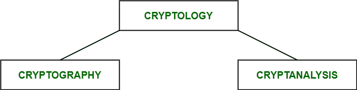
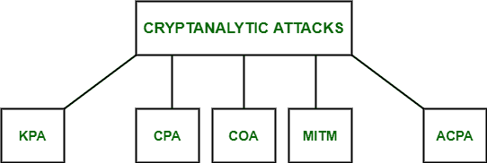

# 密码分析和攻击类型

> 原文:[https://www . geeksforgeeks . org/密码分析和攻击类型/](https://www.geeksforgeeks.org/cryptanalysis-and-types-of-attacks/)

**密码学**由两部分组成，即**密码学**和**密码分析**，前者专注于创建密码，后者研究密码算法和密码的破解。练习密码分析的人被称为**密码分析者**。它有助于我们更好地理解密码系统，也有助于我们通过发现任何弱点来改进系统，从而研究算法来创建更安全的密码。例如，密码分析者可能试图破译密文来导出明文。它可以帮助我们推导出明文或加密密钥。

密码学部分

为了确定密码系统的弱点，攻击系统是很重要的。这种攻击被称为**密码分析攻击。**攻击依赖于算法的性质以及明文一般特征的知识，即明文可以是用英语编写的常规文档，也可以是用 Java 编写的代码。因此，在尝试使用攻击之前，应该知道明文的性质。

**密码分析攻击的类型:**

密码分析攻击的五种类型

*   **已知明文分析(KPA) :**
    在这种类型的攻击中，一些明文-密文对是已知的。攻击者映射它们以便找到加密密钥。这种攻击更容易使用，因为大量信息已经可用。

*   **选择明文分析(CPA) :**
    在这种类型的攻击中，攻击者选择随机的明文并获得相应的密文，然后试图找到加密密钥。像 KPA 一样实现起来很简单，但是成功率很低。*   **纯密文分析(COA) :**
    在这种类型的攻击中，只知道一些密文，攻击者试图找到相应的加密密钥和明文。这是最难实现的，但也是最有可能的攻击，因为只需要密文。*   **中间人(MITM)攻击:**
    在这种类型的攻击中，攻击者通过安全通道拦截通信双方之间的消息/密钥。*   **自适应选择明文分析(ACPA) :**
    这个攻击类似 CPA。在这里，攻击者在获得某些文本的密文后，会请求附加明文的密文。