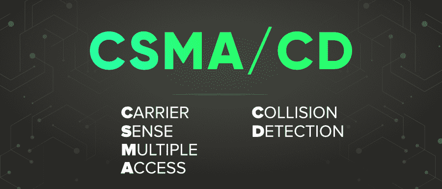

# CSMA/光盘完整版

> 原文:[https://www.geeksforgeeks.org/csma-cd-full-form/](https://www.geeksforgeeks.org/csma-cd-full-form/)

**CSMA/光盘**代表**载波侦听多路访问/冲突检测**。它是一种广泛使用的媒体访问控制协议。其规格已由 IEEE 802.3 标准标准化。当一个站想在 CSMA 传输一个帧时，它会检测信道以检查它是否空闲。如果信道空闲，站发送帧，现在可能发生其他站也发送帧，因此发生冲突。现在，在 CSMA 的情况下，站必须等待(往返传播延迟)传输后的确认。但是有了 CSMA/裁谈会，这个时间可以减少。

在 CSMA/光盘中，希望传输的站首先监听以确定链路是空闲的，然后传输数据并再次监听。该站检查线路是否有极高的电压表明发生了碰撞。站点检测到冲突后，会中止传输，等待一段时间后再试。发射站还会释放一个干扰信号来指示发生了冲突。

#### CSMA/光盘的特点

*   CSMA/光盘具有载波侦听功能，即它侦听传输信道，以检查信道是否繁忙。
*   检测到冲突后，站点必须等待一段随机的时间，然后再重新传输帧。
*   堵塞信号用于指示其他站点发生了碰撞，站点必须等待。
*   可以实现更高的传输优先级机制。

#### CSMA/裁谈会的优势

*   在较短的时间内检测到碰撞。
*   避免了浪费的帧传输，因此如果可能的话，利用了所有可用的带宽。
*   它的开销很低。

#### CSMA/光盘的缺点

*   在长距离和大型网络上是不可能的。
*   它不会降低碰撞的可能性，并且碰撞会降低性能。
*   性能与电台数量成反比。因此，更多的站点会成倍地降低性能。