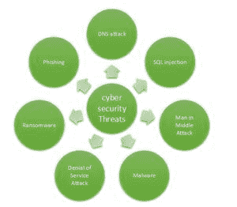
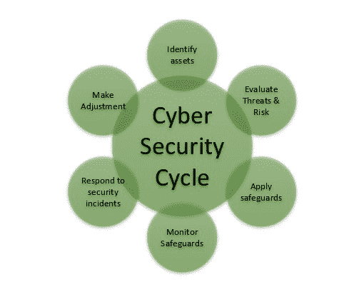

# 网络安全政策

> 原文:[https://www.geeksforgeeks.org/cyber-security-policy/](https://www.geeksforgeeks.org/cyber-security-policy/)

**网络空间**是一个复杂的环境，由人、软件和服务之间的交互组成，由信息和通信技术(ICT)设备和网络的全球分布支持。

**网络安全**在数字世界领域扮演着至关重要的角色。 保护信息和数据成为当今最重要的挑战之一。每当我们期待网络安全时，涉及我们头脑的首要事情就是日益增长的网络犯罪。各国政府和组织正在采取许多措施来制止这些网络犯罪。除了各种措施，网络安全仍然是几个人非常关心的问题。2021 年最大的三大网络安全趋势是:

*   易货
*   网络攻击面(物联网供应链和远程工作系统)
*   对 IT 基础设施的威胁

图 1:网络安全威胁的类型

在不同国家的信息技术部门的广泛增长中，快速社会转型和包容性增长的宏伟计划，以及为创建安全的计算环境和对电子交易、软件、服务、设备和网络的充分信任和信心提供正确的关注点，已经成为所有人的当务之急之一。

网络空间容易受到各种各样的事件的影响，无论是故意的还是意外的，人为的还是自然的，网络空间中交换的数据可能被用于邪恶的目的。保护信息网络空间和维护网络空间中信息的机密性、完整性和可用性是安全网络空间的本质。

图 2:网络安全周期

**以下是本文涉及的一些网络安全策略:**

### 1。数据系统策略的可接受使用

本政策的目的是规定计算机设备在公司的适当使用。这些规则保护授权用户，因此也保护公司。不当使用使公司面临风险，包括病毒攻击、网络系统和服务受损以及法律问题。

### 2.账户管理政策

本政策的目的是确定创建、管理、使用和删除帐户的典型方式，以便于访问公司的信息和技术资源。

### 3。防病毒

该策略旨在帮助防止恶意软件和其他恶意代码对公司计算机、网络和技术系统的攻击。此策略旨在帮助防止对用户应用程序、数据、文件和硬件的损坏。防病毒软件是一种计算机程序，可以检测、防止并采取措施解除或删除恶意软件程序，如病毒和蠕虫。大多数防病毒程序都包含自动更新功能，该功能使程序能够下载新病毒的配置文件，以便在发现新病毒后立即进行检查。反病毒软件是每个系统的必备和基本必需品。

### 4。电子商务政策

近年来网络攻击的频率 很高。电子商务安全是指为保护企业及其客户免受网络威胁而采取的措施。本电子商务政策将作为电子商务电子服务管理的建议和总结。

### 5。电子邮件政策

电子邮件安全可能是描述屏蔽电子邮件帐户、内容和通信以防止未经授权的访问、丢失、或损害的不同程序和技术的术语。电子邮件通常用于传播恶意软件、垃圾邮件、和网络钓鱼攻击。攻击者利用欺骗性信息诱使收件人保留敏感信息，打开附件、或点击超链接，在受害者的设备上安装恶意软件。此外，对于希望在企业网络中获得优势并获取有价值的公司数据的攻击者来说，电子邮件是一个标准入口点。电子邮件加密包括加密或伪装电子邮件的内容，以保护潜在的敏感信息不被除预期收件人之外的任何人读取。电子邮件加密通常包括身份验证。本政策旨在确定利用公司电子邮件发送、接收或存储电子邮件的规则。

### 6。硬件和电子媒体处置政策

公司拥有的剩余硬件、过时的机器以及超出合理维修或再利用范围的任何设备(包括介质)都在此政策的覆盖范围内。该政策将以合法、经济的方式建立和定义处置非租赁信息技术设备和介质的标准、程序和限制。

### 7。安全事故管理政策

该政策规定了报告和响应与公司信息系统和运营相关的事件的需求。事件响应为公司提供了发现安全事件发生的可能性。

### 8。信息技术采购政策

这一战略的原因是为了描述购买所有信息技术设备、程序设计、个人电脑相关部件和用组织储备购买的专门管理的规范、方法和限制。应该通过信息技术部门支持和促进组织获得创新和专门管理。

### 9。网络政策

制定该政策的原因是为了制定利用组织的互联网访问互联网或内联网的准则。

### 10。日志管理策略

通过适当的管理，日志管理在某种场景中通常有很大的好处，可以增强安全性、系统性能、资源管理和法规遵从性。

### 11 时。网络安全和虚拟专用网可接受使用策略

此策略的目的是定义从任何主机连接到公司网络的标准。这些标准旨在减少公司因未经授权使用公司资源而遭受损害的潜在风险。损害包括敏感或公司机密数据、财产的损失、公司关键内部系统的损坏等。

### 12 时。密码策略

用户名和密码的概念一直是保护我们信息的基本方式。这可能是关于网络安全的首批措施之一。此策略的目的是确定创建强密码的典型方法，保护这些密码，因此必须遵循更改密码的频率。

### 13。补丁管理策略

安全漏洞是计算系统和应用程序固有的。这些缺陷允许恶意软件的事件和传播，这可能会中断正常的业务运营，进而使公司处于危险之中。为了有效降低这种风险，软件“补丁”可以用来消除给定的安全漏洞。

### 14。云计算的采用

该政策的目的是确保公司能够做出适当的云采用决策，同时不使用或允许使用不适当的云服务实践。本政策列出了可接受和不可接受的云采用示例。

### 15。服务器安全策略

本政策旨在为公司内部网络或相关技术资源通过任何渠道拥有和/或运营的内部服务器设备的底层配置定义标准和限制。

### 16。社交媒体可接受使用政策

组织内部出于商业目的使用外部社交媒体的情况越来越多。该公司面临着特定数量的数据暴露，这些数据对社交媒体上的朋友的朋友来说是可见的。虽然这种暴露可能是推动价值的关键机制，但它也可能为个人和企业联系人之间的信息传递创造不适当的渠道。确定个人和个人网络之间障碍的工具以及集中管理账户的工具才刚刚开始出现。信息技术部门对安全、隐私和带宽问题的参与至关重要。

### 17。系统监控和审计政策

系统监控和审计用于确定数据系统中是否发生了不适当的操作。系统监控被用来实时观察这些动作，而系统审计则在事后寻找它们。

### 18。漏洞评估

该政策的目的是确定定期脆弱性评估的标准。该政策反映了公司对发现和实施安全控制的承诺，这可以将数据系统资源的风险保持在合理和适当的水平。

### 19。网站运营政策

本政策的目的是确定关于公司面向公众的网站的沟通和更新的指导方针。保护公司网站上和网站内的知识，在所有公司业务的交易中使用同等的安全和保密标准，对公司的成功至关重要。

### 20。工作站配置安全策略

该政策的目的是加强公司使用的工作站的安全性和高质量运行状态。IT 资源将在部署所有新工作站设备时利用这些指南。工作站用户需要注意这些指导原则，并与 IT 资源合作制定部署的规则。

### 21。服务器虚拟化

本政策的目的是确定服务器虚拟化要求，概述服务器虚拟化技术的获取、使用和管理。此策略提供控制措施，确保在做出与服务器虚拟化相关的决策时，将企业问题与业务目标一起考虑。平台架构政策、标准和指导方针将用于获取、设计、实施和管理所有服务器虚拟化技术。

### 22。无线连接政策

本政策的目的是保护公司拥有的知识资产，并确定公司可以提供的连接到免费和不安全无线网络的意识和安全做法。公司为目标和计划提供计算机设备、网络和其他电子信息系统。公司授予对这些资源的访问权限，并且必须负责任地管理这些资源，以确保所有信息资产的机密性、完整性和可用性。

### 23。远程办公政策

出于本政策的需要，参考定义了远程办公员工，他们定期在不在公司大楼或套房内的办公室执行工作。此处不包括员工的临时远程工作或非员工的远程工作。该政策专门针对通常提供给远程办公人员的信息技术设备，解决了远程办公的工作安排，因此也解决了公司提供设备的责任。

### 24。防火墙

防火墙是一种软件程序或硬件，有助于屏蔽试图通过互联网到达您计算机的黑客、病毒和蠕虫。所有进入或离开互联网的邮件都会通过防火墙，防火墙会检查每封邮件并阻止不符合指定安全标准的邮件。因此，防火墙在检测恶意软件方面发挥着重要作用。

### 25.恶意软件扫描程序

这是一种软件，有时会扫描系统中存在的所有文件和文档，查找恶意代码或有害病毒。病毒、蠕虫和特洛伊木马是恶意软件的示例，它们通常被组合在一起并被称为恶意软件。