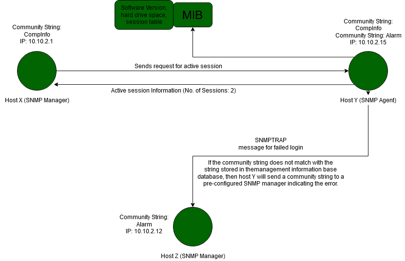

# 网络安全–枚举类型

> 原文:[https://www . geesforgeks . org/cyber-security-type-of-enumeration/](https://www.geeksforgeeks.org/cyber-security-types-of-enumeration/)

枚举本质上是检查。攻击者建立与目标主机相关联的功能。然后对弱点进行统计和评估。这样做主要是为了寻找对客观框架的攻击和危险。枚举用于收集用户名、主机名、IP 地址、密码、排列等。在建立与目标主机的正常连接时，黑客会监视目标框架。此时，他们获取私人数据和信息。时不时地，攻击者还会被发现改变客观框架的设置。与主机建立连接的方式决定了攻击者可以获得的信息或数据。

### **枚举类型**

在本节中，我们将讨论各种类型的枚举。

**1。网络基本输入输出系统枚举:**

*   NetBIOS 名称是一个特殊的 16 ASCII 字符串，用于区分 TCP/IP 上的组织小工具，15 个字符用于小工具名称，第 16 个字符保存用于管理或名称记录类型。
*   程序员利用 NetBIOS 枚举来获得具有特定域的个人电脑的概要、组织中各个主机的报价概要以及策略和密码。
*   微软不支持互联网协议版本 6 的网络 BIOS 名称目标。
*   指定 Windows 框架的初始阶段是利用 NetBIOS 应用编程接口。它最初是一个应用程序编程接口(API)，用于定制编程以获取局域网资产。Windows 利用 NetBIOS 进行文档和打印机共享。
*   一个黑客找到一个打开了端口 139 的 Windows 操作系统，就可以验证在遥远的框架上可以获得或看到什么资产。无论如何，要数一下 NetBIOS 的名字，这个遥远的框架可能支持文档和打印机共享。这种类型的枚举可能使程序员能够仔细阅读或保持与远程 PC 框架的联系，这取决于报价的可访问性，或者发送拒绝服务。
*   NetBIOS 名称列表:

<figure class="table">

| **名称** | **网络 BIOS 代码** | **类型** |
| --- | --- | --- |
|  | <00> | 独一无二的 |
| <domain></domain> | <00> | 组 |
|  | <03> | 独一无二的 |
| <username></username> | <03> | 独一无二的 |
|  | <20> | 独一无二的 |
| <domain></domain> | <1D> | 组 |
| <domain></domain> | <1B> | 独一无二的 |

</figure>

*   **Nbtstat 实用程序:**在 Windows 中，它显示了基于 TCP/IP (NetBT)约定的 NetBIOS 洞察、邻居和远程 PC 的 NetBIOS 名称表以及 NetBIOS 名称保留。此实用程序允许恢复网络 BIOS 名称缓存和使用 Windows 互联网名称服务选择的名称。Nbtstat 的句子结构:

```
nbtstat [-a RemoteName] [-A IPAddress] [-c] [-n] [-r] [-R] [-RR] [-s] [-S] [Interval]
```

下面的表格显示了不同的 Nbtstat 边界:

<figure class="table">

| **参数** |
| --- |
| -在远程 |
| -地址 |
| -c |
| 同-EN |
| -r |
| -右后 |
| 构成名词复数 |
| 构成名词复数 |
| 间隔 |

</figure>

**2。简单网络管理协议枚举:**

*   SNMP 枚举是利用 SNMP 在客观框架上指定客户端记录和小工具的循环。SNMP 由一名经理和一名专家组成；专家被插入到每个组织的小工具上，槽被引入到不同的 PC 上。
*   SNMP 有两个密码，用于从管理站访问和设计 SNMP 专家。阅读社区字符串当然是公开的；允许审查小工具/框架设置。读/写人员组字符串当然是私有的；允许很远的改变安排。
*   黑客利用这些默认的网络字符串来删除关于小工具的数据。黑客列出 SNMP 以删除关于组织资产的数据，例如 has、交换机、小工具、共享等，以及网络数据，例如 ARP 表、定向表、流量等。
*   SNMP 利用包含 SNMP 代理、管理器和一些相关部分的分散工程。与 SNMP 相关的订单包括:GetRequest、GetNextRequest、GetResponse、SetRequest、Trap。

下面给出了 SNMP 代理和管理器之间的通信:



*   SNMP 枚举工具用于检查 SNMP 授权的组织小工具的单个 IP 地址或 IP 地址范围，以筛选、分析和调查安全风险。这类仪器的实例包括网络扫描专业版、软件完善型网络扫描仪、简单网络管理协议线人等等

**3。LDAP 枚举:**

*   轻量级目录访问协议是一种互联网协议，用于访问分散的注册表管理。
*   注册管理机构可以对记录进行任何协调的安排，定期以分层和合理的结构进行，例如公司电子邮件索引。
*   客户通过与 TCP 端口 389 上的目录系统代理相关联来启动 LDAP 会议，然后向 DSA 发送活动请求。
*   使用基本编码规则在客户和员工之间发送数据。
*   程序员查询 LDAP 管理来收集信息，例如大量的用户名、地址、部门细节等，这些信息可以额外用于执行攻击。
*   在活动目录或其他目录管理中，有许多 LDAP 枚举设备进入注册表。利用这些设备，攻击者可以从各种 LDAP 工作人员那里识别数据，例如，重要的用户名、地址、部门细节等。
*   这类工具的例子包括 LDAP 管理工具、活动目录资源管理器、LDAP 管理等。

**4。NTP 枚举:**

*   网络时间协议旨在同步安排好的个人电脑的时钟。
*   它利用 UDP 端口 123 作为其通信的基本方法。
*   NTP 可以通过公共网络将时间检查到 10 毫秒以内(1/100 秒)。
*   在理想条件下，它可以在一个邻域内完成 200 微秒或更好的正确性。
*   高管们经常在安全问题上忽视国家运输计划的工作人员。尽管如此，无论何时被适当地质疑，它都能给程序员提供重要的组织数据。
*   黑客询问 NTP 工作人员以收集重要数据，例如，与 NTP 工作人员相关联的主机列表、客户在组织中的 IP 地址、他们的框架名称和 Oss，如果 NTP 工作人员在非军事区，同样可以获得内部入侵防御系统。
*   NTP 枚举工具用于筛选组织中 SNTP 和 NTP 员工的工作情况，并进一步帮助配置和确认从时间客户到 NTP 员工的可用性。

**5。SMTP 枚举:**

*   邮件框架通常将 SMTP 与 POP3 和 IMAP 结合使用，这使得客户端能够省去工人信件投递中的邮件，并偶尔从大型机下载它们。
*   SMTP 利用邮件交换(MX)工作人员通过域名系统协调邮件。它运行在 TCP 端口 25 上。
*   SMTP 提供 3 个内置命令:VRFY、EXPN、RCPT TO。
*   这些服务器对有效和无效用户的命令有不同的响应，我们可以从中确定 SMTP 服务器上的有效用户。
*   黑客可以通过 telnet brief 合法地与 SMTP 关联，并收集主机上大量客户端的概要。
*   黑客可以使用命令行实用程序(如 telnet、netcat 等)执行 SMTP 枚举。，或者通过使用 Metasploit、Nmap、NetScanTools Pro 等工具。

**6。使用区域传输的域名系统枚举:**

*   这是一个寻找域名系统工作人员和目标组织记录的周期。
*   黑客可以积累大量的组织数据，例如目标的域名系统工作人员姓名、主机名、机器名称、用户名、入侵防御系统等。
*   在域名系统区域转移枚举中，黑客试图从域名系统服务器检索一个域的整个区域文件的副本。
*   黑客为了执行区域转移，向冒充客户端的 DNS 服务器发送区域转移请求；然后，DNS 会将其数据库的一部分作为区域发送给您。该区域可能包含大量关于 DNS 区域组织的数据。

**7。IPsec 枚举:**

*   IPsec 利用 ESP(封装安全负载)、AH(认证报头)和 IKE(互联网密钥交换)来确保虚拟专用网络(VPN)终端焦点之间的一致性。
*   大多数基于 IPsec 的虚拟专用网使用互联网安全关联和密钥管理协议(IKE 的一部分)来建立、安排、更改和擦除虚拟专用网环境中的安全关联和密钥。
*   在 UDP 端口 500 上直接检查 ISAKMP 可以证明 VPN 通道的存在。
*   黑客可以进一步研究利用一种装置，例如，IKE 输出来识别敏感信息，包括加密和散列计算、认证类型、密钥传送计算等。

**8。网络电话枚举:**

*   VoIP 使用 SIP(会话发起协议)协议来实现 IP 网络上的语音和视频呼叫。
*   SIP 管理基本上使用 UDP/TCP 端口 2000、2001、5050、5061。
*   VoIP 枚举提供敏感信息，如 VoIP 网关/服务器、IP-PBX 系统、客户端软件和用户扩展。
*   这些信息可用于发起各种网络电话攻击，如拒绝服务、会话劫持、来电显示欺骗、窃听、网络电话垃圾邮件、网络电话网络钓鱼等。

**9。RPC 枚举:**

*   远程过程调用允许客户和工作人员在传播的客户/工作人员程序中进行传授。
*   计算 RPC 端点使攻击者能够识别这些管理端口上任何薄弱的管理。
*   在由防火墙和其他安全设施保证的网络中，这个端口映射器被定期筛选。按照这些思路，黑客过滤高端口范围，以识别可用于协调攻击的 RPC 管理。

**10。Unix/Linux 用户枚举:**

*   进行枚举最重要的步骤之一是执行这种枚举。这提供了用户列表以及详细信息，如用户名、主机名、每个会话的开始日期和时间等。
*   我们可以使用命令行工具来执行 Linux 用户枚举，如 rusers、rwho、finger 等。

**11 时。中小企业枚举:**

*   中小型企业列表是任何笔测试人员的重要专业知识。在弄清楚如何计算中小企业之前，我们应该先了解什么是中小企业。SMB 代表服务器消息块。
*   这是一个共享像记录、打印机这样的资产的惯例，总的来说，任何应该被服务器检索或访问的资产。它基本上依赖于服务器在端口 445 或端口 139 上运行。
*   它在窗口中非常容易访问，所以除了基本设置之外，窗口客户端不需要安排任何额外的东西。无论如何，在 Linux 中，这有点不寻常。为了使它适用于 Linux，您必须引入一个 samba 服务器，因为 Linux 本地不使用 SMB 约定。
*   很明显，某种确认将被建立起来，就像用户名和密码，只是某些资产被共享。所以厌恶每个人可以得到一切，一个坚实的确认。
*   主要的明显缺陷是利用默认认证或有效猜测，有时甚至不验证对服务器重要资产的访问。对于需要使用中小型企业资产的客户，管理员应该注意使用可靠的密码。随后的缺陷是 samba 服务器。Samba 服务器因极其脆弱而臭名昭著。

### 不同类型枚举的缓解

有几种对策可以用来减轻几种列举:

**1。网络 BIOS 枚举:**

*   禁用 SMB 和 NetBIOS。
*   使用网络防火墙。
*   首选 Windows 防火墙/软件防火墙。
*   禁用共享。

**2。SNMP 枚举:**

*   取消专家或关闭 SNMP 管理。
*   如果停止 SNMP 不是一个选择，此时更改默认网络字符串名称。
*   移动到 SNMP3，它编码密码和消息。
*   实施组策略安全替代方案。

**3。LDAP 枚举:**

*   利用 SSL 技术加密流量。
*   选择与您的电子邮件地址相关的唯一用户名，并授权帐户锁定。

**4。NTP 枚举:**

*   配置 MD5 层。
*   配置 NTP 身份验证。
*   升级 NTP 版本。

**5。SMTP 枚举:**

*   忽略给未知收件人的电子邮件。
*   禁用开路继电器功能。
*   断点从一个来源确认的关联数量，以防止暴力攻击。
*   不要在邮件响应中包含敏感的邮件服务器和本地主机信息。

**6。使用区域传输的域名系统枚举:**

*   禁止域名系统区域移动到不受信任的主机。
*   确保私有主机及其 IP 地址没有发布在公共 DNS 服务器的 DNS 区域文件中。
*   使用高级域名系统管理服务，对公众隐藏敏感信息，如主机信息。
*   利用标准的组织管理员联系人进行域名系统登记，以保持与社会设计攻击的战略距离。
*   避免将私有 IP 地址信息发布到区域文件中。
*   禁用不受信任主机的区域传输。
*   对公共主机隐藏敏感信息。

**7。IPsec 枚举:**

*   与基本模式和强制模式 IKE 密钥交换组件一起使用的预共享密钥可用于嗅探和断开野蛮力量的造粒攻击，以交换共享的秘密。您应该利用高级测试或双因素验证组件来反驳这些危险。
*   预共享密钥和强制模式 IKE 坚持是一场等待发生的灾难。万一你支持强制模式 IKE，利用高级声明进行验证。
*   强制防火墙和通道流量通过虚拟专用网加密隧道，以便在权衡的情况下，网络访问受到限制。这一点在为多用途客户端而不是分支工作场所提供网络访问时尤为重要。
*   在可能的情况下，将入站 ipsec 安全关系限制为显式的 IP 地址。这保证了无论攻击者是否讨价还价预共享密钥，她都只能费力地访问虚拟专用网络。

**8。网络电话枚举:**

*   这种攻击可以通过实施 SIP(SIP over TLS)和确认 SIP 查询和反应(可以包含正直保险)来遏制。
*   SIPS 的使用和反应的验证可以抑制许多相关的黑客攻击，包括窃听和消息或客户哑剧。
*   摘要确认的使用与 SIP 电话和 SIP 中介之间的 TLS 的使用相结合，可以提供一个站点，通过该站点，客户可以在他们的 SIP 域内安全地进行验证。
*   语音邮件消息可以被转换为消息记录，并由普通垃圾邮件通道解析。这只能屏蔽客户的语音邮件。

**9。RPC 枚举:**

*   尽量不要运行 rexd、rusersd 或 rwalld RPC 管理，因为它们的利用率可以忽略不计，并且会给攻击者提供有价值的数据和直接访问您的主机的权限。
*   在高安全性条件下，不要向公共互联网提供任何 RPC 管理。由于这些管理的不可预测性，几乎可以肯定的是，攻击者可以在固定数据交付之前访问零日误用内容。
*   为了限制针对重要 RPC 管理的内部或秘密黑客攻击的危险，(例如，包括 statd、lockd 和 mountd 在内的 NFS 细分市场)，引入了最新的卖家安全补丁。
*   在可能的情况下，强制引导出口流量，以保证无论对 RPC 管理的攻击是否有效，相关的后台外壳都不会被带到黑客面前。

**10。Unix/Linux 用户枚举:**

*   保持内核的固定和刷新。
*   除非真正需要，否则不要以 root 用户身份运行任何服务，尤其是 web、信息库和记录大型机。
*   SUID 数字不应该设置为任何程序，让你逃到壳。
*   你不应该在任何记录上设置 SUID 循环，因为攻击者无疑可以阅读/覆盖框架上的任何文档。
*   尽量不要给任何让你破壳而出的程序 sudo 权限。

**11 时。中小企业枚举:**

*   削弱网络和域名系统主机上的中小企业惯例。
*   削弱面向大型机的中小型企业传统网络。
*   中小企业会议使用的障碍端口 TCP 139 和 TCP 445。
*   通过 Windows 注册表中的“限制空访问”参数限制匿名访问。