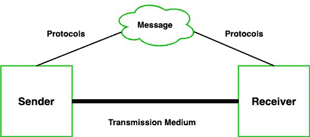

# 数据通信–定义、组件、类型、通道

> 原文:[https://www . geesforgeks . org/data-communication-definition-components-type-channel/](https://www.geeksforgeeks.org/data-communication-definition-components-types-channels/)

人类是地球上唯一能够通过语言媒介相互交流的生物。但是人类把这种天赋带到了另一个程度。如今，人的距离、时间和身体存在在交流中并不重要，因为他们建立了一个交流系统，通过这个系统，他们可以随时随地与爱人交流或共享图像、视频、文本、文件等数据。通信被定义为一台以上的计算机相互传递信息、指令和共享资源的过程。或者换句话说，通信是我们可以发送或接收数据的过程或行为。计算机网络被定义为自治计算机的互连集合。自主意味着没有计算机可以启动、停止或控制另一台计算机。

### 数据通信的组成部分

通信系统由以下组件组成:

1.  **消息:**消息是要从一个人传递给另一个人的一条信息。它可以是文本文件、音频文件、视频文件等。
2.  **发送方:**简单来说就是发送数据消息的设备。它可以是电脑、手机、电话、笔记本电脑、摄像机或工作站等。
3.  **接收器:**是接收消息的设备。它可以是电脑、手机、工作站等。
4.  **传输介质/通信通道:**通信通道是连接两个或多个工作站的介质。工作站可以通过有线媒体或无线媒体连接。
5.  **规则集(协议):**当有人发送数据(发送方)时，也应该是接收方可以理解的，否则没有意义。例如，Sonali 向车坛发送消息。如果 Sonali 用印地语写作，Chetan 听不懂印地语，那就是一场毫无意义的对话。

因此，连接到互联网的每台计算机都遵循一些规则(协议)，它们是:

*   **TCP(传输控制协议)**:它负责在源计算机上将消息划分为数据包，并在目的地或接收计算机上将接收到的数据包重新组装。它还确保数据包包含有关消息数据来源、消息数据目的地、消息数据重组顺序的信息，并检查消息是否已正确发送到特定目的地。
*   **IP(互联网协议)**:你有没有想过计算机是如何判断哪个数据包属于哪个设备的。如果你给朋友发的信息被你父亲收到了会怎么样？可怕的权利。嗯！IP 负责处理目的计算机的地址，以便将每个数据包发送到正确的目的地。

### 数据通信类型

众所周知，数据通信是我们可以从一台设备向另一台设备发送或接收数据的通信。数据通信分为三种类型:

1.  **单工通信:**是单向通信或者我们可以说是单向通信，即一台设备只接收，另一台设备只发送数据，设备在传输中使用全部容量。例如，物联网、使用键盘输入数据、使用扬声器列出音乐等。
2.  **半双工通信:**是双向通信，或者我们可以说是双向通信，两个设备可以同时发送和接收数据，但不能同时接收。当一台设备发送数据时，另一台设备仅接收数据，反之亦然。比如对讲机。
3.  **全双工通信:**是双向通信或者我们可以说是两个设备同时收发数据的双向通信。比如手机、座机等。

### 沟通渠道

通信通道是连接两个或多个工作站的媒介。工作站可以通过有线媒体或无线媒体连接。它也被称为传输介质。传输介质或信道是在两个或多个设备之间传送消息的链路。我们可以将传播媒体分为两类:

*   导向媒体传播
*   非导向媒体传播

**1。** [**引导媒体:**](https://www.geeksforgeeks.org/difference-between-guided-and-unguided-media/) 在这种传输媒体中，使用电线或电缆在两台或多台计算机或设备之间创建物理链路，然后使用这些电缆以信号的形式传输数据。以下类型的引导式媒体传输:

**1。双绞线:**是通信中最常见的电线形式。在双绞线电缆中，两根相同的电线以双螺旋缠绕在一起。电线的扭曲减少了串扰。这被称为信号从一根电线泄漏到另一根电线，由于这种泄漏，信号可能会损坏并导致网络错误。扭曲保护电线免受内部串扰和外部形式的信号干扰。双绞线电缆的类型:

*   **非屏蔽双绞线(UTP):** 广泛用于电脑和电话。顾名思义，没有外部屏蔽，因此它不能防止外部干扰。比 STP 便宜。
*   **屏蔽双绞线(STP):** 它提供了更好的保护，防止屏蔽引起的串扰。由于屏蔽，它可以防止外部干扰。与 UTP 相比，它更重、更贵。

**2。同轴电缆:**它由一个实心线芯组成，线芯被一个或多个箔片或电线屏蔽罩包围。同轴电缆的内芯承载信号，外屏蔽层提供接地。它被广泛用于电视信号，也被大公司用于构建安全系统。与双绞线相比，这种电缆的数据传输更好，但价格昂贵。

**3。光纤:**光纤是一项重要的技术。它以非常高的速度传输大量数据，因此被广泛用于互联网电缆。它以光的形式携带数据，光在薄玻璃纤维中传播。光缆由三部分组成:

1.  **核心:**核心是光穿过的那块。它通常由玻璃或塑料制成。
2.  **包层:**是纤芯的覆盖层，将光线反射回纤芯。
3.  **护套:**是保护光缆不受环境影响的保护性覆盖物。

**2。** [**【无导向媒体】**](https://www.geeksforgeeks.org/difference-between-guided-and-unguided-media/) **:** 无导向传输媒体是信号从一个设备无线传播到另一个设备的传输模式。信号可以在空气、水或真空中波动。它通常用于向各个方向传输信号。非导向介质进一步分为不同的部分:

**1。微波:**微波提供通信，无需使用电缆。微波信号就像无线电和电视信号一样。它用于远距离通信。微波传输由发射器、接收器和大气组成。在微波通信中，抛物面天线安装在塔上，向另一个天线发送波束。塔越高，范围越大。

**2。无线电波:**当通过无线电频率进行通信时，则称为无线电波传输。它提供移动性。它由发射机和接收机组成。两者都使用天线来辐射和捕捉无线电信号。

**3。红外线:**是短距离通信，可以通过任何物体。一般用于电视遥控器、无线鼠标等。