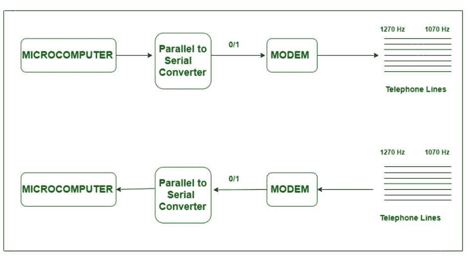

# 使用调制解调器通过电话线进行数据通信

> 原文:[https://www . geesforgeks . org/data-communication-通过电话线-使用调制解调器/](https://www.geeksforgeeks.org/data-communication-over-telephone-lines-using-modems/)

我们可以使用串行输入/输出技术通过电话线远距离发送数据。但是，电话线是为处理某些特定范围的声音而设计的；电话线的带宽从 300 赫兹到 3300 赫兹不等。当数字信号的时间以纳秒为单位时，我们需要几兆赫的带宽。因此，数据位应该转换成音频音调；这是通过[调制解调器](https://www.geeksforgeeks.org/difference-between-modem-and-router/)实现的。

**什么是调制解调器？**
调制解调器是调制器/解调器的简称。调制解调器是一种硬件组件/设备，可以将计算机和其他设备(如路由器和交换机)连接到互联网。调制解调器将来自电话线的模拟信号转换或调制成数字形式，即 0 秒和 1 秒的形式。目前的调制解调器可以以 300-2400 bps(每秒位数)的速率传输数据。通常，使用两种类型的调制技术:用于低速调制解调器的频移键控(FSK)和用于高速调制解调器的相移键控(PSK)。

第一批调制解调器是“拨号”，这意味着我们必须拨一个电话号码才能将计算机连接到互联网服务提供商。它们的最大数据传输速率几乎是 56 kbps。现代调制解调器是 DSL 或电缆调制解调器。与拨号调制解调器相比，它们具有较高的数据传输速率和较宽的频率范围。

**工作过程:**
下面解释电话线上的数据通信将如何通过调制解调器进行。计算机可以通过电话线使用两个调制解调器交换信息，每端一个。主叫计算机(或终端)或发起者通过电话号码联系接收计算机(也称为应答)，并且在计算机和调制解调器之间交换控制信号之后建立通信链路。

300 bps 调制解调器的典型通信过程如上图所示。并行字被转换成串行位；反过来，发起者/终端调制解调器生成两个音频频率–逻辑 0 为 1070 Hz，逻辑 1270 Hz。这些音频通过电话线传输。在应答端，音频被转换回 0 s 和 1 s，串行位被转换成并行字，由于是二进制形式，计算机很容易读取。当应答端计算机需要传输时，在 2025 Hz(空间)和 2225 Hz(标记)上传输。

显然，调制解调器在数据通信中起着至关重要的作用，因为它主要将模拟信号转换成二进制形式。

**使用调制解调器的优势:**

*   调制解调器在连接局域网和互联网时更有用。
*   调制解调器的速度取决于成本，越是成本越强大的是调制解调器。
*   调制解调器最有可能用于数据通信领域。
*   调制解调器将数字信号转换成模拟信号。

**使用调制解调器的缺点:**

*   调制解调器只是局域网和互联网之间的接口。
*   不存在调制解调器的流量维护。
*   调制解调器无法理解中间过程。
*   调制解调器不知道自己的目标路径。
*   在调制解调器中，可以连接的设备数量有限，最少 8 个，最多 12 个。
*   与集线器相比，调制解调器速度较慢。