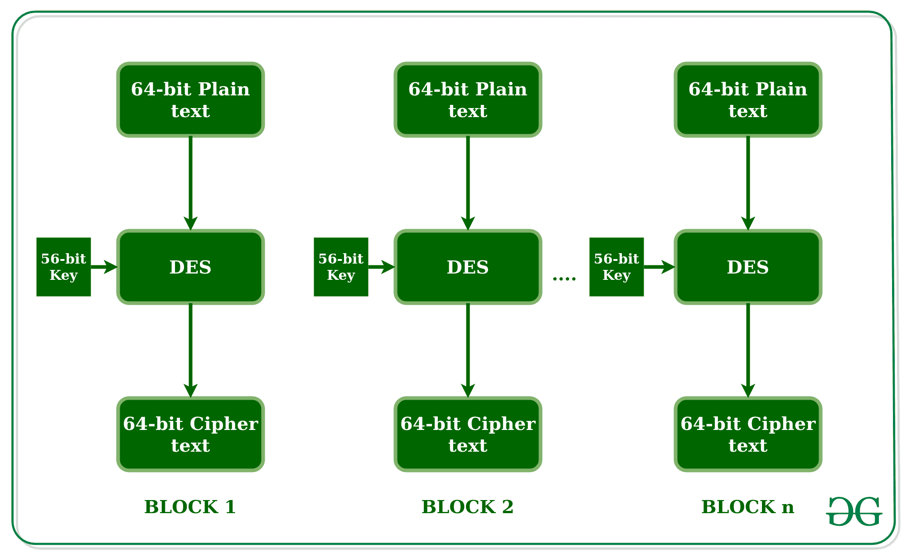
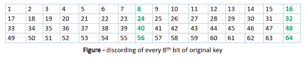
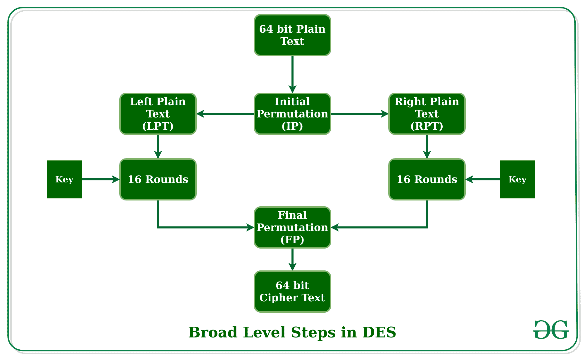
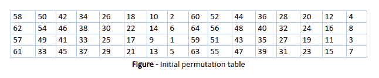
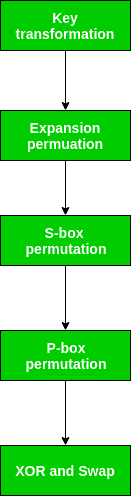
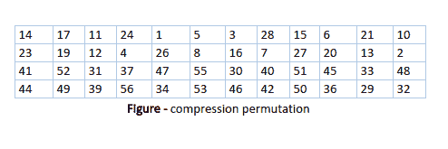
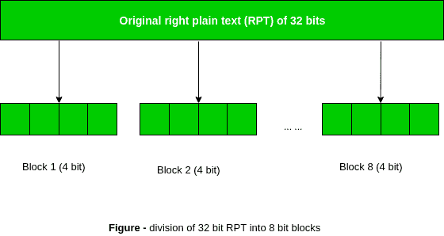

# 数据加密标准(DES) |第 1 套

> 原文:[https://www . geesforgeks . org/data-encryption-standard-des-set-1/](https://www.geeksforgeeks.org/data-encryption-standard-des-set-1/)

**数据加密标准(DES)** 被发现容易受到非常强大的攻击，因此，发现 DES 的受欢迎程度略有下降。
DES 是一种分组密码，以每个 64 位大小的块对数据进行加密，这意味着 64 位纯文本作为 DES 的输入，DES 产生 64 位密文。加密和解密使用相同的算法和密钥，只有细微的差别。密钥长度为 56 位。基本思路如图所示。



我们已经提到，DES 使用 56 位密钥。实际上，初始密钥由 64 位组成。然而，在 DES 过程开始之前，密钥的每 8 位都会被丢弃，以产生一个 56 位密钥。也就是说，位位置 8、16、24、32、40、48、56 和 64 被丢弃。



因此，丢弃密钥的每第 8 位将从原始的 64 位密钥产生一个 56 位密钥。
DES 基于密码学的两个基本属性:替代(也叫混淆)和换位(也叫扩散)。DES 由 16 个步骤组成，每个步骤称为一轮。每回合执行替换和换位的步骤。现在让我们讨论 DES 中的广义步骤。

1.  在第一步中，64 位纯文本块被交给一个初始置换函数。
2.  初始置换在纯文本上执行。
3.  接下来，初始置换产生置换块的两半；表示左纯文本和右纯文本。
4.  现在每个 LPT 和 RPT 都要经历 16 轮加密过程。
5.  最后，LPT 和 RPT 重新连接，并对组合块执行最终置换
6.  这个过程的结果产生 64 位密文。



**初始排列(IP)–**
正如我们已经注意到的，初始排列(IP)只发生一次，而且发生在第一轮之前。它建议如何进行知识产权的转换，如图所示。
比如说 IP 用原纯文本块的第 58 位替换原纯文本块的第一位，用原纯文本块的第 50 位替换第二位，以此类推。
这不过是对原始纯文本块的位位置的篡改。相同的规则适用于图中所示的所有其他位位置。



正如我们已经注意到的，在 IP 完成后，产生的 64 位置换文本块被分成两个半块。每个半块由 32 位组成，16 轮中的每一轮依次由图中概述的宽级别步骤组成。



**步骤-1:密钥转换–**
我们已经注意到，通过丢弃初始密钥的每 8 位，初始 64 位密钥被转换为 56 位密钥。因此，每个 56 位密钥都是可用的。从这个 56 位密钥开始，在每一轮使用称为密钥转换的过程生成不同的 48 位子密钥。为此，56 位密钥被分成两半，每一半 28 位。根据回合的不同，这两个半部分会向左循环移动一个或两个位置。
例如，如果轮次号为 1、2、9 或 16，则其他轮次只按位置移动，而循环移动则按两个位置移动。每轮移位的关键位数如图所示。


经过适当的移位后，56 位中的 48 位被选中。为了选择 56 位中的 48 位，下表如下图所示。例如，在移位之后，位号 14 移动到第一位置，位号 17 移动到第二位置，以此类推。如果我们仔细观察这个表，我们会发现它只包含 48 位的位置。第 18 位被丢弃(我们在表中找不到)，像其他 7 位一样，将 56 位密钥简化为 48 位密钥。由于密钥转换过程涉及置换以及选择原始 56 位密钥的 48 位子集，因此称为压缩置换。



由于这种压缩置换技术，在每一轮中使用不同的密钥位子集。这使得 DES 不容易破解。

**步骤-2:扩展排列–**
回想一下，在初始排列之后，我们有两个 32 位纯文本区域，称为左纯文本(LPT)和右纯文本(RPT)。在扩展置换期间，RPT 从 32 位扩展到 48 位。位也被置换，因此称为扩展置换。这是因为 32 位 RPT 被分成 8 个块，每个块由 4 位组成。然后，前一步骤的每个 4 位块被扩展到相应的 6 位块，即，每 4 位块增加 2 位。



这个过程导致在创建输出时输入位的扩展和置换。密钥转换过程将 56 位密钥压缩到 48 位。然后扩展置换过程将 32 位 RPT 扩展到 48 位。现在，48 位密钥与 48 位 RPT 进行异或运算，得到的输出被提供给下一步，即 S-Box 替换。

## C++

```
#include <bits/stdc++.h>
using namespace std;
string hex2bin(string s)
{
    // hexadecimal to binary conversion
    unordered_map<char, string> mp;
    mp['0'] = "0000";
    mp['1'] = "0001";
    mp['2'] = "0010";
    mp['3'] = "0011";
    mp['4'] = "0100";
    mp['5'] = "0101";
    mp['6'] = "0110";
    mp['7'] = "0111";
    mp['8'] = "1000";
    mp['9'] = "1001";
    mp['A'] = "1010";
    mp['B'] = "1011";
    mp['C'] = "1100";
    mp['D'] = "1101";
    mp['E'] = "1110";
    mp['F'] = "1111";
    string bin = "";
    for (int i = 0; i < s.size(); i++) {
        bin += mp[s[i]];
    }
    return bin;
}
string bin2hex(string s)
{
    // binary to hexadecimal conversion
    unordered_map<string, string> mp;
    mp["0000"] = "0";
    mp["0001"] = "1";
    mp["0010"] = "2";
    mp["0011"] = "3";
    mp["0100"] = "4";
    mp["0101"] = "5";
    mp["0110"] = "6";
    mp["0111"] = "7";
    mp["1000"] = "8";
    mp["1001"] = "9";
    mp["1010"] = "A";
    mp["1011"] = "B";
    mp["1100"] = "C";
    mp["1101"] = "D";
    mp["1110"] = "E";
    mp["1111"] = "F";
    string hex = "";
    for (int i = 0; i < s.length(); i += 4) {
        string ch = "";
        ch += s[i];
        ch += s[i + 1];
        ch += s[i + 2];
        ch += s[i + 3];
        hex += mp[ch];
    }
    return hex;
}

string permute(string k, int* arr, int n)
{
    string per = "";
    for (int i = 0; i < n; i++) {
        per += k[arr[i] - 1];
    }
    return per;
}

string shift_left(string k, int shifts)
{
    string s = "";
    for (int i = 0; i < shifts; i++) {
        for (int j = 1; j < 28; j++) {
            s += k[j];
        }
        s += k[0];
        k = s;
        s = "";
    }
    return k;
}

string xor_(string a, string b)
{
    string ans = "";
    for (int i = 0; i < a.size(); i++) {
        if (a[i] == b[i]) {
            ans += "0";
        }
        else {
            ans += "1";
        }
    }
    return ans;
}
string encrypt(string pt, vector<string> rkb, vector<string> rk)
{
    // Hexadecimal to binary
    pt = hex2bin(pt);

    // Initial Permutation Table
    int initial_perm[64] = { 58, 50, 42, 34, 26, 18, 10, 2,
                             60, 52, 44, 36, 28, 20, 12, 4,
                             62, 54, 46, 38, 30, 22, 14, 6,
                             64, 56, 48, 40, 32, 24, 16, 8,
                             57, 49, 41, 33, 25, 17, 9, 1,
                             59, 51, 43, 35, 27, 19, 11, 3,
                             61, 53, 45, 37, 29, 21, 13, 5,
                             63, 55, 47, 39, 31, 23, 15, 7 };
    // Initial Permutation
    pt = permute(pt, initial_perm, 64);
    cout << "After initial permutation: " << bin2hex(pt) << endl;

    // Splitting
    string left = pt.substr(0, 32);
    string right = pt.substr(32, 32);
    cout << "After splitting: L0=" << bin2hex(left)
         << " R0=" << bin2hex(right) << endl;

    // Expansion D-box Table
    int exp_d[48] = { 32, 1, 2, 3, 4, 5, 4, 5,
                      6, 7, 8, 9, 8, 9, 10, 11,
                      12, 13, 12, 13, 14, 15, 16, 17,
                      16, 17, 18, 19, 20, 21, 20, 21,
                      22, 23, 24, 25, 24, 25, 26, 27,
                      28, 29, 28, 29, 30, 31, 32, 1 };

    // S-box Table
    int s[8][4][16] = { { 14, 4, 13, 1, 2, 15, 11, 8, 3, 10, 6, 12, 5, 9, 0, 7,
                          0, 15, 7, 4, 14, 2, 13, 1, 10, 6, 12, 11, 9, 5, 3, 8,
                          4, 1, 14, 8, 13, 6, 2, 11, 15, 12, 9, 7, 3, 10, 5, 0,
                          15, 12, 8, 2, 4, 9, 1, 7, 5, 11, 3, 14, 10, 0, 6, 13 },
                        { 15, 1, 8, 14, 6, 11, 3, 4, 9, 7, 2, 13, 12, 0, 5, 10,
                          3, 13, 4, 7, 15, 2, 8, 14, 12, 0, 1, 10, 6, 9, 11, 5,
                          0, 14, 7, 11, 10, 4, 13, 1, 5, 8, 12, 6, 9, 3, 2, 15,
                          13, 8, 10, 1, 3, 15, 4, 2, 11, 6, 7, 12, 0, 5, 14, 9 },

                        { 10, 0, 9, 14, 6, 3, 15, 5, 1, 13, 12, 7, 11, 4, 2, 8,
                          13, 7, 0, 9, 3, 4, 6, 10, 2, 8, 5, 14, 12, 11, 15, 1,
                          13, 6, 4, 9, 8, 15, 3, 0, 11, 1, 2, 12, 5, 10, 14, 7,
                          1, 10, 13, 0, 6, 9, 8, 7, 4, 15, 14, 3, 11, 5, 2, 12 },
                        { 7, 13, 14, 3, 0, 6, 9, 10, 1, 2, 8, 5, 11, 12, 4, 15,
                          13, 8, 11, 5, 6, 15, 0, 3, 4, 7, 2, 12, 1, 10, 14, 9,
                          10, 6, 9, 0, 12, 11, 7, 13, 15, 1, 3, 14, 5, 2, 8, 4,
                          3, 15, 0, 6, 10, 1, 13, 8, 9, 4, 5, 11, 12, 7, 2, 14 },
                        { 2, 12, 4, 1, 7, 10, 11, 6, 8, 5, 3, 15, 13, 0, 14, 9,
                          14, 11, 2, 12, 4, 7, 13, 1, 5, 0, 15, 10, 3, 9, 8, 6,
                          4, 2, 1, 11, 10, 13, 7, 8, 15, 9, 12, 5, 6, 3, 0, 14,
                          11, 8, 12, 7, 1, 14, 2, 13, 6, 15, 0, 9, 10, 4, 5, 3 },
                        { 12, 1, 10, 15, 9, 2, 6, 8, 0, 13, 3, 4, 14, 7, 5, 11,
                          10, 15, 4, 2, 7, 12, 9, 5, 6, 1, 13, 14, 0, 11, 3, 8,
                          9, 14, 15, 5, 2, 8, 12, 3, 7, 0, 4, 10, 1, 13, 11, 6,
                          4, 3, 2, 12, 9, 5, 15, 10, 11, 14, 1, 7, 6, 0, 8, 13 },
                        { 4, 11, 2, 14, 15, 0, 8, 13, 3, 12, 9, 7, 5, 10, 6, 1,
                          13, 0, 11, 7, 4, 9, 1, 10, 14, 3, 5, 12, 2, 15, 8, 6,
                          1, 4, 11, 13, 12, 3, 7, 14, 10, 15, 6, 8, 0, 5, 9, 2,
                          6, 11, 13, 8, 1, 4, 10, 7, 9, 5, 0, 15, 14, 2, 3, 12 },
                        { 13, 2, 8, 4, 6, 15, 11, 1, 10, 9, 3, 14, 5, 0, 12, 7,
                          1, 15, 13, 8, 10, 3, 7, 4, 12, 5, 6, 11, 0, 14, 9, 2,
                          7, 11, 4, 1, 9, 12, 14, 2, 0, 6, 10, 13, 15, 3, 5, 8,
                          2, 1, 14, 7, 4, 10, 8, 13, 15, 12, 9, 0, 3, 5, 6, 11 } };

    // Straight Permutation Table
    int per[32] = { 16, 7, 20, 21,
                    29, 12, 28, 17,
                    1, 15, 23, 26,
                    5, 18, 31, 10,
                    2, 8, 24, 14,
                    32, 27, 3, 9,
                    19, 13, 30, 6,
                    22, 11, 4, 25 };

    cout << endl;
    for (int i = 0; i < 16; i++) {
        // Expansion D-box
        string right_expanded = permute(right, exp_d, 48);

        // XOR RoundKey[i] and right_expanded
        string x = xor_(rkb[i], right_expanded);

        // S-boxes
        string op = "";
        for (int i = 0; i < 8; i++) {
            int row = 2 * int(x[i * 6] - '0') + int(x[i * 6 + 5] - '0');
            int col = 8 * int(x[i * 6 + 1] - '0') + 4 * int(x[i * 6 + 2] - '0') + 2 * int(x[i * 6 + 3] - '0') + int(x[i * 6 + 4] - '0');
            int val = s[i][row][col];
            op += char(val / 8 + '0');
            val = val % 8;
            op += char(val / 4 + '0');
            val = val % 4;
            op += char(val / 2 + '0');
            val = val % 2;
            op += char(val + '0');
        }
        // Straight D-box
        op = permute(op, per, 32);

        // XOR left and op
        x = xor_(op, left);

        left = x;

        // Swapper
        if (i != 15) {
            swap(left, right);
        }
        cout << "Round " << i + 1 << " " << bin2hex(left) << " "
             << bin2hex(right) << " " << rk[i] << endl;
    }

    // Combination
    string combine = left + right;

    // Final Permutation Table
    int final_perm[64] = { 40, 8, 48, 16, 56, 24, 64, 32,
                           39, 7, 47, 15, 55, 23, 63, 31,
                           38, 6, 46, 14, 54, 22, 62, 30,
                           37, 5, 45, 13, 53, 21, 61, 29,
                           36, 4, 44, 12, 52, 20, 60, 28,
                           35, 3, 43, 11, 51, 19, 59, 27,
                           34, 2, 42, 10, 50, 18, 58, 26,
                           33, 1, 41, 9, 49, 17, 57, 25 };

    // Final Permutation
    string cipher = bin2hex(permute(combine, final_perm, 64));
    return cipher;
}
int main()
{
    // pt is plain text
    string pt, key;
    /*cout<<"Enter plain text(in hexadecimal): ";
    cin>>pt;
    cout<<"Enter key(in hexadecimal): ";
    cin>>key;*/

    pt = "123456ABCD132536";
    key = "AABB09182736CCDD";
    // Key Generation

    // Hex to binary
    key = hex2bin(key);

    // Parity bit drop table
    int keyp[56] = { 57, 49, 41, 33, 25, 17, 9,
                     1, 58, 50, 42, 34, 26, 18,
                     10, 2, 59, 51, 43, 35, 27,
                     19, 11, 3, 60, 52, 44, 36,
                     63, 55, 47, 39, 31, 23, 15,
                     7, 62, 54, 46, 38, 30, 22,
                     14, 6, 61, 53, 45, 37, 29,
                     21, 13, 5, 28, 20, 12, 4 };

    // getting 56 bit key from 64 bit using the parity bits
    key = permute(key, keyp, 56); // key without parity

    // Number of bit shifts
    int shift_table[16] = { 1, 1, 2, 2,
                            2, 2, 2, 2,
                            1, 2, 2, 2,
                            2, 2, 2, 1 };

    // Key- Compression Table
    int key_comp[48] = { 14, 17, 11, 24, 1, 5,
                         3, 28, 15, 6, 21, 10,
                         23, 19, 12, 4, 26, 8,
                         16, 7, 27, 20, 13, 2,
                         41, 52, 31, 37, 47, 55,
                         30, 40, 51, 45, 33, 48,
                         44, 49, 39, 56, 34, 53,
                         46, 42, 50, 36, 29, 32 };

    // Splitting
    string left = key.substr(0, 28);
    string right = key.substr(28, 28);

    vector<string> rkb; // rkb for RoundKeys in binary
    vector<string> rk; // rk for RoundKeys in hexadecimal
    for (int i = 0; i < 16; i++) {
        // Shifting
        left = shift_left(left, shift_table[i]);
        right = shift_left(right, shift_table[i]);

        // Combining
        string combine = left + right;

        // Key Compression
        string RoundKey = permute(combine, key_comp, 48);

        rkb.push_back(RoundKey);
        rk.push_back(bin2hex(RoundKey));
    }

    cout << "\nEncryption:\n\n";
    string cipher = encrypt(pt, rkb, rk);
    cout << "\nCipher Text: " << cipher << endl;

    cout << "\nDecryption\n\n";
    reverse(rkb.begin(), rkb.end());
    reverse(rk.begin(), rk.end());
    string text = encrypt(cipher, rkb, rk);
    cout << "\nPlain Text: " << text << endl;
}
```

## Java 语言(一种计算机语言，尤用于创建网站)

```
import java.util.*;

class Main {
    private static class DES {
        // CONSTANTS
        // Initial Permutation Table
        int[] IP = { 58, 50, 42, 34, 26, 18,
                     10, 2, 60, 52, 44, 36, 28, 20,
                     12, 4, 62, 54, 46, 38,
                     30, 22, 14, 6, 64, 56,
                     48, 40, 32, 24, 16, 8,
                     57, 49, 41, 33, 25, 17,
                     9, 1, 59, 51, 43, 35, 27,
                     19, 11, 3, 61, 53, 45,
                     37, 29, 21, 13, 5, 63, 55,
                     47, 39, 31, 23, 15, 7 };

        // Inverse Initial Permutation Table
        int[] IP1 = { 40, 8, 48, 16, 56, 24, 64,
                      32, 39, 7, 47, 15, 55,
                      23, 63, 31, 38, 6, 46,
                      14, 54, 22, 62, 30, 37,
                      5, 45, 13, 53, 21, 61,
                      29, 36, 4, 44, 12, 52,
                      20, 60, 28, 35, 3, 43,
                      11, 51, 19, 59, 27, 34,
                      2, 42, 10, 50, 18, 58,
                      26, 33, 1, 41, 9, 49,
                      17, 57, 25 };

        // first key-hePermutation Table
        int[] PC1 = { 57, 49, 41, 33, 25,
                      17, 9, 1, 58, 50, 42, 34, 26,
                      18, 10, 2, 59, 51, 43, 35, 27,
                      19, 11, 3, 60, 52, 44, 36, 63,
                      55, 47, 39, 31, 23, 15, 7, 62,
                      54, 46, 38, 30, 22, 14, 6, 61,
                      53, 45, 37, 29, 21, 13, 5, 28,
                      20, 12, 4 };

        // second key-Permutation Table
        int[] PC2 = { 14, 17, 11, 24, 1, 5, 3,
                      28, 15, 6, 21, 10, 23, 19, 12,
                      4, 26, 8, 16, 7, 27, 20, 13, 2,
                      41, 52, 31, 37, 47, 55, 30, 40,
                      51, 45, 33, 48, 44, 49, 39, 56,
                      34, 53, 46, 42, 50, 36, 29, 32 };

        // Expansion D-box Table
        int[] EP = { 32, 1, 2, 3, 4, 5, 4,
                     5, 6, 7, 8, 9, 8, 9, 10,
                     11, 12, 13, 12, 13, 14, 15,
                     16, 17, 16, 17, 18, 19, 20,
                     21, 20, 21, 22, 23, 24, 25,
                     24, 25, 26, 27, 28, 29, 28,
                     29, 30, 31, 32, 1 };

        // Straight Permutation Table
        int[] P = { 16, 7, 20, 21, 29, 12, 28,
                    17, 1, 15, 23, 26, 5, 18,
                    31, 10, 2, 8, 24, 14, 32,
                    27, 3, 9, 19, 13, 30, 6,
                    22, 11, 4, 25 };

        // S-box Table
        int[][][] sbox = {
            { { 14, 4, 13, 1, 2, 15, 11, 8, 3, 10, 6, 12, 5, 9, 0, 7 },
              { 0, 15, 7, 4, 14, 2, 13, 1, 10, 6, 12, 11, 9, 5, 3, 8 },
              { 4, 1, 14, 8, 13, 6, 2, 11, 15, 12, 9, 7, 3, 10, 5, 0 },
              { 15, 12, 8, 2, 4, 9, 1, 7, 5, 11, 3, 14, 10, 0, 6, 13 } },

            { { 15, 1, 8, 14, 6, 11, 3, 4, 9, 7, 2, 13, 12, 0, 5, 10 },
              { 3, 13, 4, 7, 15, 2, 8, 14, 12, 0, 1, 10, 6, 9, 11, 5 },
              { 0, 14, 7, 11, 10, 4, 13, 1, 5, 8, 12, 6, 9, 3, 2, 15 },
              { 13, 8, 10, 1, 3, 15, 4, 2, 11, 6, 7, 12, 0, 5, 14, 9 } },
            { { 10, 0, 9, 14, 6, 3, 15, 5, 1, 13, 12, 7, 11, 4, 2, 8 },
              { 13, 7, 0, 9, 3, 4, 6, 10, 2, 8, 5, 14, 12, 11, 15, 1 },
              { 13, 6, 4, 9, 8, 15, 3, 0, 11, 1, 2, 12, 5, 10, 14, 7 },
              { 1, 10, 13, 0, 6, 9, 8, 7, 4, 15, 14, 3, 11, 5, 2, 12 } },
            { { 7, 13, 14, 3, 0, 6, 9, 10, 1, 2, 8, 5, 11, 12, 4, 15 },
              { 13, 8, 11, 5, 6, 15, 0, 3, 4, 7, 2, 12, 1, 10, 14, 9 },
              { 10, 6, 9, 0, 12, 11, 7, 13, 15, 1, 3, 14, 5, 2, 8, 4 },
              { 3, 15, 0, 6, 10, 1, 13, 8, 9, 4, 5, 11, 12, 7, 2, 14 } },
            { { 2, 12, 4, 1, 7, 10, 11, 6, 8, 5, 3, 15, 13, 0, 14, 9 },
              { 14, 11, 2, 12, 4, 7, 13, 1, 5, 0, 15, 10, 3, 9, 8, 6 },
              { 4, 2, 1, 11, 10, 13, 7, 8, 15, 9, 12, 5, 6, 3, 0, 14 },
              { 11, 8, 12, 7, 1, 14, 2, 13, 6, 15, 0, 9, 10, 4, 5, 3 } },
            { { 12, 1, 10, 15, 9, 2, 6, 8, 0, 13, 3, 4, 14, 7, 5, 11 },
              { 10, 15, 4, 2, 7, 12, 9, 5, 6, 1, 13, 14, 0, 11, 3, 8 },
              { 9, 14, 15, 5, 2, 8, 12, 3, 7, 0, 4, 10, 1, 13, 11, 6 },
              { 4, 3, 2, 12, 9, 5, 15, 10, 11, 14, 1, 7, 6, 0, 8, 13 } },
            { { 4, 11, 2, 14, 15, 0, 8, 13, 3, 12, 9, 7, 5, 10, 6, 1 },
              { 13, 0, 11, 7, 4, 9, 1, 10, 14, 3, 5, 12, 2, 15, 8, 6 },
              { 1, 4, 11, 13, 12, 3, 7, 14, 10, 15, 6, 8, 0, 5, 9, 2 },
              { 6, 11, 13, 8, 1, 4, 10, 7, 9, 5, 0, 15, 14, 2, 3, 12 } },
            { { 13, 2, 8, 4, 6, 15, 11, 1, 10, 9, 3, 14, 5, 0, 12, 7 },
              { 1, 15, 13, 8, 10, 3, 7, 4, 12, 5, 6, 11, 0, 14, 9, 2 },
              { 7, 11, 4, 1, 9, 12, 14, 2, 0, 6, 10, 13, 15, 3, 5, 8 },
              { 2, 1, 14, 7, 4, 10, 8, 13, 15, 12, 9, 0, 3, 5, 6, 11 } }
        };
        int[] shiftBits = { 1, 1, 2, 2, 2, 2, 2, 2,
                            1, 2, 2, 2, 2, 2, 2, 1 };

        // hexadecimal to binary conversion
        String hextoBin(String input)
        {
            int n = input.length() * 4;
            input = Long.toBinaryString(
                Long.parseUnsignedLong(input, 16));
            while (input.length() < n)
                input = "0" + input;
            return input;
        }

        // binary to hexadecimal conversion
        String binToHex(String input)
        {
            int n = (int)input.length() / 4;
            input = Long.toHexString(
                Long.parseUnsignedLong(input, 2));
            while (input.length() < n)
                input = "0" + input;
            return input;
        }

        // per-mutate input hexadecimal
        // according to specified sequence
        String permutation(int[] sequence, String input)
        {
            String output = "";
            input = hextoBin(input);
            for (int i = 0; i < sequence.length; i++)
                output += input.charAt(sequence[i] - 1);
            output = binToHex(output);
            return output;
        }

        // xor 2 hexadecimal strings
        String xor(String a, String b)
        {
            // hexadecimal to decimal(base 10)
            long t_a = Long.parseUnsignedLong(a, 16);
            // hexadecimal to decimal(base 10)
            long t_b = Long.parseUnsignedLong(b, 16);
            // xor
            t_a = t_a ^ t_b;
            // decimal to hexadecimal
            a = Long.toHexString(t_a);
            // prepend 0's to maintain length
            while (a.length() < b.length())
                a = "0" + a;
            return a;
        }

        // left Circular Shifting bits
        String leftCircularShift(String input, int numBits)
        {
            int n = input.length() * 4;
            int perm[] = new int[n];
            for (int i = 0; i < n - 1; i++)
                perm[i] = (i + 2);
            perm[n - 1] = 1;
            while (numBits-- > 0)
                input = permutation(perm, input);
            return input;
        }

        // preparing 16 keys for 16 rounds
        String[] getKeys(String key)
        {
            String keys[] = new String[16];
            // first key permutation
            key = permutation(PC1, key);
            for (int i = 0; i < 16; i++) {
                key = leftCircularShift(
                          key.substring(0, 7), shiftBits[i])
                      + leftCircularShift(key.substring(7, 14),
                                          shiftBits[i]);
                // second key permutation
                keys[i] = permutation(PC2, key);
            }
            return keys;
        }

        // s-box lookup
        String sBox(String input)
        {
            String output = "";
            input = hextoBin(input);
            for (int i = 0; i < 48; i += 6) {
                String temp = input.substring(i, i + 6);
                int num = i / 6;
                int row = Integer.parseInt(
                    temp.charAt(0) + "" + temp.charAt(5), 2);
                int col = Integer.parseInt(
                    temp.substring(1, 5), 2);
                output += Integer.toHexString(
                    sbox[num][row][col]);
            }
            return output;
        }

        String round(String input, String key, int num)
        {
            // fk
            String left = input.substring(0, 8);
            String temp = input.substring(8, 16);
            String right = temp;
            // Expansion permutation
            temp = permutation(EP, temp);
            // xor temp and round key
            temp = xor(temp, key);
            // lookup in s-box table
            temp = sBox(temp);
            // Straight D-box
            temp = permutation(P, temp);
            // xor
            left = xor(left, temp);
            System.out.println("Round "
                               + (num + 1) + " "
                               + right.toUpperCase()
                               + " " + left.toUpperCase() + " "
                               + key.toUpperCase());

            // swapper
            return right + left;
        }

        String encrypt(String plainText, String key)
        {
            int i;
            // get round keys
            String keys[] = getKeys(key);

            // initial permutation
            plainText = permutation(IP, plainText);
            System.out.println(
                "After initial permutation: "
                + plainText.toUpperCase());
            System.out.println(
                "After splitting: L0="
                + plainText.substring(0, 8).toUpperCase()
                + " R0="
                + plainText.substring(8, 16).toUpperCase() + "\n");

            // 16 rounds
            for (i = 0; i < 16; i++) {
                plainText = round(plainText, keys[i], i);
            }

            // 32-bit swap
            plainText = plainText.substring(8, 16)
                        + plainText.substring(0, 8);

            // final permutation
            plainText = permutation(IP1, plainText);
            return plainText;
        }

        String decrypt(String plainText, String key)
        {
            int i;
            // get round keys
            String keys[] = getKeys(key);

            // initial permutation
            plainText = permutation(IP, plainText);
            System.out.println(
                "After initial permutation: "
                + plainText.toUpperCase());
            System.out.println(
                "After splitting: L0="
                + plainText.substring(0, 8).toUpperCase()
                + " R0=" + plainText.substring(8, 16).toUpperCase()
                + "\n");

            // 16-rounds
            for (i = 15; i > -1; i--) {
                plainText = round(plainText, keys[i], 15 - i);
            }

            // 32-bit swap
            plainText = plainText.substring(8, 16)
                        + plainText.substring(0, 8);
            plainText = permutation(IP1, plainText);
            return plainText;
        }
    }
    public static void main(String args[])
    {
        String text = "123456ABCD132536";
        String key = "AABB09182736CCDD";

        DES cipher = new DES();
        System.out.println("Encryption:\n");
        text = cipher.encrypt(text, key);
        System.out.println(
            "\nCipher Text: " + text.toUpperCase() + "\n");
        System.out.println("Decryption\n");
        text = cipher.decrypt(text, key);
        System.out.println(
            "\nPlain Text: "
            + text.toUpperCase());
    }
}
// code contributed by Abhay Bhat
```

## 计算机编程语言

```
# Hexadecimal to binary conversion
def hex2bin(s):
    mp = {'0' : "0000",
          '1' : "0001",
          '2' : "0010",
          '3' : "0011",
          '4' : "0100",
          '5' : "0101",
          '6' : "0110",
          '7' : "0111",
          '8' : "1000",
          '9' : "1001",
          'A' : "1010",
          'B' : "1011",
          'C' : "1100",
          'D' : "1101",
          'E' : "1110",
          'F' : "1111" }
    bin = ""
    for i in range(len(s)):
        bin = bin + mp[s[i]]
    return bin

# Binary to hexadecimal conversion
def bin2hex(s):
    mp = {"0000" : '0',
          "0001" : '1',
          "0010" : '2',
          "0011" : '3',
          "0100" : '4',
          "0101" : '5',
          "0110" : '6',
          "0111" : '7',
          "1000" : '8',
          "1001" : '9',
          "1010" : 'A',
          "1011" : 'B',
          "1100" : 'C',
          "1101" : 'D',
          "1110" : 'E',
          "1111" : 'F' }
    hex = ""
    for i in range(0,len(s),4):
        ch = ""
        ch = ch + s[i]
        ch = ch + s[i + 1]
        ch = ch + s[i + 2]
        ch = ch + s[i + 3]
        hex = hex + mp[ch]

    return hex

# Binary to decimal conversion
def bin2dec(binary):

    binary1 = binary
    decimal, i, n = 0, 0, 0
    while(binary != 0):
        dec = binary % 10
        decimal = decimal + dec * pow(2, i)
        binary = binary//10
        i += 1
    return decimal

# Decimal to binary conversion
def dec2bin(num):
    res = bin(num).replace("0b", "")
    if(len(res)%4 != 0):
        div = len(res) / 4
        div = int(div)
        counter =(4 * (div + 1)) - len(res)
        for i in range(0, counter):
            res = '0' + res
    return res

# Permute function to rearrange the bits
def permute(k, arr, n):
    permutation = ""
    for i in range(0, n):
        permutation = permutation + k[arr[i] - 1]
    return permutation

# shifting the bits towards left by nth shifts
def shift_left(k, nth_shifts):
    s = ""
    for i in range(nth_shifts):
        for j in range(1,len(k)):
            s = s + k[j]
        s = s + k[0]
        k = s
        s = ""
    return k   

# calculating xow of two strings of binary number a and b
def xor(a, b):
    ans = ""
    for i in range(len(a)):
        if a[i] == b[i]:
            ans = ans + "0"
        else:
            ans = ans + "1"
    return ans

# Table of Position of 64 bits at initial level: Initial Permutation Table
initial_perm = [58, 50, 42, 34, 26, 18, 10, 2,
                60, 52, 44, 36, 28, 20, 12, 4,
                62, 54, 46, 38, 30, 22, 14, 6,
                64, 56, 48, 40, 32, 24, 16, 8,
                57, 49, 41, 33, 25, 17, 9, 1,
                59, 51, 43, 35, 27, 19, 11, 3,
                61, 53, 45, 37, 29, 21, 13, 5,
                63, 55, 47, 39, 31, 23, 15, 7]

# Expansion D-box Table
exp_d = [32, 1 , 2 , 3 , 4 , 5 , 4 , 5,
         6 , 7 , 8 , 9 , 8 , 9 , 10, 11,
         12, 13, 12, 13, 14, 15, 16, 17,
         16, 17, 18, 19, 20, 21, 20, 21,
         22, 23, 24, 25, 24, 25, 26, 27,
         28, 29, 28, 29, 30, 31, 32, 1 ]

# Straight Permutation Table
per = [ 16,  7, 20, 21,
        29, 12, 28, 17,
         1, 15, 23, 26,
         5, 18, 31, 10,
         2,  8, 24, 14,
        32, 27,  3,  9,
        19, 13, 30,  6,
        22, 11,  4, 25 ]

# S-box Table
sbox =  [[[14, 4, 13, 1, 2, 15, 11, 8, 3, 10, 6, 12, 5, 9, 0, 7],
          [ 0, 15, 7, 4, 14, 2, 13, 1, 10, 6, 12, 11, 9, 5, 3, 8],
          [ 4, 1, 14, 8, 13, 6, 2, 11, 15, 12, 9, 7, 3, 10, 5, 0],
          [15, 12, 8, 2, 4, 9, 1, 7, 5, 11, 3, 14, 10, 0, 6, 13 ]],

         [[15, 1, 8, 14, 6, 11, 3, 4, 9, 7, 2, 13, 12, 0, 5, 10],
            [3, 13, 4, 7, 15, 2, 8, 14, 12, 0, 1, 10, 6, 9, 11, 5],
            [0, 14, 7, 11, 10, 4, 13, 1, 5, 8, 12, 6, 9, 3, 2, 15],
           [13, 8, 10, 1, 3, 15, 4, 2, 11, 6, 7, 12, 0, 5, 14, 9 ]],

         [ [10, 0, 9, 14, 6, 3, 15, 5, 1, 13, 12, 7, 11, 4, 2, 8],
           [13, 7, 0, 9, 3, 4, 6, 10, 2, 8, 5, 14, 12, 11, 15, 1],
           [13, 6, 4, 9, 8, 15, 3, 0, 11, 1, 2, 12, 5, 10, 14, 7],
            [1, 10, 13, 0, 6, 9, 8, 7, 4, 15, 14, 3, 11, 5, 2, 12 ]],

          [ [7, 13, 14, 3, 0, 6, 9, 10, 1, 2, 8, 5, 11, 12, 4, 15],
           [13, 8, 11, 5, 6, 15, 0, 3, 4, 7, 2, 12, 1, 10, 14, 9],
           [10, 6, 9, 0, 12, 11, 7, 13, 15, 1, 3, 14, 5, 2, 8, 4],
            [3, 15, 0, 6, 10, 1, 13, 8, 9, 4, 5, 11, 12, 7, 2, 14] ],

          [ [2, 12, 4, 1, 7, 10, 11, 6, 8, 5, 3, 15, 13, 0, 14, 9],
           [14, 11, 2, 12, 4, 7, 13, 1, 5, 0, 15, 10, 3, 9, 8, 6],
            [4, 2, 1, 11, 10, 13, 7, 8, 15, 9, 12, 5, 6, 3, 0, 14],
           [11, 8, 12, 7, 1, 14, 2, 13, 6, 15, 0, 9, 10, 4, 5, 3 ]],

         [ [12, 1, 10, 15, 9, 2, 6, 8, 0, 13, 3, 4, 14, 7, 5, 11],
           [10, 15, 4, 2, 7, 12, 9, 5, 6, 1, 13, 14, 0, 11, 3, 8],
            [9, 14, 15, 5, 2, 8, 12, 3, 7, 0, 4, 10, 1, 13, 11, 6],
            [4, 3, 2, 12, 9, 5, 15, 10, 11, 14, 1, 7, 6, 0, 8, 13] ],

          [ [4, 11, 2, 14, 15, 0, 8, 13, 3, 12, 9, 7, 5, 10, 6, 1],
           [13, 0, 11, 7, 4, 9, 1, 10, 14, 3, 5, 12, 2, 15, 8, 6],
            [1, 4, 11, 13, 12, 3, 7, 14, 10, 15, 6, 8, 0, 5, 9, 2],
            [6, 11, 13, 8, 1, 4, 10, 7, 9, 5, 0, 15, 14, 2, 3, 12] ],

         [ [13, 2, 8, 4, 6, 15, 11, 1, 10, 9, 3, 14, 5, 0, 12, 7],
            [1, 15, 13, 8, 10, 3, 7, 4, 12, 5, 6, 11, 0, 14, 9, 2],
            [7, 11, 4, 1, 9, 12, 14, 2, 0, 6, 10, 13, 15, 3, 5, 8],
            [2, 1, 14, 7, 4, 10, 8, 13, 15, 12, 9, 0, 3, 5, 6, 11] ] ]

# Final Permutation Table
final_perm = [ 40, 8, 48, 16, 56, 24, 64, 32,
               39, 7, 47, 15, 55, 23, 63, 31,
               38, 6, 46, 14, 54, 22, 62, 30,
               37, 5, 45, 13, 53, 21, 61, 29,
               36, 4, 44, 12, 52, 20, 60, 28,
               35, 3, 43, 11, 51, 19, 59, 27,
               34, 2, 42, 10, 50, 18, 58, 26,
               33, 1, 41, 9, 49, 17, 57, 25 ]

def encrypt(pt, rkb, rk):
    pt = hex2bin(pt)

    # Initial Permutation
    pt = permute(pt, initial_perm, 64)
    print("After initial permutation", bin2hex(pt))

    # Splitting
    left = pt[0:32]
    right = pt[32:64]
    for i in range(0, 16):
        #  Expansion D-box: Expanding the 32 bits data into 48 bits
        right_expanded = permute(right, exp_d, 48)

        # XOR RoundKey[i] and right_expanded
        xor_x = xor(right_expanded, rkb[i])

        # S-boxex: substituting the value from s-box table by calculating row and column
        sbox_str = ""
        for j in range(0, 8):
            row = bin2dec(int(xor_x[j * 6] + xor_x[j * 6 + 5]))
            col = bin2dec(int(xor_x[j * 6 + 1] + xor_x[j * 6 + 2] + xor_x[j * 6 + 3] + xor_x[j * 6 + 4]))
            val = sbox[j][row][col]
            sbox_str = sbox_str + dec2bin(val)

        # Straight D-box: After substituting rearranging the bits 
        sbox_str = permute(sbox_str, per, 32)

        # XOR left and sbox_str
        result = xor(left, sbox_str)
        left = result

        # Swapper
        if(i != 15):
            left, right = right, left
        print("Round ", i + 1, " ", bin2hex(left), " ", bin2hex(right), " ", rk[i])

    # Combination
    combine = left + right

    # Final permutation: final rearranging of bits to get cipher text
    cipher_text = permute(combine, final_perm, 64)
    return cipher_text

pt = "123456ABCD132536"
key = "AABB09182736CCDD"

# Key generation
# --hex to binary
key = hex2bin(key)

# --parity bit drop table
keyp = [57, 49, 41, 33, 25, 17, 9,
        1, 58, 50, 42, 34, 26, 18,
        10, 2, 59, 51, 43, 35, 27,
        19, 11, 3, 60, 52, 44, 36,
        63, 55, 47, 39, 31, 23, 15,
        7, 62, 54, 46, 38, 30, 22,
        14, 6, 61, 53, 45, 37, 29,
        21, 13, 5, 28, 20, 12, 4 ]

# getting 56 bit key from 64 bit using the parity bits
key = permute(key, keyp, 56)

# Number of bit shifts
shift_table = [1, 1, 2, 2,
                2, 2, 2, 2,
                1, 2, 2, 2,
                2, 2, 2, 1 ]

# Key- Compression Table : Compression of key from 56 bits to 48 bits
key_comp = [14, 17, 11, 24, 1, 5,
            3, 28, 15, 6, 21, 10,
            23, 19, 12, 4, 26, 8,
            16, 7, 27, 20, 13, 2,
            41, 52, 31, 37, 47, 55,
            30, 40, 51, 45, 33, 48,
            44, 49, 39, 56, 34, 53,
            46, 42, 50, 36, 29, 32 ]

# Splitting
left = key[0:28]    # rkb for RoundKeys in binary
right = key[28:56]  # rk for RoundKeys in hexadecimal

rkb = []
rk  = []
for i in range(0, 16):
    # Shifting the bits by nth shifts by checking from shift table
    left = shift_left(left, shift_table[i])
    right = shift_left(right, shift_table[i])

    # Combination of left and right string
    combine_str = left + right

    # Compression of key from 56 to 48 bits
    round_key = permute(combine_str, key_comp, 48)

    rkb.append(round_key)
    rk.append(bin2hex(round_key))

print("Encryption")
cipher_text = bin2hex(encrypt(pt, rkb, rk))
print("Cipher Text : ",cipher_text)

print("Decryption")
rkb_rev = rkb[::-1]
rk_rev = rk[::-1]
text = bin2hex(encrypt(cipher_text, rkb_rev, rk_rev))
print("Plain Text : ",text)

# This code is contributed by Aditya Jain
```

**输出:**

```
Encryption:

After initial permutation: 14A7D67818CA18AD
After splitting: L0=14A7D678 R0=18CA18AD

Round 1 18CA18AD 5A78E394 194CD072DE8C
Round 2 5A78E394 4A1210F6 4568581ABCCE
Round 3 4A1210F6 B8089591 06EDA4ACF5B5
Round 4 B8089591 236779C2 DA2D032B6EE3
Round 5 236779C2 A15A4B87 69A629FEC913
Round 6 A15A4B87 2E8F9C65 C1948E87475E
Round 7 2E8F9C65 A9FC20A3 708AD2DDB3C0
Round 8 A9FC20A3 308BEE97 34F822F0C66D
Round 9 308BEE97 10AF9D37 84BB4473DCCC
Round 10 10AF9D37 6CA6CB20 02765708B5BF
Round 11 6CA6CB20 FF3C485F 6D5560AF7CA5
Round 12 FF3C485F 22A5963B C2C1E96A4BF3
Round 13 22A5963B 387CCDAA 99C31397C91F
Round 14 387CCDAA BD2DD2AB 251B8BC717D0
Round 15 BD2DD2AB CF26B472 3330C5D9A36D
Round 16 19BA9212 CF26B472 181C5D75C66D

Cipher Text: C0B7A8D05F3A829C

Decryption

After initial permutation: 19BA9212CF26B472
After splitting: L0=19BA9212 R0=CF26B472

Round 1 CF26B472 BD2DD2AB 181C5D75C66D
Round 2 BD2DD2AB 387CCDAA 3330C5D9A36D
Round 3 387CCDAA 22A5963B 251B8BC717D0
Round 4 22A5963B FF3C485F 99C31397C91F
Round 5 FF3C485F 6CA6CB20 C2C1E96A4BF3
Round 6 6CA6CB20 10AF9D37 6D5560AF7CA5
Round 7 10AF9D37 308BEE97 02765708B5BF
Round 8 308BEE97 A9FC20A3 84BB4473DCCC
Round 9 A9FC20A3 2E8F9C65 34F822F0C66D
Round 10 2E8F9C65 A15A4B87 708AD2DDB3C0
Round 11 A15A4B87 236779C2 C1948E87475E
Round 12 236779C2 B8089591 69A629FEC913
Round 13 B8089591 4A1210F6 DA2D032B6EE3
Round 14 4A1210F6 5A78E394 06EDA4ACF5B5
Round 15 5A78E394 18CA18AD 4568581ABCCE
Round 16 14A7D678 18CA18AD 194CD072DE8C

Plain Text: 123456ABCD132536
```

请参考–AES 和 DES 密码的区别