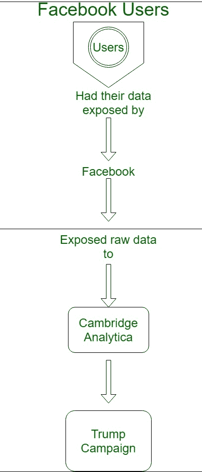

# 数据安全

> 原文:[https://www.geeksforgeeks.org/data-security/](https://www.geeksforgeeks.org/data-security/)

**数据**，这个词现在无论如何都在说，人们整天都在公司工作，小规模的数据保存在我的发现中，我们公司的数据不应该被任何机会或任何外力泄露，但是他们没有想到他们的数据是不安全的。

**为什么我们的数据不安全？**
我们在使用应用程序时感到自由，尤其是像脸书、Whatsapp 这样的社交媒体应用程序，这是不正常的，因为我们在不同的设备上登录，这对于我们的个人数据以及通过它链接的人来说都不是一个有利的条件。
例:2018 年剑桥分析(Cambridge Analytica)，一家以数据本身为原材料，以采矿、分析等不同方式进行处理的公司，用途很多。他们发现脸书在帮助他们竞选(竞选)的人的数据丑闻中有罪，它通过人们在应用程序上的活动/行为来分析一个人的个性。它的主要结果是知道特定政党和政治广告的投票人数。

下面是一个流程图，以便更好地理解–

数据是这个星球上的资产，在如今处理和保护数据非常关键，因为数据泄露并不难，黑客正在入侵个人资料并出售，数据出售是一种新的赚钱方式。

**数据安全**对于在线工作人员来说是最重要的部分，在这一点上不应该有任何妥协，但它仍然会发生，而且将会发生，因为他们无法摆脱被盗的数据，但可以通过多种方式在一定程度上加以控制。

**数据将如何得到保护？**

*   使用防火墙。
*   使用加密系统。
*   使用 VPN。
*   切勿授权给外部方。
*   使用强密码并经常更改。
*   我们应该尽可能避免使用公共网络，比如地铁、机场的无线网络。
*   登录另一台设备时，请务必解决信任问题。

从上面我们知道了我们离这一切有多远，这是不容易的，至少在我们自己的个人数据方面，这是你的，也是唯一的。

有法律规定，如果你认为有人拥有并使用数据，有权索要数据。所以，这完全取决于个人如何考虑这一点。