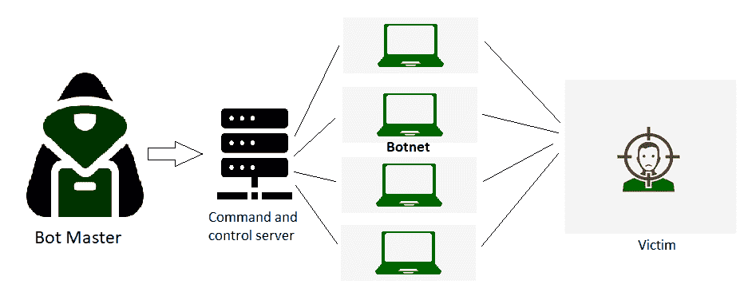

# DDoS 完整形式

> 原文:[https://www.geeksforgeeks.org/ddos-full-form/](https://www.geeksforgeeks.org/ddos-full-form/)

**DDoS** 代表**分布式拒绝服务**。它是一种网络攻击，是 DoS 攻击的一个子集，是有史以来最持久、最具破坏性的网络攻击之一。第一次大规模的分布式拒绝服务攻击发生在 1999 年 7 月，当时对手使用了一种名为 **Trin00** 的工具，通过感染总共 114 个计算机系统，使明尼苏达大学的计算机网络瘫痪两天，这些计算机系统又向该大学的网站发送数据包。过了一会儿，像雅虎、亚马逊、美国有线电视新闻网等众多网站。成为了 DDoS 攻击的新受害者。

#### 什么是 DDoS 攻击？

它是一种恶意的网络攻击，通过发送大量的互联网流量来破坏目标服务器或网络的正常流量。通过这样做，合法用户无法访问受损网络或**服务**。
攻击是**分布式**，这意味着多个设备首先被恶意脚本锁定，这样它们就可以成为流量的来源。

#### DDoS 攻击是如何发生的？

在 DDoS 攻击中，攻击者首先需要获得网络上系统的控制权。这可以通过**用恶意脚本**感染他们来实现。系统被破坏后，每个系统都被称为一个**机器人**，所有的机器人共同构成了一个被称为**僵尸网络的东西。**

一个规模非常小的僵尸网络看起来是这样的(攻击者控制所有被入侵的设备):

现在攻击者完全控制了僵尸网络，并向所有被入侵的系统发送更新的指令。这些机器人现在向目标 IP 地址发送大量数据包，因此导致其**溢出容量并最终关闭。**
因此，合法用户无法访问该服务。由于每个机器人也是合法的互联网设备，不能被受危害的服务识别为恶意软件，因此通常很难区分正常流量和虚假流量。

#### DDoS 攻击的主要类型

*   **基于卷的攻击–**
    攻击者试图消耗和**过载目标服务器(或服务)和互联网之间的所有带宽**。这又造成了巨大的拥塞，从而使用户无法访问服务。这是通过**使用僵尸网络发送大量数据包**来实现的。一些例子包括 UDP 泛洪、ICMP 泛洪和 ping 泛洪、DNS 放大。
*   **基于协议的攻击–**
    攻击者利用并攻击开放系统互连(OSI)模型的**第 3 层和第 4 层中的弱点。**此攻击消耗目标和中间服务以及任何其他网络硬件(如防火墙)的所有处理能力，从而导致网络中断。例子包括 SYN 洪水，死亡之平。
*   **基于应用的攻击–**
    这是最难识别的攻击之一。攻击者利用协议栈第 7 层的**弱点。目标是关闭一个在线应用程序或网站。在应用层，攻击集中在 **CPU 或内存**上，而不是网络本身。示例包括 HTTP 泛洪、缓存旁路和 DNS 服务器攻击。**

#### DDoS 攻击的缺点/后果是什么？

*   **一个品牌的声誉受损**:如果一个网站加载时间很长，用户就会转移到另一个提供类似服务的平台。此外，该网站将更不值得信赖和依赖。
*   **营业额减少**:对于一个在线网站来说，就像电商平台一样，如果服务无法到达，就无法进行交易，从而导致巨大的损失。
*   **生产力损失**:当发生 DDoS 攻击，关键网络系统关闭时，公司的生产力就停止了。

> **注:**
> DDoS 攻击在很多国家都是非法的，可以归入网络犯罪范畴。
> 如果被抓，最高可能会被判 10 年监禁或巨额赔偿。