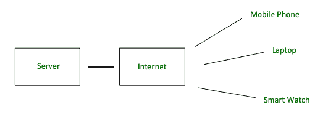
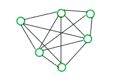
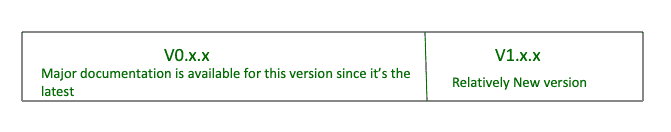

# 分散式网络–网络 3

> 原文:[https://www.geeksforgeeks.org/decentralized-web-web3/](https://www.geeksforgeeks.org/decentralized-web-web3/)

先决条件–[Web 1.0、Web 2.0 和 Web 3.0](https://www.geeksforgeeks.org/web-1-0-web-2-0-and-web-3-0-with-their-difference/)

自从引入计算机以来，我们已经走了很长的路，随着技术的每天进步，我们正在走一条似乎没有尽头的路。在计算机发明的早期，当计算机是独立的机器时，人们习惯于把数据存储在软盘上，取出后交给想要它的朋友。

然后是互联网，通过提供传输协议如 TCP/IP、UDP 等出现了 [WWW](https://www.geeksforgeeks.org/www-full-form/) 。这简化了交换信息的任务，因此我们看到了引入社交媒体和电子商务网站概念的网络 2 的兴起。网络 2 将想提供服务的人和想消费的人聚集在一起，彻底改变了世界秩序和经济。然而，缺点是总是需要中间人来确保信任。

**现有系统的问题:**
Web2 通过使其更具交互性和用户友好性而彻底改变了前端，而随着 Web3 的引入，前端没有太大变化，它是后端革命，关于数据如何在后端存储的数据架构。

每次您向脸书服务器请求数据时，服务器都会访问您的数据，所有这些数据都集中存储在它们的服务器上。现在随着物联网的出现，我们越来越多的设备，如冰箱、手表等。连接到互联网，因此第三方可以访问我们越来越多的数据，而这些数据显然是不可信的。

我们今天使用的互联网主要建立在独立计算机的概念上。数据集中存储和管理在可信机构的服务器上。这些服务器上的数据受防火墙保护，需要系统管理员来管理这些服务器及其防火墙。试图操纵服务器上的数据就像闯入住宅，那里的安全由围栏和报警系统提供。

**Figure –** Client-Server Internet

**为什么 Web3 是下一个可能的 BIG 东西？**
Web3 很难理解，因为它还处于早期阶段。随着 Ethereum 的引入，自 2015 年推出以来，领先的 Web3 区块链网络在塑造 Web3 的当前发展和分散化方面发挥着重要作用。由于 Web2 中经常出现数据泄露，Web3 的共识协议被设计成几乎不可能黑掉节点并访问数据。Web3 使用户能够控制数据隐私和数据所有权，而不是中间的第三方。本质上，Web3 技术为 P2P(点对点)通信、支付、服务和市场提供了基础。

**Figure –** P2P Network

由于 Web3 仍处于开发阶段，人们会发现 Web3 有两个版本，即 v0.x.x 和 v1.x.x。前者支持原语接口——仅支持异步代码的回调，而后者支持承诺+异步/等待。简而言之，两个版本的语法都有显著差异，后者是前者的改进版本。

**Figure –** Web3 Versioning

**挑战:**

1.  **可扩展性–**
    如今，区块链大部分地区都无法达到 Web2 应用程序提供的可扩展性。例如，Visa 每秒处理 1700-2500 个事务，而像 Ethereum 这样的 Web3 应用程序每秒只能处理 15-25 个事务。
2.  **数据隐私–**
    在数据安全方面，Web3 已经证明了自己优于 Web2，然而，交易数据和历史可以被任何人实时看到，只需知道用户的公开地址，这就产生了一种新的数据隐私问题。