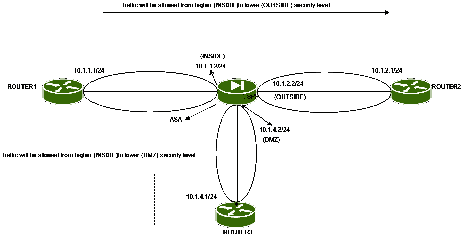
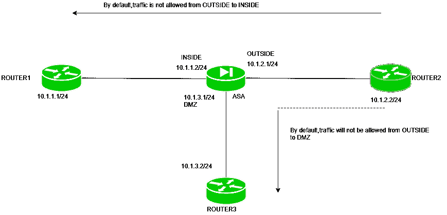
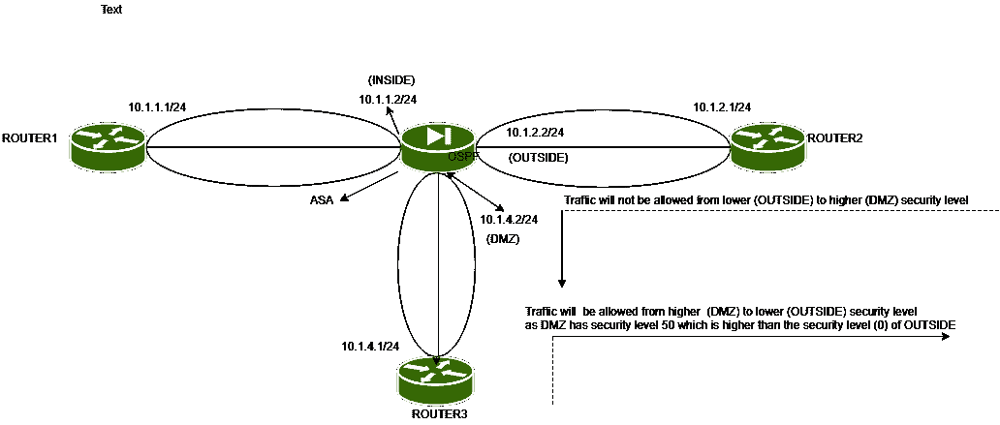

# 默认流量(ASA)

> 原文:[https://www.geeksforgeeks.org/default-flow-of-traffic-asa/](https://www.geeksforgeeks.org/default-flow-of-traffic-asa/)

先决条件–[自适应安全设备(ASA)](https://www.geeksforgeeks.org/computer-network-adaptive-security-appliance-asa-features/)
ASA 是一款思科安全设备，可执行防火墙功能，并具有 VPN 功能、路由支持、防病毒功能和许多其他功能。

**安全级别–**
ASA 使用与可路由接口相关联的安全级别。请记住，默认情况下，ASA 接口处于路由模式，即在第 3 层运行。这些接口被分配了从 0 到 100 的安全级别。数字越大，对连接到该 ASA 接口的网络的信任就越大。
根据安全级别，ASA 采取行动(是允许还是拒绝数据包)。

此外，请注意，我们可以为 ASA 接口指定名称，如内部、外部或 DMZ。一旦我们将这些名称分配给一个接口，它就会自动为自己分配一个安全级别。例如，如果我们为接口内部分配了一个名称，它会为自己分配 100(安全级别)，即最受信任的网络。如果我们将名称“外部”或“非军事区”或任何其他名称分配给接口，它将自动将安全级别 0 分配给。这些是默认值，可以更改。

给内部(最受信任的网络)100(最大值)，给外部(不受信任的或公共的网络)0(最小值)，给 DMZ(组织公共设备网络)50，这是一个很好的做法。

**注意–**
为 ASA 接口分配名称(内部、外部或 DMZ)并不是强制性的，但是分配这些名称是一种很好的做法，因为它们既简单又有意义。

**默认流量–**
请注意，如果流量被检查，则数据包的状态将被保留，即连接表将被维护，因此回复将被允许(来自不受信任的网络)，而如果对流量的操作被通过，则只有流量被通过，而没有连接表被维护。



*默认情况下，ASA 允许流量从较高的安全级别流向较低的安全级别*。如果流量是由安全级别较高的设备发起的，那么它将通过防火墙到达安全级别较低的设备，如外部或非军事区。

如果(TCP 或 UDP)流量是从较高的安全级别发起的，则允许来自较低安全级别(外部或非军事区)的回复(对于较高的安全级别)。这是由于默认的状态检测(这意味着数据包的状态将被保存在连接表中)。

但是，如果流量是 ICMP 的，将从较高的安全级别发送到较低的安全级别，那么它将到达较低的安全级别设备，并且较低的安全级别也将发送回应回复，但是防火墙(ASA)将丢弃它，因为默认情况下只检查 TCP 和 UDP 流量。

如果我们希望 ICMP 流量由 ASA 检查，那么我们必须通过命令手动检查。

```
asa(config)#fixup protocol ICMP 
```



*此外，如果较低安全级别(外部或非军事区)想要向较高安全级别发送任何流量(TCP、UDP* 、*或 ICMP)，则 ASA 防火墙会根据其默认策略*拒绝该流量。为了允许它，可以使用访问列表。



此外，请注意，当我们将安全级别 50 设置为非军事区，100 设置为内部，0 设置为外部时，将允许从非军事区到外部的流量，但非军事区设备仍然无法到达内部设备。

*同样，默认情况下，如果两个接口具有相同的安全级别，则流量将不被允许*。
但是可以通过命令手动允许流量(在具有相同安全级别的两个接口之间)

```
asa(config)#same-security-traffic 
                permit inter-interface 
```