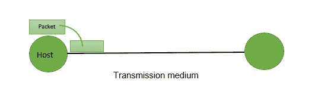

# 计算机网络延迟

> 原文:[https://www.geeksforgeeks.org/delays-in-computer-network/](https://www.geeksforgeeks.org/delays-in-computer-network/)

这里的延迟指的是处理特定数据包的时间。计算机网络中存在以下类型的延迟:

**1。传输延迟:**
将数据包从主机传输到传输介质所花费的时间称为传输延迟。



例如，如果带宽为 1 bps(每秒 1 位可以传输到传输介质上)，数据大小为 20 位，那么传输延迟是多少？如果在一秒钟内，可以传输 1 位。要传输 20 位，需要 20 秒。

假设 B bps 是带宽，L 位是数据的大小，那么传输延迟是，

```
Tt = L/B
```

这种延迟取决于以下因素:

*   如果有多个活动会话，延迟将变得很大。
*   增加带宽可以减少传输延迟。
*   如果链路在多台设备之间共享，媒体访问控制协议会极大地影响延迟。
*   发送和接收数据包涉及操作系统中的上下文切换，这需要有限的时间。

**2。传播延迟:**
数据包传输到传输介质后，必须经过介质才能到达目的地。因此，数据包的最后一位到达目的地所需的时间称为传播延迟。


影响传播延迟的因素:

1.  **距离–**如果介质的距离比较长，到达目的地需要更多的时间。
2.  **速度–**如果信号的速度(速度)更高，数据包将被更快地接收。

```
Tp = Distance / Velocity 
```

**注:**

```
Velocity =3 X 10^8 m/s (for air)
Velocity= 2.1 X 10^8 m/s (for optical fibre) 
```

**3。排队延迟:**
让数据包被目的地接收，数据包不会被目的地立即处理。它必须在一个叫做缓冲区的队列中等待。因此，它在被处理之前在队列中等待的时间量称为排队延迟。

一般来说，我们不能计算排队延迟，因为我们没有任何公式。

这种延迟取决于以下因素:

*   如果队列的大小很大，排队延迟会很大。如果队列是空的，将会有更少或没有延迟。
*   如果在很短或没有时间间隔内有更多的数据包到达，排队延迟将会很大。
*   服务器/链路数量越少，排队延迟越大。

**4。处理延迟:**
现在将对数据包进行处理，这称为处理延迟。

处理器处理数据包所需的时间，即中间路由器决定将数据包转发到哪里、更新 TTL、执行报头校验和计算所需的时间。

它也没有任何公式，因为它取决于处理器的速度，处理器的速度因计算机而异。

**注意:**排队延迟和处理延迟都没有任何公式，因为它们取决于处理器的速度
这个延迟取决于以下因素:

*   这取决于处理器的速度。

```
Ttotal = Tt + Tp + Tq + Tpro

Ttotal = Tt+Tp
(when taking Tq and Tpro equals to 0) 
```