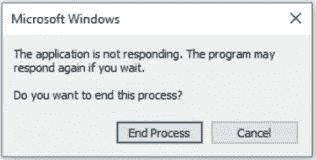

# 拒绝服务:软件不安全的领跑者

> 原文:[https://www . geesforgeks . org/拒绝服务-软件不安全的领跑者/](https://www.geeksforgeeks.org/denial-of-service-a-frontrunner-for-software-insecurity/)

在本文中，我们将讨论[拒绝服务](https://www.geeksforgeeks.org/deniel-service-prevention/)攻击，这些攻击在 C 编程中很容易受到影响。此外，我们将借助示例介绍防御策略、攻击者视角，最后得出结论。我们一个一个来讨论。

**概述:**
当今世界，科技在我们的生活中扮演着至关重要的角色。你可以看到它是如何改变世界的，因为所有人都可以轻松地连接到世界上的任何地方。但是，考虑到交易、个人聊天、使用社交账户等活动正在上线，我们还需要关注安全部分。为公众使用而开发的软件永远不会远离被利用的威胁。无论是登录系统还是用户会话，都可能是软件中最薄弱的一环，并且有正当理由成为攻击目标，导致应用程序关闭、不良行为或只是窃取客户凭据。

**意外创建攻击目标:**
作为一名程序员，程序是从头开始构建的，倾向于用户定义数据结构及其大小，用于迎合数据的存储、处理。大小是隐式声明的，表示数据结构容纳的数据字节数不能超过它被指示容纳的字节数。

**示例–**
例如，让我们分析如下代码片段。

```
//Example of a login system
#include<stdio.h>

#include<string.h>

int main(void) {
  char A[15];
  int password = 0;

  printf("\n Enter the password \n");
  gets(A);

  if (strcmp(A, "p455w0rd")) {
    printf("\n Wrong Password \n");
  } else {
    printf("\n Correct Password \n");
    password = 1;
  }
  if (password) {
    //This branch gives admin privileges to user
    printf("\n Admin privileges are given to user \n");
  }
  return 0;
}
```

**分析程序:**
在这，我们将讨论对上述程序的分析。程序员指示数组 A 保存 15 字节的数据，以满足输入要求。这是善意的，程序员知道没有人会想在现有的机制下混日子。他/她在道德上不能被追究责任。普通用户只需遵循指导原则，输入凭据，获得访问权限，然后继续他们的一天。

**了解攻击者的视角:**
另一方面，攻击者无法事先筛选登录系统的源代码，但可以感觉到可能存在可以利用的漏洞点。这种威胁行为者正在寻找一个微小的窗口，通过这个窗口，他们可以利用他们的漏洞，让一个系统比以前更加瘫痪。有意地，密码的输入字段被垃圾发送，攻击者完全知道它不能容纳这么多字节。这是编译器应该负责的地方。在运行时之前，编译器没有缓冲区溢出检查来扫描代码。具有讽刺意味的是，编译器不会停下来检测易受攻击的数据结构的错误。开源工具，如 StackGaurd 和 StackSmash，可以用来防止出现错误

**开采后:**
开采后，可以观察到以下几种可能性。

*   应用程序关闭-无法处理溢出。
*   不良行为-软件显示无限循环、无响应和静态。
*   拒绝服务-在第 2 点中描述。



**它如何影响基于事务的服务:**
在这一部分中，您将看到攻击者如何利用您的弱点，这是由于内存、处理、端口数量等有限。你将用来提供服务。在服务器级别，您主要担心的应该是通过设置自我保护限制来避免崩溃。例如，设置您知道可以处理的最大连接数，并简单地拒绝任何其他连接。

**防御策略:**
全力以赴，通过使用专门的材料，比如防火墙，可以在一定程度上抵御攻击，但总有办法绕过它们。在这方面，我们必须遵循标准做法，如必须启用帐户安全性，以防止暴力发现用户密码是锁定帐户使用后，如果有人将输入错误的密码 3 至 5 次。这意味着，即使合法用户提供了他们的有效密码，他们也无法登录系统，直到他们的帐户被解锁。如果有办法预测有效的登录帐户，这种防御机制可能会变成针对应用程序的 DoS 攻击。

**结论:**
最佳编码实践是在培训阶段教给开发人员的，非常鼓励他们应用到软件开发中，但并不是所有的实践都是有效的，可以防止我们讨论的攻击方法。这是软件开发的失败之一。如前所述，攻击者根据你的弱点来玩你。开发人员有责任使系统更能抵抗攻击，同时隐藏弱点，使其不被发现，并在零日攻击中进行补救。