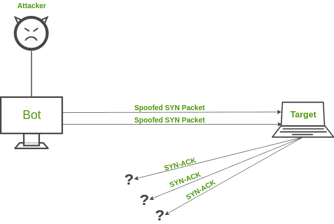
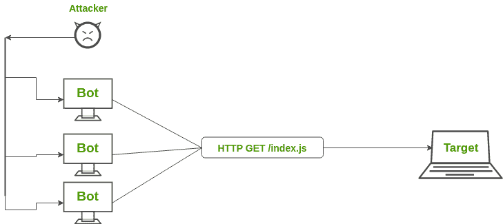
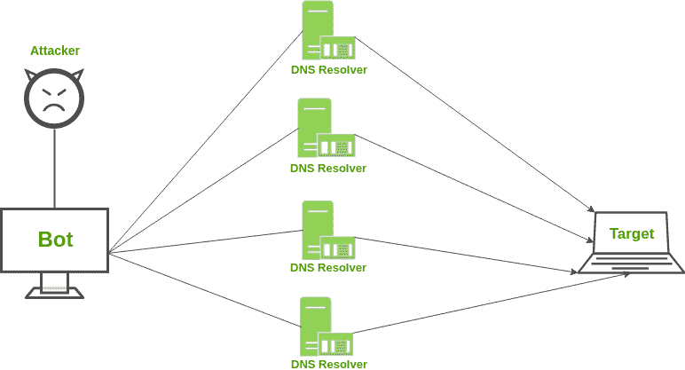

# 拒绝服务 DDoS 攻击

> 原文:[https://www . geesforgeks . org/拒绝服务-ddos-attack/](https://www.geeksforgeeks.org/denial-of-service-ddos-attack/)

想象一个场景，你正在访问一些网站，其中一个似乎有点慢。你可能会责怪他们的服务器提高了他们的可伸缩性，因为他们的网站上可能有大量的用户流量。大多数网站已经事先考虑到了这个问题。很有可能，他们是被称为分布式拒绝服务攻击的受害者。参见–[拒绝服务和预防](https://www.geeksforgeeks.org/deniel-service-prevention/)

在 DDoS 攻击中，攻击者试图通过引导来自多个终端系统的连续且巨大的流量来使特定的服务不可用。由于这种巨大的流量，网络资源被用于服务那些伪终端系统的请求，使得合法用户不能为他/她自己访问资源。

**DDoS 攻击的类型–**
DDoS 攻击可以分为三大类:

1.  **Application layer attacks –** 
    These attacks focus on attacking the layer 7 of the OSI model where the webpages are generated in response to the request initiated by the end user. For a client, generating a request does not take any heavy load and it can easily generate multiple requests to the server. On the other hand, responding to a request takes considerable load for the server as it has to build all the pages, compute any queries and load the results from the database according to the request. 
    **Examples:** HTTP Flood attack and attack on DNS Services. 
2.  **Protocol attacks –** 
    They are also known as state-exhaustion attacks. These attacks focus on vulnerabilities in the layer 3 and layer 4 of the protocol stack. These types of attacks consume resources like serves, firewalls and load balancers. 
    **Examples:** SYN Flood attack and Ping of Death. 
3.  **体积攻击–**
    体积攻击侧重于消耗网络带宽，并通过放大或僵尸网络使其饱和，以阻碍其对用户的可用性。它们很容易通过将大量流量导向目标服务器而产生。
    **举例:** NTP 放大、DNS 放大、UDP Flood 攻击、TCP Flood 攻击。

**常见的 DDoS 攻击–**

*   **SYN Flood attack –** 
    A SYN Flood attack works in a similar way a mischievous child keeps on ringing the door bell (request) and running away. The old person inside comes out, opens the door and does not see anyone (no response). Ultimately, after frequent such scenarios, the old person gets exhausted and does not answer even genuine people. A SYN attack exploits TCP Handshake by sending out SYN messages with a spoofed IP address. The victim server keeps on responding but does not receive final acknowledgement. 

*   **HTTP flood attack –** 
    In HTTP Flood attack, multiple HTTP requests are generated simultaneously against a target server. This leads to exhaustion of network resources of that server and thus fails to serve actual users’ requests. The variations of HTTP Flood attacks are – HTTP GET attack and HTTP POST attack. 

*   **DNS 放大–**
    假设一个场景，你给必胜客打电话，让他们给你回一个电话号码，告诉你他们所有的披萨组合以及配料和甜点。您用很小的输入生成了很大的输出。但是，问题是你给他们的号码不是你的。同样，域名系统放大的工作原理是从一个欺骗的 IP 地址请求域名系统服务器，并对您的请求进行结构化，以便域名系统服务器向目标受害者发送大量数据。

**DDoS 缓解–**
防止 DDoS 攻击比 DoS 攻击更难，因为流量来自多个来源，实际上很难将恶意主机与非恶意主机区分开来。可以使用的一些缓解技术有:

1.  **黑洞路由–**
    在黑洞路由中，网络流量被导向一个“黑洞”。在这种情况下，恶意流量和非恶意流量都会在黑洞中丢失。当服务器遭受 DDoS 攻击，并且所有流量都被转移用于维护网络时，此对策非常有用。

2.  **速率限制**
    速率限制包括控制网络接口发送或接收的流量速率。它可以有效地降低网页抓取器的速度以及暴力登录的工作量。但是，仅仅限制速率不太可能阻止复合 DDoS 攻击。

3.  **黑名单/白名单–**
    黑名单是屏蔽 IP 地址、URL、域名等的机制。并允许来自所有其他来源的流量。另一方面，白名单是指允许所有的 IP 地址、URL、域名等的机制。并拒绝所有其他来源访问网络资源。