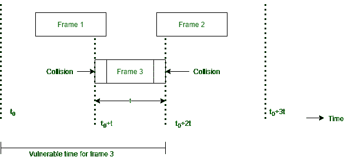

# 推导纯 ALOHA 协议的效率

> 原文:[https://www . geeksforgeeks . org/pure-the-efficiency-of-aloha-protocol/](https://www.geeksforgeeks.org/derive-the-efficiency-of-pure-aloha-protocol/)

一个 [ALOHA](https://www.geeksforgeeks.org/differences-between-pure-and-slotted-aloha/) 系统的效率是所有传输的帧中逃脱冲突的那部分，也就是没有陷入冲突的那部分。
考虑电脑(站)上的互动用户数量。每个用户要么在打字，要么在等待。最初，它们都处于打字状态。当用户键入一行时，用户会停止并等待。然后，该站发送包含该线路的帧，并检查信道以确认成功。如果成功，那么用户将再次开始键入，否则，用户等待，并且它的帧被重传很长时间，直到它被成功发送。

**帧时间:**
让帧时间定义为传输标准固定长度帧所需的时间量。
注意 ***帧时间=帧长度/比特率***

我们假设∨用户数根据泊松分布生成新帧，平均每帧时间 N 帧。N > 1 的值表示用户正在以高于信道能够处理的速率生成帧。所以大部分的画面都会面临碰撞。
因此 0 < N < 1，以减少碰撞次数。假设每帧时间有 k 次传输尝试(包括重传)。每帧时间 k 次传输的概率也是泊松。

假设平均传输次数为每帧时间 **G** 。所以， **G≥N** 。在低负载 N ≈ 0 时，冲突会更少，因此重传次数和 G ≈ N 会更少。随着负载的增加，冲突会更多，因此 G > N。综合所有这些，我们可以说，对于所有负载，吞吐量由下式给出:

**P0*****= S/G*****(成功传输的尝试帧的比例)**
***S = GP*****(每帧时间吞吐量)**

其中，P’=帧不会发生冲突的概率。

**图 3 中的第 3 帧无损到达且无碰撞的条件是什么？**

让 *t =发送一帧所需的时间*。如果在 t 0 到(t 0 + t)之间的任何时刻生成帧 1，那么它将与帧 3 碰撞，同样，在(t 0 + 1)和(t + 2t)之间生成的任何帧 2 也将与帧 3 碰撞。根据泊松分布，在给定的帧时间内产生 k 帧的概率由下式给出

**P[k]=[Gkx e(-G)/k！(泊松分布)**
其中 G =愿意传输数据的站数

所以生成零帧即 k= 0 的概率是 3。

**P[k]=[G0x e(-G))/0！**
**P[k]= e-2G**

如果一个时间间隔为两帧长，则在该时间间隔内生成的平均帧数为 2G。在易受攻击期间(可能发生冲突的时间)传输另一帧的概率是，

**P0= e-2G**
图为提供的流量 G 与吞吐量 S 的关系，显示最大吞吐量出现在**G = 0.5**
**S = 0.5 x e-2x 0.5**
**= 0.5 x e-1**
T22

s(最大)= 0.184。所以最好的信道利用率是 18.4%。这意味着 82%的帧以冲突告终，因此会丢失。