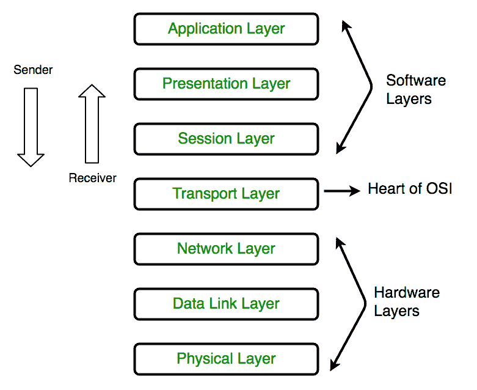

# 物理层的设计问题

> 原文:[https://www . geesforgeks . org/物理层设计问题/](https://www.geeksforgeeks.org/design-issues-in-physical-layer/)

**物理层**协调通过物理介质传输比特流所需的功能。它涉及接口和传输介质的机械和电气规格。

[OSI 参考模型](https://www.geeksforgeeks.org/layers-of-osi-model/)的最底层是物理层。它负责设备之间的实际物理连接。物理层包含比特形式的信息。它负责将各个位从一个节点传输到下一个节点。

**物理层功能:**

1.  **数据速率–**
    该层定义传输速率，即每秒的位数。
2.  **接口–**
    物理层定义设备和传输介质之间的传输接口。
3.  **位的表示–**
    该层中的数据由位流组成。这些比特必须编码成信号才能传输。它定义了编码的类型，即 0 和 1 是如何变成信号的。
4.  **线路配置–**
    该层通过介质连接设备，可以是点对点配置，也可以是多点配置。
5.  **传输模式–**
    物理层定义了单工、半双工、全双工等两种设备之间的传输方向。
6.  **拓扑–**
    设备必须通过任何拓扑连接，可以是网状、星形、总线和环形。

**物理层的设计问题:**

*   物理层主要是通过通信信道传输原始比特。
*   这里的设计问题主要涉及电气、机械、定时接口以及位于物理层之下的物理传输介质。
*   设计问题与确保当 1 比特从一侧发送时，它被另一侧接收 1 比特而不是 0 比特有关。

这里的一些问题如下:

1.  一位能持续多少纳秒？
2.  1 位应该用多少伏，0 位应该用多少伏？
3.  网络连接器有多少个引脚，每个引脚用于什么？