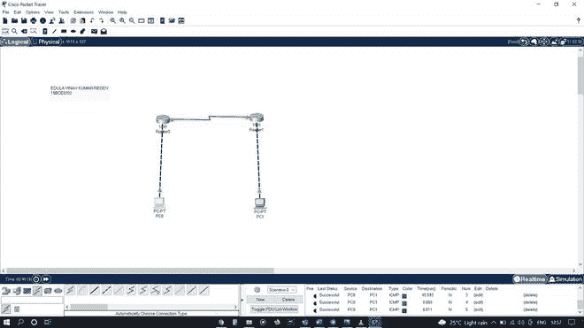
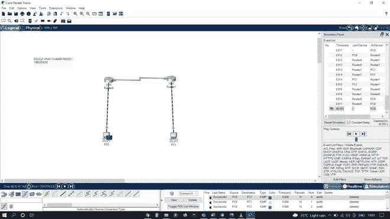
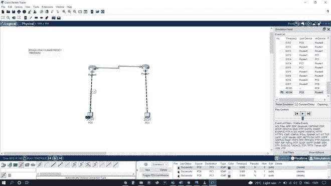
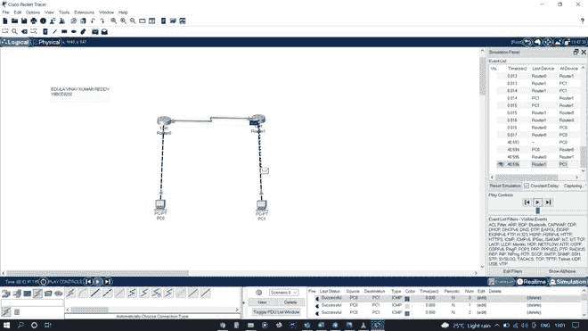
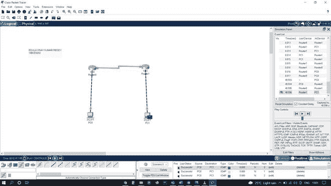
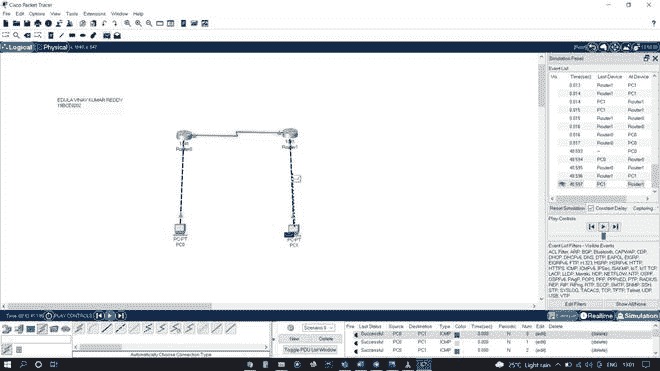
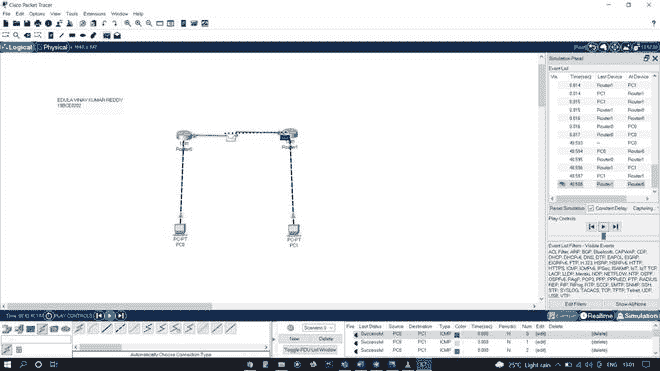

# 使用思科数据包跟踪器设计串行端口配置

> 原文:[https://www . geesforgeks . org/design-a-serial-port-configuration-use-Cisco-packet-tracer/](https://www.geeksforgeeks.org/designing-a-serial-port-configuration-using-cisco-packet-tracer/)

本文涉及使用串行接口 se0/0/0 或 se0/0/1 在 cisco packet tracer 中进行串行端口配置的分步设计。在端、还将讨论如何通过在远程电脑之间传输 PDU 来检查网络连通性。

### 目标:

*   使用两台路由器和两台电脑在 cisco packet tracer 中配置串行端口。
*   设计网络拓扑的模拟。
*   通过从 PC0 向 PC1 发送一个简单的 PDU 来检查网络连通性。

### 程序:

**步骤 1(配置路由器 0):**

1.  从网络设备中选择一台 1841 路由器，并将其拖放到工作区。
2.  选择路由器 0 并转到物理。
3.  关闭 Router0 的 PowerPoint，然后选择 WIC-2T 串行端口连接器，并将其放在交换机上建立连接。之后打开路由器 0 的幻灯片。
4.  选择路由器 0 并转到配置。
5.  通过将 IP 地址分配为 192.168.10.1，将子网掩码分配为 255.255.255.0 来配置快速以太网 0/0，并打开端口状态
6.  通过将 IP 地址分配为 192.168.30.1 并将子网掩码分配为 255.255.255.0 来配置 Serial0/0/0，并打开端口状态。

**步骤 2(配置路由器 1):**

1.  从网络设备中选择一台 1841 路由器，并将其拖放到工作区。
2.  选择路由器 1 并转到物理。
3.  关闭路由器 1 的 PowerPoint，然后选择 WIC-2T 串行端口连接器，并将其放在交换机上建立连接。之后打开路由器 1 的幻灯片。
4.  选择路由器 1 并转到配置。
5.  通过将 IP 地址指定为 192.168.40.1，子网掩码指定为 255.255.255.0 来配置快速以太网 0/0，并打开端口状态。
6.  通过将 IP 地址分配为 192.168.30.2 并将子网掩码分配为 255.255.255.0 来配置 Serial0/0/0，并打开端口状态。

**步骤 3(配置 PC0):**

1.  从终端设备中选择一台电脑-个人电脑类型的电脑，并拖放到工作区。
2.  选择 PC0，转到配置中的快速以太网 0，为 PC0 分配一个 IP 地址和子网掩码，分别为 192.168.10.2、255.255.255.0，并打开端口状态。
3.  在配置中，转到设置，并将默认网关指定为 192.168.10.1

**步骤 4(配置 PC1):**

1.  从终端设备中选择一台电脑-个人电脑类型的电脑，并拖放到工作区。
2.  选择 PC1，转到配置中的快速以太网 0，为 PC0 分配一个 IP 地址和子网掩码，分别为 192.168.40.2、255.255.255.0，并打开端口状态。
3.  在配置中，转到设置，并将默认网关指定为 192.168.40.1

**步骤 5(建立连接):**

1.  使用交叉铜线将 PC0 与 Router0 连接起来。
2.  使用 DCE 电缆连接路由器 0 和路由器 1。
3.  使用交叉铜线将 PC1 与路由器 1 连接起来。
4.  要告诉路由器间接连接的网络，请使用 CLI 中的 IP 路由命令。

**电脑配置表:**

<figure class="table">

| **装置** | **主机名** | **IP 地址 Fa0/0** | **子网掩码** | **默认网关** |
| PC-PT 电脑 | PC-0 | 192.168.10.2  | 255.255.255.0  |   192.168.10.1  |
| PC-PT 电脑 | PC-1 | 192.168.40.2  | 255.255.255.0  |    192.168.40.1  |

**路由器配置表:**

<figure class="table">

| **装置** | **主机名** | **IP 地址 Fa0/0** | **IP 地址 Se0/0/0** | **子网掩码** |
| 1841 路由器 | 路由器-0 |     192.168.10.1  | 192.168.30.1  | 255.255.255.0  |
| 1841 路由器 | 路由器-1 |     192.168.40.1 | 192.168.30.2 | 255.255.255.0  |

### **设计网络拓扑:**

### **设计网络拓扑模拟:**

**从 PC0 向 PC1 发送一个分组数据单元。**

   

**从 PC1 到 PC0 的确认。**

  

</figure>

</figure>