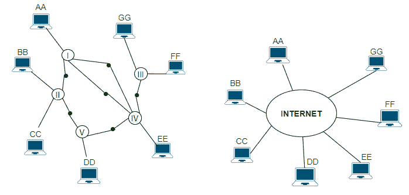
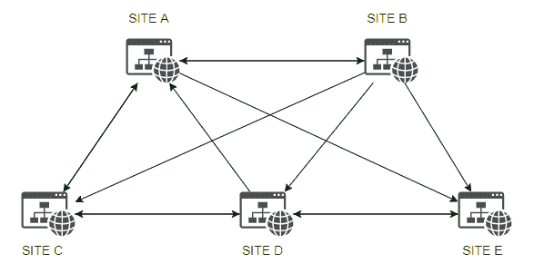
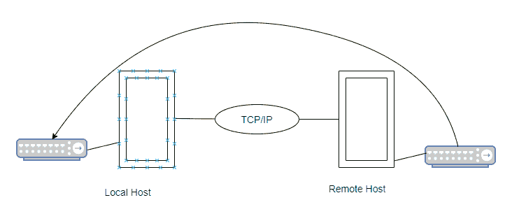
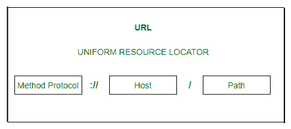
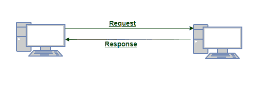

# 目的地 IP 地址

> 原文:[https://www.geeksforgeeks.org/destination-ip-addresses/](https://www.geeksforgeeks.org/destination-ip-addresses/)

每个 IP 数据报包含一个源地址和一个目的地址。根据数据包报头中的 IP 地址，有一项任务是将数据包以 IP 形式从源主机传送到目标主机。无论要传送的是什么封装数据，都由 IP 数据包结构定义。利用源和目的地信息，它定义了用于标记数据报的寻址方法。

#### 使用类型:

**【TCP/IP】****:**

1.  计算机之间有一种协议通信，用作通过网络传输数据的标准，并构成标准互联网协议的基础。这被称为传输控制协议或互联网协议。
2.  它是在两台计算机之间执行数据传输的一组组合协议，而建立这种在两台计算机之间通过互联网传输数据的方法的一组规则是可能的互联网拓扑。
3.  主机以字母 AA、BB、CC 等开头，实心圆圈数字是 1、2、3 这些是路由器或网关，包含罗马数字的较大椭圆是单独的物理网络。

[**【UDP】**](https://www.geeksforgeeks.org/user-datagram-protocol-udp/):--

1.  在称为数据报的单个消息的帮助下，作为传输协议的用户数据报协议传输数据。
2.  它不提供可靠和顺序的数据传送，也不建立新的连接，也不支持数据流控制的错误连接，还用于传输小尺寸数据或传输它们的速度，这是从可靠性考虑的。
3.  **示例:-** 域名系统，实时音频&视频。

[**【FTP】**](https://www.geeksforgeeks.org/file-transfer-protocol-ftp-in-application-layer/):

1.  通过本地磁盘或互联网将文件从一个位置传输到另一个位置的方法称为文件传输协议。
2.  这是在互联网站点之间移动文件的常见方法。
3.  FTP 是一种登录到另一个互联网站点的特殊方式，目的是检索和发送文件。
4.  这种传输文件的方法是一种用于在互联网上的计算机之间传输文件的协议。

**TFTP** :

1.  普通文件传输协议在传输文件后不为用户目录功能提供密码保护，因为它是 FTP 的简化版本，与 TCP for IP 系列或依赖于无连接数据报传送服务 UDP 的协议相关联。
2.  通过这种方式，一个由服务器组成的网络通过一个共同的协议连接在一起，允许访问数以百万计的超文本资源。
3.  在世界各地，计算机上的文档集合通过可点击的超链接相互连接，超链接需要运行到浏览器程序才能访问网络。
4.  HTTP 的服务器允许文本图形、声音和视频文件在计算机网络中显示，该网络由通过超文本传输协议提供文本图形、声音和动画资源的互联网站点的集合组成。

 

[**URL**](https://www.geeksforgeeks.org/url-full-form/) **:**

1.  通过这个，网页的位置被识别，因为它访问需要地址的网页。
2.  分布在世界各地的文件很容易获得。
3.  www 使用位置标识符和统一资源定位符的概念。
4.  网址是定义互联网上任何一种信息的标准，不仅仅是方法主机和路径名。
5.  例如网址:http://www.yahoo.com。

*   **方法–**
    这是一个用于检索文档的协议，有几个协议，如 Gopher、FTP、HTTP、news 和 Telnet。
*   **主机–**
    主机名标识资源所在的主机。比如 www.abcd.com，这里 www 是主机名，abcd.com 是 a 域名。
*   **路径–**
    在该信息中，包含将目录与 UNIX 操作系统中的子目录和文件分开的斜线。
*   **HTTP–**
    超文本传输协议传输万维网的 HTML 文档，是这个万维网运行的主要协议。

[**DNS**](https://www.geeksforgeeks.org/domain-name-system-dns-in-application-layer/) :

1.  这是一种域名系统或服务，其中互联网服务将域名翻译成 IP 地址，因为这些是字母，容易记住。
2.  每当我们使用域名时，域名服务必须将该名称翻译成相应的 IP 地址。
3.  但是，IP 地址真的是基于互联网的，或者我们可以说互联网真的是基于 IP 地址的。

**通用域** :
也称组织域，按照通用行为划分注册主机。红色，从左到右，从关于主机的最特定信息开始，随着每个标签变得越来越通用，直到它们到达最右边的标签，并描述命名主机的更大的组附属关系:

1.  。商业组织，
2.  。edu:教育机构，
3.  。政府机构，
4.  。国际组织
5.  。军事集团
6.  。网络:网络提供商
7.  。组织:除上述组织以外的组织。