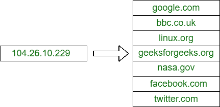
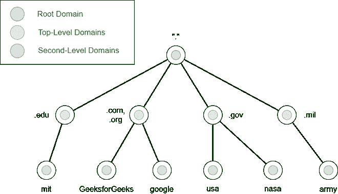
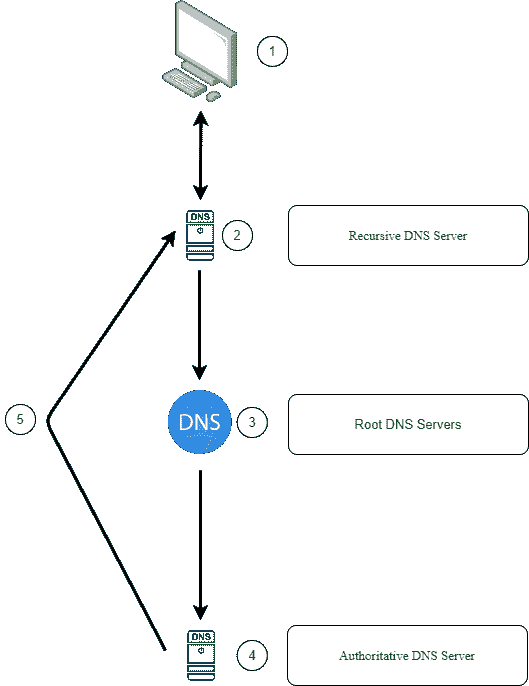

# 域名系统详情

> 原文:[https://www.geeksforgeeks.org/details-on-dns/](https://www.geeksforgeeks.org/details-on-dns/)

**简介:**
[**DNS(域名系统)**](https://www.geeksforgeeks.org/domain-name-system-dns-in-application-layer/) 让你无需记忆长串数字就能与互联网上的设备进行交互。互联网上的每台计算机都有自己唯一的地址，称为 IP 地址，就像每个家庭都有发送直邮的唯一地址一样。104.26.10.228 是一个 IP 地址，由从 0 到 255 的四组数字组成，用句点分隔。每次你想访问一个网站时，记住这些复杂的数字并不容易，这就是域名系统派上用场的地方。**可以记住 geeksforgeeks.org**而不是 104.26.10.228。

**域层次:**

[**TLD(顶级域名)**](https://www.geeksforgeeks.org/introduction-to-domain-name/)T4:
A**TLD**是一个域名最右边的部分。geeksforgeeks.com 的 TLD 是”。com”。顶级域名分为两类:通用顶级域名和国家代码顶级域名。历史上，通用顶级域名(gTLD)的目的是告知用户域名的用途；例如，a.com 将用于商业目的。组织的组织。edu 教育学院。政府的州长。国家代码顶级域名(ccTLD)用于地理目的，例如。ca 代表加拿大站点，co.uk 代表英国站点，以此类推。由于高需求，出现了许多新的通用顶级域名，包括. online、。俱乐部，。网站，。商业和许多其他行业。

**SLD(二级域):**
The。**geeksforgeeks.org**的 com 组件是顶级域名，geeksforgeeks 是二级域名。二级域名只能包含 a-z 0-9 和连字符，并且在注册域名时限制为 63 个字符和顶级域名(不能以连字符开头或结尾，也不能包含连续的连字符)。

**子域:**
句点用于将子域与二级域分开。例如，管理部分是一个名为 admin.geeksforgeeks.org 的子域。子域名称与二级域一样，限制为 63 个字符，只能包含字母 a-z、0-9 和连字符(不能以连字符或连续连字符开头或结尾)。要创建更长的名称，可以使用多个用句点分隔的子域，如**mailer.servers.geeksforgeeks.org**。但是，最大长度不应超过 253 个字符。您可以为您的域名创建任意数量的子域。

**DNS 记录类型:**
然而，DNS 不仅仅是针对网站，还有很多其他类型的 DNS 记录。我们将讨论一些你可能会遇到的最常见的问题。

*   **记录–**
    例如，104.26.10.228 是这些条目解析到的 IPv4 地址。
*   **AAAA 记录–**
    例如，2506:4700:20::681a:bc6 解析为 IPv6 地址。
*   **CNAME 记录–**
    例如，Geeksforgeeks 网店的子域名为 marketing.geeksforgeeks.org，给出了 marketing.shopify.com 的 CNAME 记录。为了确定 IP 地址，另一个 DNS 请求将被发送到 marketing.shopify.com。
*   **MX 记录–**
    这些记录指向为您正在寻找的域处理电子邮件的服务器。例如，geeksforgeeks.com 的 MX 记录响应看起来像 alt1.aspmx.l.google.com。这些文件上还有一个优先标志。它指示客户端尝试服务器的顺序。当主服务器出现故障并且需要将电子邮件发送到备份服务器时，这非常有用。
*   **TXT 记录–**
    TXT 记录是文本字段，可用于存储任何基于文本的数据。TXT 记录可以用于多种用途，但最常见的一种是识别有权代表域发送电子邮件的服务器(这有助于打击垃圾邮件和假冒电子邮件)。是)。在注册第三方服务时，它们也可以用来验证域所有权。

**当你发出 DNS 请求时，会发生什么？**

*   当您请求域名时，您的计算机首先检查其本地缓存，以查看您最近是否访问过该地址。如果没有，您的计算机将向递归 DNS 服务器发送请求。
*   您的 ISP 通常会为您提供递归 DNS 服务器，但您也可以使用自己的。最近发现的域名的本地缓存也保存在此服务器上。如果发现了一个本地结果，它会被返回到您的计算机，您的请求也就完成了(这对于流行的和高请求的服务来说很常见，如谷歌、脸书、推特)。如果本地无法满足请求，则从互联网的根域名系统服务器开始寻找适当的响应。
*   根服务器充当互联网的 DNS 主干，根据您的请求引导您找到合适的顶级域服务器。例如，如果您请求**www.geeksforgeeks.org**，根服务器将识别。org 顶级域名，并指引您找到合适的 TLD 服务器 for.com 地址。
*   TLD 服务器跟踪在哪里寻找响应域名系统请求的权威服务器。权威服务器有时被称为域名服务器。例如，kip.ns.cloudflare.com 和 uma.ns.cloudflare.com 是 geeksforgeeks.org 的域名服务器。一个域名的多个名称服务器经常被用作备份，以防万一。
*   权威的域名系统服务器是存储域名的域名系统记录的服务器，在该服务器上可以对该域名的域名系统记录进行任何修改。然后，域名系统记录被传输到递归域名系统服务器，在那里，本地副本被缓存以备将来查询，然后被发送回基于记录类型发出请求的发起客户端。