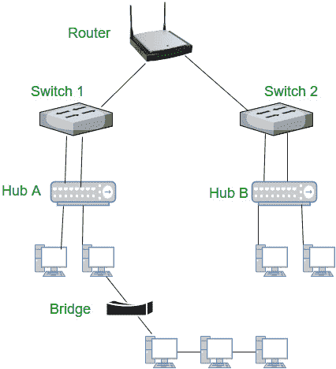

# TCP/IP 模型各层使用的设备

> 原文:[https://www . geesforgeks . org/devices-每层使用的 tcp-ip-model/](https://www.geeksforgeeks.org/devices-used-in-each-layer-of-tcp-ip-model/)

先决条件–[TCP/IP 模型](https://www.geeksforgeeks.org/computer-network-tcpip-model/)、[网络设备](https://www.geeksforgeeks.org/network-devices-hub-repeater-bridge-switch-router-gateways/)

**1。物理层–**TCP/IP 模型的物理层负责两台设备的物理连接。物理层使用的一些设备有:

*   **集线器:**
    集线器是通常用于连接局域网网段的设备。它包含多个输入/输出端口。当信号在任何一个输入端口时，除了它来自的输出端口之外，该信号将在所有输出端口产生。
*   **电缆:**
    在有线网络架构(例如以太网)中，电缆用于互连设备。一些类型的电缆是同轴电缆、光纤电缆和双绞线电缆。
*   **调制解调器:**调制解调器代表调制器/解调器。调制解调器将计算机产生的数字信号转换成模拟信号，然后通过电缆线路传输，并将输入的模拟信号转换成数字信号。
*   **中继器:**
    中继器用于传输系统，以再生因传输损耗而失真的模拟或数字信号。模拟中继器只能放大信号，而数字中继器可以将信号复制到接近其原始质量。

**2。数据链路层–**数据链路层负责根据媒体访问控制地址逐跳传输数据(即在同一局域网内，从一台设备传输到另一台设备)。数据链路层使用的一些设备有:

*   **网桥:**
    网桥是一种计算机网络设备，它提供与使用相同协议的其他网络的互连，将两个不同的网络连接在一起，并在它们之间提供通信。
*   **网络接口卡:**
    网络接口卡是一种安装在计算机只读存储器上的电子设备，用于将计算机连接到计算机网络，通常是局域网。它被认为是计算机硬件的一部分。大多数现代计算机支持直接嵌入主板的内部网络接口控制器，而不是作为外部组件提供。

**3。网络层–**网络层负责创建路由表，并根据路由表转发输入请求。网络层使用的一些设备有:

*   **路由器:**
    路由器是一种类似交换机的设备，它根据数据包的 IP 地址来路由/转发数据包。路由器通常将局域网(LAN)和广域网(wan)连接在一起，并具有动态更新的路由表，路由器根据该路由表来决定传入数据包的路由。
*   **Brouters:**
    桥接路由器或 brouter 是一种既能作为网桥又能作为路由器工作的网络设备。brouter 为已知协议路由数据包，并像网桥一样简单地转发所有其他数据包。Brouters 在网络层运行可路由协议(或者在具有不同数据链路层协议的网络之间运行。一个网络在以太网(802.3)上运行，另一个网络在令牌环网(802.5)上运行，并在数据链路层运行不可路由的协议(或者两个网络都使用相同的数据链路层协议)。

**图:**路由器、交换机、集线器和网桥的典型互联

**4。传输层–**传输层负责端到端通信(或进程间通信)。一些传输层设备是，

*   **网关:**
    在计算机网络中，网关是使用不同协议的两个网络的一部分。网关是一个协议转换器，它将一个协议转换成另一个协议。路由器是网关的特例。
*   **防火墙:**
    防火墙是一种旨在防止未经授权访问或来自专用网络的系统，防火墙的一些功能是，包过滤和作为代理服务器。

**5。应用层–**应用层是 TCP/IP 模型的最顶层，提供应用程序和网络之间的接口。应用层用于交换消息。应用层中使用的一些设备是，

*   *个人电脑、电话、服务器*
*   *网关和防火墙*