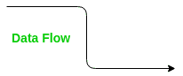
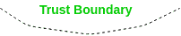
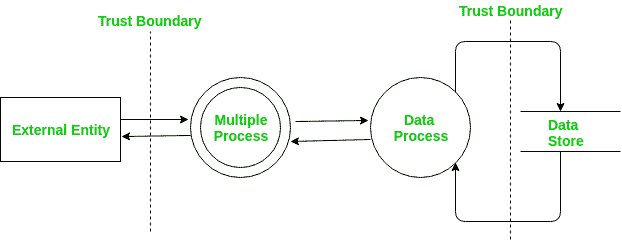

# 基于 DFD 的威胁建模|第 2 集

> 原文:[https://www . geesforgeks . org/DFD-基于威胁-建模-set-2/](https://www.geeksforgeeks.org/dfd-based-threat-modelling-set-2/)

先决条件–[威胁建模](https://www.geeksforgeeks.org/computer-network-threat-modelling/)、[基于 DFD 的威胁建模|集合 1](https://www.geeksforgeeks.org/dfd-based-threat-modelling-set-1/)
使用 DFD:
的**视觉表示本质上是迭代的。因此，系统建模涉及到 DFD 不同层次的构建。这意味着要准确地反映这个体系，DFD 必须以等级的方式组织起来。遵循 DFD 中使用的各种形状:** 

**1 流程–**
DFD 的每个流程都有一个唯一的编号，其中子流程将有一个以父流程编号为前缀的编号。流程是指对给定数据执行特定任务的实体。以下是流程的形状:

**2 多个流程–**
这意味着流程有一个子流程，子流程号以父流程号为前缀。例如，父进程号为 1。那么子流程的编号为 1.1，子流程的编号为 1.1.1，依此类推。多重处理的形状如下:

**3 外部实体–**
只能在入口点或出口点交互，位于系统外部。它可能只与一个进程或多个进程交互。它可以是数据源，也可以是数据的目的地。下面是在 DFD 使用的外部实体的形状:

**4 数据存储–**
是存储数据的地方，也是检索数据的地方。它只能与一个进程或多个进程交互。数据存储的形状如下:

**5 数据流–**
用于显示数据在元素之间的移动。下面是数据流的形状:

**6 信任边界–**
它是信任级别或特权之间的边界。下面是信任边界的形状:

DFD 从一个整体的上下文层次图开始，该图将整个系统表示为单个的多个进程。然后，每个节点都是代表其他进程的更详细的 DFD。

**确定威胁–**
这是威胁建模系统的最后一步。创建 DFD 后，下一步是确定对手在系统中可能拥有的目标。然后，这些目标用于确定威胁路径、定位入口/出口点，并跟踪系统中的数据，以了解哪些数据被提供给哪个节点。

在前进之前，我们将首先了解什么是威胁路径。威胁路径是执行某种安全关键操作的一系列进程节点，因此容易受到攻击。所有代表数据的变更或操作的流程节点都容易受到威胁。

以下是在此阶段执行的一系列步骤。

**威胁概况–**
这是描述以下两件事的安全设计规范:首先是系统中对手的可能目标，其次也是最重要的，是由于这些目标而存在的漏洞。

应该预防或减轻每个已识别的威胁。威胁概况包括以下关键领域:

1.  **Identify the threats –** 
    Threat identification is a very important step towards building a secure system. Identifying threats is a 3 step process where the first step involves analyzing each entry/exit point, the second step involves identifying the nature and type of critical processing occurring at entry/exit points and the third and the last step involves thinking and describing how entry/exit point might be attacked. Identifying threats is not an easy process to do. It involves asking questions like: 

    对手是否有可能不经审计或通过跳过访问控制或作为另一个用户来获得对资产的访问？

    对手如何使用或操纵数据从系统中检索信息，或编辑系统中的信息，或修改/控制系统，或获得额外权限，或导致系统失败或变得不可用。

    这些只是基本问题。这需要安全团队进行大量头脑风暴，以识别尽可能多的可能威胁。
    识别威胁的下一步是威胁分类。 **STRIDE** 是我们与 DFD 联合使用的威胁分类方法之一。我们在上一篇文章中讨论了 STRIDE。

2.  **Investigate and analyse the threats –** 
    After identifying threats next step is to conduct an in-depth analysis of identified threats to determine vulnerable areas and valid attack paths. 

    威胁树用于此目的。有两种方法来表示威胁树:一种是图形方式，另一种是使用文本表示。
    威胁树的基本结构由根节点和子节点组成。每个子节点代表对手发现和识别威胁所需的条件。识别漏洞的过程包括从没有子节点的节点开始，然后以自下而上的方式遍历到根节点。

    分析威胁的另一个步骤涉及确定威胁的风险和威胁条件。这是通过使用恐惧模型来完成的。我们在上一篇文章中已经讨论过这个模型。

3.  **减轻威胁造成的漏洞–**
    到目前为止，所有威胁都已被识别和解决。如果任何威胁仍未解决，那么它将导致漏洞。完成威胁树后，就可以识别攻击路径。如果不减少任何攻击路径，将导致漏洞。由威胁、威胁树、漏洞和缓解措施组成的威胁建模文档此威胁文档将在设计阶段用作安全规范文档，在测试阶段用作识别系统易受攻击区域的基础。