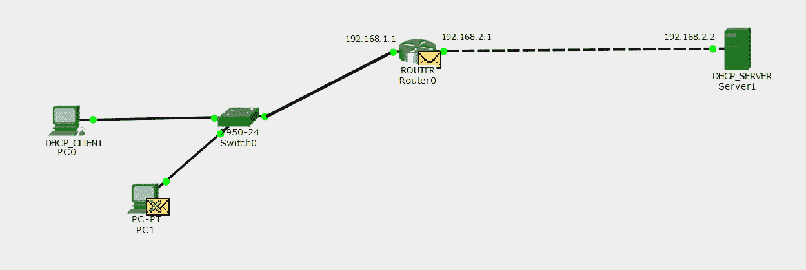
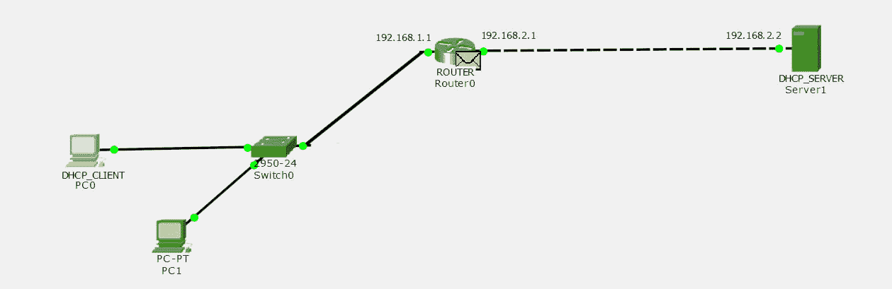
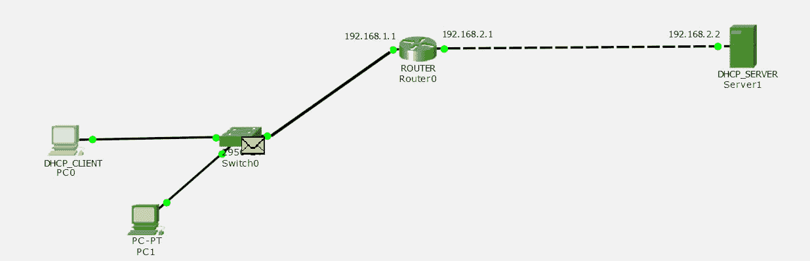
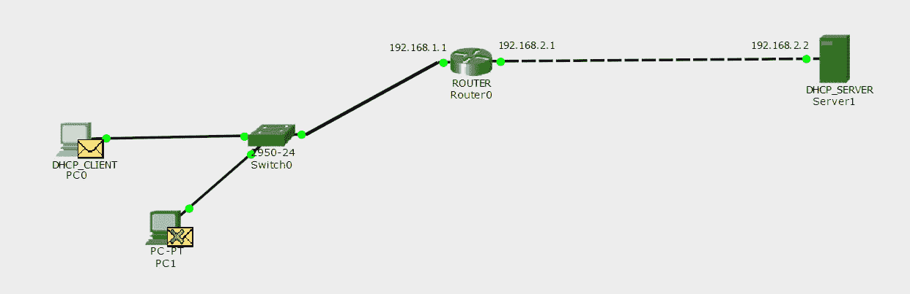
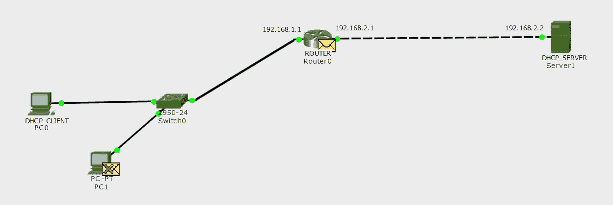
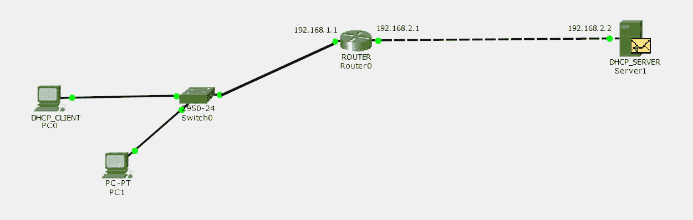
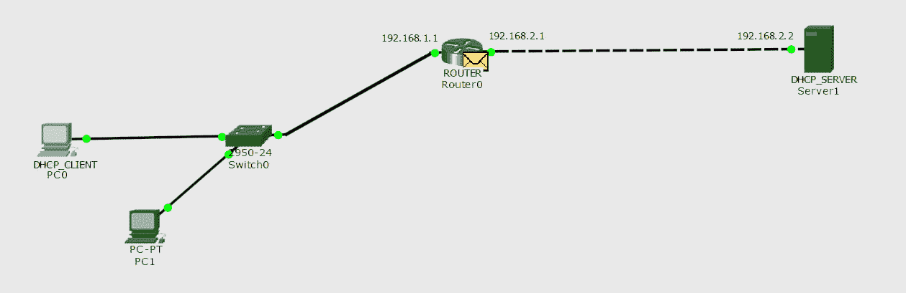
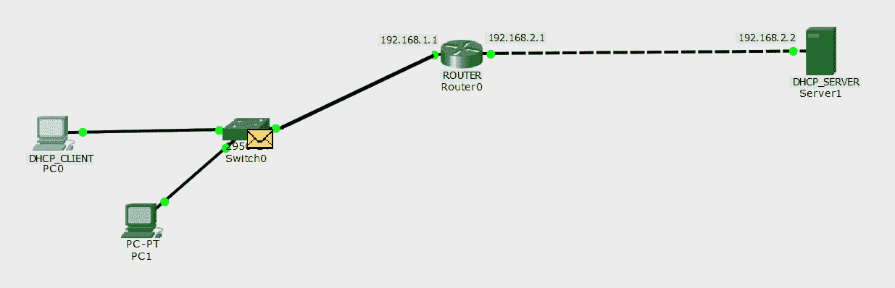
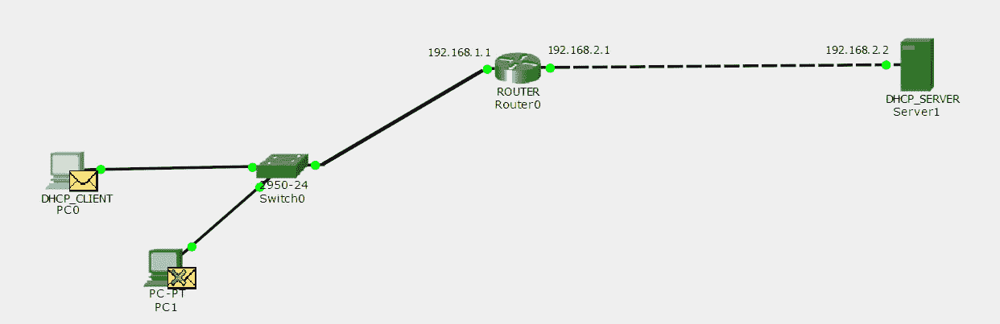

# 计算机网络中的 DHCP 中继代理

> 原文:[https://www . geesforgeks . org/DHCP-中继-计算机网络中的代理/](https://www.geeksforgeeks.org/dhcp-relay-agent-in-computer-network/)

先决条件–[动态主机配置协议(DHCP)](https://www.geeksforgeeks.org/computer-network-dynamic-host-configuration-protocol-dhcp/) 、[DHCP 服务器如何动态分配 IP 地址给主机？](https://www.geeksforgeeks.org/how-dhcp-server-dynamically-assigns-ip-address-to-a-host/)

为了给主机动态分配一个 IP 地址，DHCP 客户端在 DORA 过程中与 DHCP 服务器交换 DHCP 消息。

在多址接入过程中，根据广播标志的值，发现和请求消息被广播，提议和确认消息被广播或单播，即如果广播标志的值为 1，则提议和确认消息被广播，如果为 0，则消息被单播。但是，只有当 DHCP 服务器存在于同一网络中时，这才有效，因为路由器不会转发任何广播数据包。如果服务器位于不同的网络中，该怎么办？DHCP 中继代理的角色来了。

**DHCP 中继代理–**
DHCP 中继代理是任何 TCP/IP 主机，当服务器位于不同的网络上时，它用于在 DHCP 服务器和客户端之间转发请求和回复。中继代理接收 DHCP 消息，然后生成新的 DHCP 消息，在另一个接口上发送出去。此外，DHCP 中继代理添加 giaddr(数据包的网关地址)字段，如果启用，还添加中继代理信息选项 82。当服务器回复转发到主机时，选项字段将被删除。

**注意–**发现和请求消息由 DHCP 中继代理单播。

**示例–**


这是一个拓扑，其中有一个没有 IP 地址的 DHCP 客户端。有一台 DHCP 服务器的 IP 地址为 192.168.2.2，中间有一台路由器，因为 DHCP 中继代理的 IP 地址为 fa0/0 接口上的 192.168.1.1 和 fa0/1 接口上的 192.168.2.1。



现在，首先，发现消息由 DHCP 客户端广播，以找出交换机接收的 DHCP 服务器，因为它在同一个广播域中。交换机在网络中广播由个人计算机和路由器(DHCP 中继代理)接收的 DHCP 数据包。个人电脑和路由器接收广播数据包，但个人电脑会丢弃数据包，因为 DHCP 服务器位于不同的网络中，因此数据包只需发送到默认网关。


启用了 DHCP 中继代理功能的路由器用自己的地址替换源地址，用 DHCP 服务器的 IP 地址替换目的 IP 地址，即 DHCP 中继代理将数据包单播到 DHCP 服务器。DHCP 中继代理将 giaddr 字段添加到数据包中，并将其转发到 DHCP 服务器。giaddr 字段被添加到数据包中，这样服务器应该知道它必须从哪个池分配 IP 地址。

在我们的例子中，giaddr 字段将包含 192.168.1.1(路由器[DHCP 中继代理]接收发现消息的接口的 IP 地址)。



服务器向提供释放的 IP 地址的路由器回复单播 DHCP 提议。



作为回报，路由器向发送了 DHCP 请求的网络广播 DHCP Offer 消息。广播消息由交换机接收，如上图所示。



交换机向主机广播 DHCP 提供消息。因此，该消息由 DHCP 客户端接收



现在，DHCP 客户端为交换机接收到的服务器广播 DHCP 请求消息，表示接受 IP 地址。交换机向另一台主机和路由器(DHCP 中继代理)广播 DHCP 请求消息，如上图所示。



路由器用自己的 IP 地址替换源 IP 地址，目的 IP 地址保持不变，即由 DHCP 中继代理单播



服务器向路由器(DHCP 中继代理)回复单播 DHCP 确认消息，如上图所示。



路由器反过来向网络广播 DHCP 确认消息，它接收到对 IP 地址的 DHCP 请求。广播消息由交换机接收，如上图所示。



当交换机通过其所有端口广播消息时，DHCP 客户端会收到广播的 DHCP 确认消息。

**配置–**

这是客户端、路由器、dhcp_server 的基本配置。路由器一直在 fa0/0 上分配 IP 地址 192.168.1.1，在 fa0/1 上分配 IP 地址 192.168.2.1。

```
ROUTER(config)#int f0/0
ROUTER(config-if)#ip address 192.168.1.1 255.255.255.0
ROUTER(config-if)#no shutdown
ROUTER(config)#int f0/1
ROUTER(config-if)#ip address 192.168.2.1 255.255.255.0
ROUTER(config-if)#no shutdown
```

DHCP_SERVER 在接口 fa0/0 上被分配了 IP 地址 192.168.2.2，DHCP 池被定义为名称 POOL1，子网掩码为 255.255.255.0 的网络 192.168.1.0 被分配给池 POOL1。

```

DHCP_SERVER(config)#int f0/0
DHCP_SERVER(config-if)#ip address 192.168.2.2 255.255.255.0
DHCP_SERVER(config-if)#no shutdown
DHCP_SERVER(config)#ip dhcp pool POOL1
DHCP_SERVER(dhcp-config)#network 192.168.1.0 255.255.255.0
DHCP_SERVER(dhcp-config)#default-router 192.168.1.1
DHCP_SERVER(dhcp-config)#exit
```

现在，IP helper-address 命令用于将路由器配置为 DHCP 中继代理，为 192.168.2.2 提供 DHCP_server 的地址。

```
ROUTER(config)#int f0/0
ROUTER(config-if)#ip helper-address 192.168.2.2
ROUTER(config-if)#exit
```