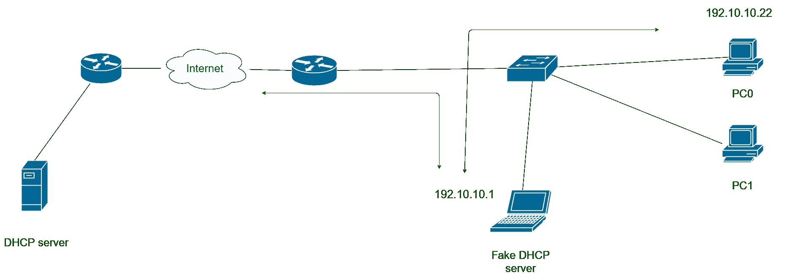
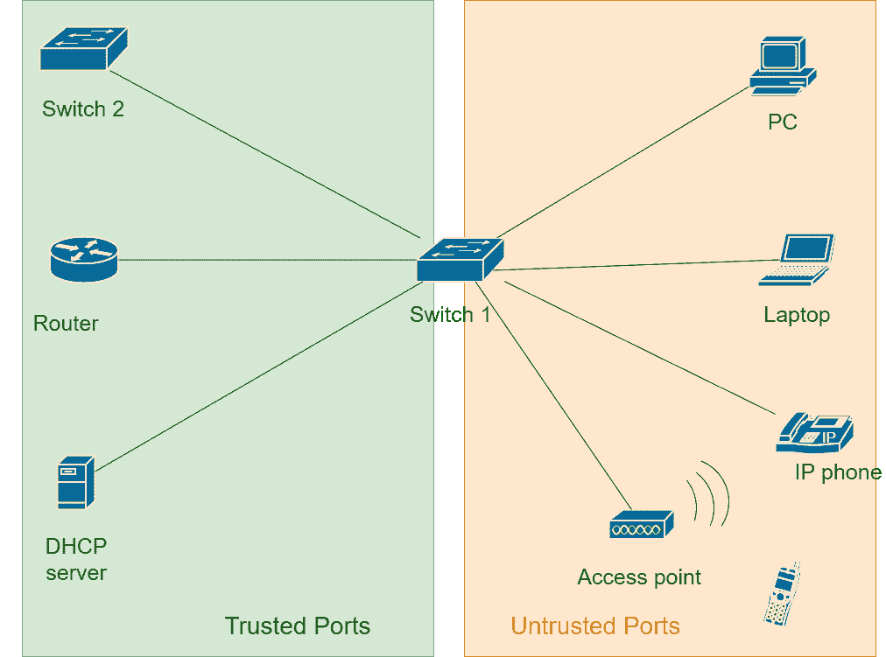
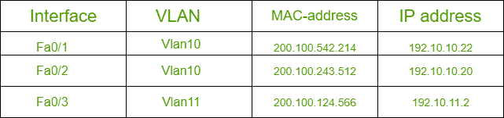

# DHCP 侦听

> 原文:[https://www.geeksforgeeks.org/dhcp-snooping/](https://www.geeksforgeeks.org/dhcp-snooping/)

先决条件–[动态主机配置协议(DHCP)](https://www.geeksforgeeks.org/dynamic-host-configuration-protocol-dhcp/)
我们在计算机网络中学习的每个协议都有一些规则，这些规则控制着协议的工作。这些规则有时为攻击者利用网络提供了途径。攻击者还可以利用 DHCP 的工作来破坏我们的网络。在本文中，我们将了解我们的网络如何受到威胁，以及我们如何防止它们。

**基于 DHCP 的攻击:**
考虑下面给出的场景。攻击者将他的笔记本电脑连接到网络，并充当假的 DHCP 服务器。我们知道，DHCP 客户端和服务器之间最初的多拉消息交换使用广播地址。攻击者监听广播，并向客户端租用自己地址、掩码和默认路由器。现在客户端会将其所有流量转发给攻击者。这造成了中间人攻击，违反了安全的完整性部分。

**Figure –** DHCP based attack

**DHCP 侦听:**
DHCP 侦听在连接终端设备的交换机上完成，以防止基于 DHCP 的攻击。基本上，DHCP 侦听将交换机的接口分为两部分

1.  **可信端口–**
    连接交换机、路由器、服务器等管理控制设备的所有端口都是可信端口。
2.  **不可信端口–**
    所有连接 PC、笔记本电脑、接入点等终端设备的端口都被设为不可信端口。

我们知道，DHCP 地址租用是在 DHCP 客户端和服务器之间交换 DORA 消息后完成的。

两条消息发现和请求来自客户端，两条消息提供和确认来自服务器端。使用这些信息，DHCP 侦听以下列方式工作

*   如果受信任的端口接收到“提供”和“确认”消息，则什么也不做，只是让它们通过。
*   如果不受信任的端口接收到“提供”和“确认”消息，那么这些消息将被阻止，因为它们是来自 DHCP 服务器的消息。不可信端口是应该连接到 DHCP 服务器端口。

**Figure –** Trusted and Untrusted ports

DHCP 不可信端口的逻辑可以更混乱一点。所有真实用户都连接到不受信任的端口。网络管理员无法知道哪些是合法用户，哪些是攻击者。DHCP 侦听功能在 DHCP 绑定表中保存用户租用地址的记录。该表包含接口、VLAN、媒体访问控制地址的记录，该地址被租用。这就检查了局域网中的身份盗用问题。

DHCP 侦听也可以配置为限制到达任何接口的请求数量。这有助于防止可能消耗整个地址空间或使 DHCP 服务器过载的 DOS 攻击。

**Figure –** DHCP Binding Table
