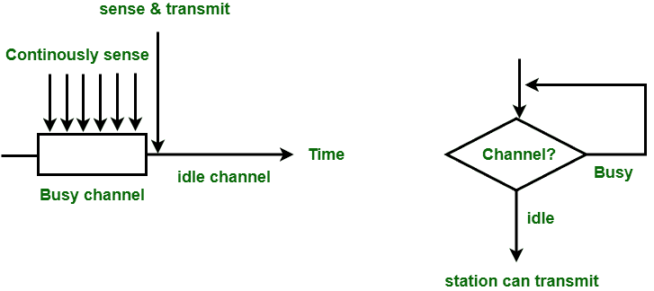

# 1-持续和非持续 CSMA 之间的差异

> 原文:[https://www . geesforgeks . org/difference-1-persistent-和-non-persistent-csma/](https://www.geeksforgeeks.org/difference-between-1-persistent-and-non-persistent-csma/)

先决条件–[载波侦听多路访问(CSMA)](https://www.geeksforgeeks.org/carrier-sense-multiple-access-csma/)
**1。1-持久 CSMA :**
在 1-持久 CSMA 中，站连续感测信道以检查其状态，即空闲或忙碌，以便它可以传输数据。如果频道忙，电台将等待频道空闲。当站发现空闲信道时，它以概率 1 在信道间无任何延迟地发送帧。由于概率 1，它被称为 1-持久 CSMA。这种方法的问题是冲突的可能性很大，因为两个或多个站可以在空闲状态下找到信道并同时传输帧。当冲突发生时，站必须等待随机时间，使信道空闲并重新开始。

**Figure –** 1 – persistent CSMA

**2。非持久性 CSMA :**
在非持久性 CSMA 中，有帧只发送通道感官的电台。在空闲信道的情况下，它将立即向该信道发送帧。如果发现信道忙，它将等待一段固定的时间，并再次检测站的状态是空闲还是忙。在这种方法中，当站点检测到前一次传输结束时，它不会为了捕获信道而立即感测信道。这种方法减少了冲突的机会，但降低了网络的效率。

**Figure –** Non – persistent CSMA

**1-持久性和非持久性 CSMA 之间的差异:**

| 基础 | 1-持久的 CSMA | 非持久性 CSMA |
| --- | --- | --- |
| 载波侦听 | 当信道空闲时，它将以概率 1 发送。 | 当信道空闲时，它将发送帧。 |
| 等待 | 它将持续检测帧传输的信道。 | 它将随机等待一段时间来检查载波。 |
| 碰撞的机会 | 在这种方法中，观察到的碰撞数量最多。 | 在这种方法中，碰撞的几率小于 1-persistent。 |
| 利用 | 它的利用率高于 ALOHA，因为只有在空闲状态下发现信道时才会发送帧。 | 它的利用率高于 1-持续，因为在这种情况下，所有的电台都会同时检查频道。 |
| 延迟低负载 | 它很小，因为帧只在空闲状态下发送。 | 它比 1 长-持久，因为它只在信道繁忙时随机检查。 |
| 延迟高负载 | 由于碰撞，它很高。 | 它比 1 长，因为当信道繁忙时，站点会随机检查。 |

