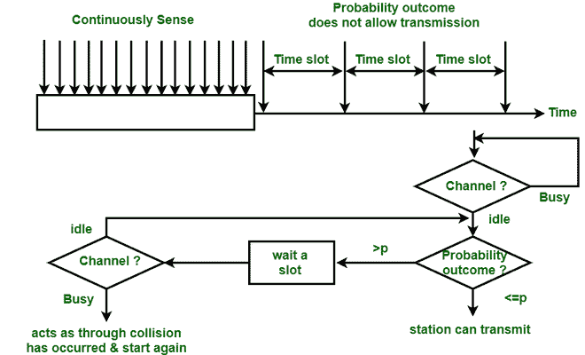
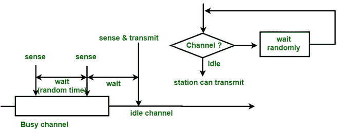

# 1 持久性、p 持久性和非持久性 CSMA 之间的差异

> 原文:[https://www . geesforgeks . org/difference-1-persistent-p-persistent-和-non-persistent-csma/](https://www.geeksforgeeks.org/difference-between-1-persistent-p-persistent-and-non-persistent-csma/)

先决条件–[载波侦听多路访问(CSMA)](https://www.geeksforgeeks.org/carrier-sense-multiple-access-csma/)

**1。1-持久 CSMA :**
在 1-持久 CSMA 中，站连续感测信道以检查其状态，即空闲或忙碌，以便它可以传输数据或不传输数据。万一频道忙，电台将等待频道空闲。当站点发现空闲信道时，它会将帧无延迟地发送到该信道。它以概率 1 传输帧。由于概率 1，它被称为 1-持久 CSMA。

这种方法的问题在于，冲突的可能性很大，因为两个或多个站同时发现处于空闲状态的信道和发送帧时，存在冲突的可能性。当冲突发生时，站必须等待信道空闲的随机时间，然后重新开始。

 

**Figure –** 1-persistent CSMA

**2\. p-persistent CSMA :**
This is the method that is used when channel has time-slots and that time-slot duration is equal to or greater than the maximum propagation delay time. When the station is ready to send the frames, it will sense the channel. If the channel found to be busy, the channel will wait for the next slot. If the channel found to be idle, it transmits the frame with probability p, thus for the left probability i.e. q which is equal to 1-p the station will wait for the beginning of the next time slot. In case, when the next slot is also found idle it will transmit or wait again with the probabilities p and q. This process is repeated until either the frame gets transmitted or another station has started transmitting.

**Figure –** p-persistent CSMA

**3\. Non-persistent CSMA :**
In this method, the station that has frames to send, only that station senses for the channel. In case of an idle channel, it will send frame immediately to that channel. In case when the channel is found busy, it will wait for the random time and again sense for the state of the station whether idle or busy. In this method, the station does not immediately sense for the channel for only the purpose of capturing it when it detects the end of the previous transmission. The main advantage of using this method is that it reduces the chances of collision. The problem with this is that it reduces the efficiency of the network.

**Figure –** Non-persistent CSMA

**Difference between 1-persistent, p-persistent and Non-persistent CSMA :**

| 参数 | 1-持久的 CSMA | 持久性 CSMA | 非持久性 CSMA |
| --- | --- | --- | --- |
| 载波侦听 | 当信道空闲时，它以概率 1 发送。 | 当信道空闲时，它以概率 p 发送。 | 它在信道空闲时发送。 |
| 等待 | 它持续感知频道或载波。 | 它等待下一个时隙。 | 它将等待随机的时间量来检查载体。 |
| 碰撞的机会 | 在这种情况下碰撞的可能性最高。 | 与 1-持久性和 p-持久性相比，机会更少。 | 与 1-持久性相比，机会较少，但比 p-持久性多。 |
| 利用 | 它的利用率高于 ALOHA，因为只有在信道空闲时才会发送帧。 | 它的利用率取决于概率 p。 | 它的利用率高于 1-持久，因为不是所有的电台都在同一时间不断检查频道。 |
| 延迟低负载 | 当信道空闲时发送帧时，该值较低。 | 当 p 很小时，它很大，因为当信道空闲时，站不会总是发送。 | 它很小，因为只要发现信道空闲，站就会发送，但比 1 长-持续时间，因为它在忙时检查随机时间。 |
| 延迟高负载 | 由于碰撞，它很高。 | 当信道空闲且信道很少空闲时，发送的概率 p 较小时，该概率较大。 | 它长于 1-持续时间，因为通道在繁忙时会被随机检查。 |

