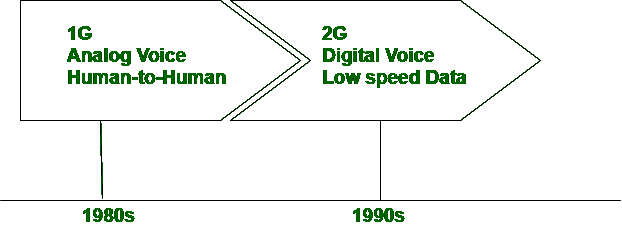

# 1G 和 2G 的区别

> 原文:[https://www.geeksforgeeks.org/difference-between-1g-and-2g/](https://www.geeksforgeeks.org/difference-between-1g-and-2g/)

**1G** 代表**第一代**、 **2G** 代表**第二代**是 2 代手机。1G 是第一代将第一次无线通信带到美国的手机。

1G 使用大专模拟信号进行通信，使用 FDMA 进行信道化。1G 用于口语，1G 不提供信息传输服务。2G 是 1G 的医疗保健，即它使用数字信号进行通信。2G 采用时分多址和码分多址进行信道划分，提供语音和数字通信服务。

让我们看看下面给出的 1G 和 2G 的区别:

| S.NO | 第一代 | 2G |
| 1. | 1G 代表第一代。 | 而 2G 代表第二代。 |
| 2. | 1G 使用电路切换。 | 而 2G 电路交换以及分组交换。 |
| 3. | 在 1G 中，不提供互联网。 | 而在 2G，则提供互联网。 |
| 4. | 1G 的语音信号是模拟信号。 | 而 2G 的语音信号是数字信号。 |
| 5. | 不提供 1G 中的数据服务。 | 而在 2G 中，除了复杂的数据(视频)外，还提供数据服务。 |
| 6. | 1G 中的信道化协议是 FDMA。 | 而 2G 中的信道化协议是 TDMA 和 CDMA。 |
| 7. | 1G 于 1980 年推出。 | 2G 于 1993 年推出。 |