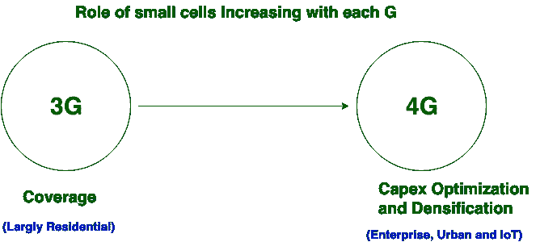

# 3G 和 4G 技术的区别

> 原文:[https://www . geeksforgeeks . org/3g 和 4g 技术的区别/](https://www.geeksforgeeks.org/difference-between-3g-and-4g-technology/)

3G 和 4G 在技术合规性、信息传输速率、容量、信息处理设计和连接种类等方面往往存在差异。 **3G** 代表**第三代**，其中优化的移动广场措施被开发用于批准具有更高属性的信息和宽带服务。 **4G** LTE 代表**第四代**，它提供了更快、更灵活的移动宽带体验，并允许大量连接。

让我们看看 3g 和 4g 技术的区别:

| S.NO | 3G 技术 | 4G 技术 |
| 1. | 它代表第三代技术。 | 而它代表第四代技术。 |
| 2. | 3G 技术最大上传速率为 5 Mbps。 | 而 4G 技术的最大上传速率是 500 Mbps。 |
| 3. | 3G 技术最大下载速率为 21 Mbps。 | 而 4G 技术的最大下载速率为 1 Gbps。 |
| 4. | 它使用分组交换技术。 | 而它使用分组交换技术以及消息交换技术。 |
| 5. | 3G 技术的频率范围是从 1.8 GHz 到 2.5 GHz。 | 而它的频率范围是从 2 千兆赫到 8 千兆赫。 |
| 6. | 它横向宽大。 | 虽然它在横向和纵向上都很宽松。 |
| 7. | 这是一个基于广域小区的网络架构。 | 而它是无线局域网和基于广域小区的网络架构的集成。 |
| 8. | 3G 技术中使用 turbo 码进行纠错。 | 4G 技术使用级联码进行纠错。 |