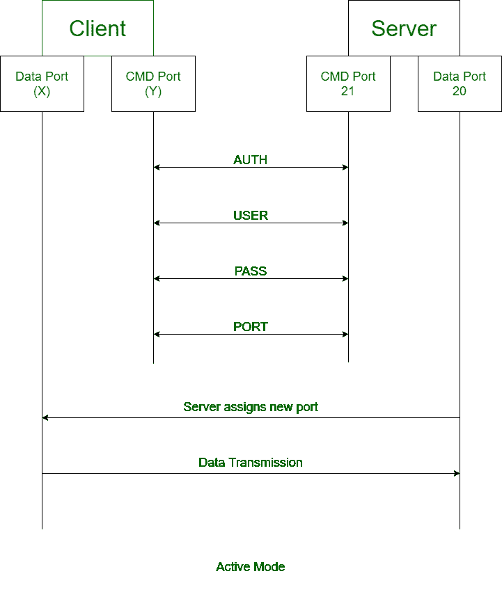
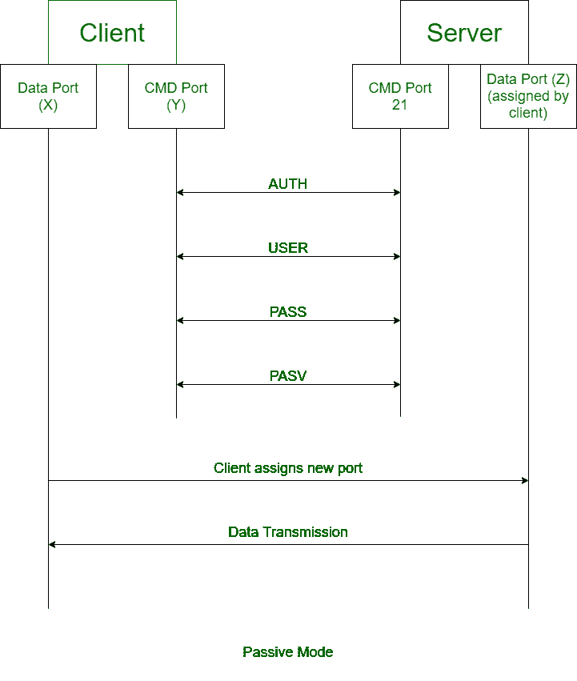

# 主动和被动 FTP 的区别

> 原文:[https://www . geesforgeks . org/主被动区别-ftp/](https://www.geeksforgeeks.org/difference-between-active-and-passive-ftp/)

**[FTP :](https://www.geeksforgeeks.org/file-transfer-protocol-ftp-in-application-layer/)**
FTP 代表文件传输协议。它是一种应用层协议，通过网络传输文件。它使用基于 TCP 的服务。

FTP 以两种不同的模式工作:

**1。主动 FTP :**
在主动模式下，客户端连接到随机端口，用于服务器传入的数据连接。客户端再次将下一个端口发送到 FTP 服务器，该端口在命令通道上得到确认。

**2。被动 FTP :**
在被动模式下，客户端使用控制连接向服务器发送 *PASV* 信号。FTP 服务器发回 IP 地址和服务器端口号。

主动和被动文件传输协议之间没有什么区别:

| 主动 FTP | 被动 FTP |
| --- | --- |
| 在主动 FTP 中，客户端建立命令通道，服务器建立数据通道。 | 在被动 FTP 中，命令通道和数据通道都是由客户端建立的。 |
| 主动 FTP 为 FTP 服务器提供安全性。 | 被动 FTP 不为 FTP 服务器提供安全性。 |
| 主动 FTP 可能会因为防火墙而导致问题。 | 被动 FTP 没有来自防火墙的连接问题。 |
| 活动模式不用作浏览器的默认模式。 | 被动模式用作浏览器的默认模式。 |
| FTP 客户端在数据通道上确认。 | FTP 服务器在数据通道上确认。 |
| 客户端向服务器发送随机端口号。 | 客户端向服务器发送 PASV 命令。 |

