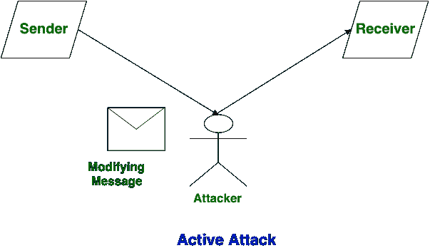

# 主动攻击和被动攻击的区别

> 原文:[https://www . geesforgeks . org/主动攻击和被动攻击的区别/](https://www.geeksforgeeks.org/difference-between-active-attack-and-passive-attack/)

先决条件–[安全攻击类型|主动和被动攻击](https://www.geeksforgeeks.org/types-of-security-attacks-active-and-passive-attacks/)
**主动攻击:**
主动攻击是攻击者试图更改或修改消息内容的攻击类型。主动攻击对完整性和可用性都是危险的。由于主动攻击，系统总是被破坏，系统资源可以被改变。最重要的是，在主动攻击中，受害者被告知攻击。

**被动攻击:**
被动攻击是攻击者观察消息内容或复制消息内容的攻击类型。被动攻击是保密的危险。由于被动攻击，对系统没有任何伤害。最重要的是，在被动攻击中，受害者不会被告知攻击。

**主动攻击和被动攻击的区别:**

| S.NO | 主动攻击 | 被动攻击 |
| 1. | 在主动攻击中，会发生信息修改。 | 在被动攻击中，信息的修改不会发生。 |
| 2. | 主动攻击对**完整性**和**可用性**都是危险的。 | 被动攻击是**保密**的危险。 |
| 3. | 在主动攻击中，注意力集中在检测上。 | 在被动攻击中，注意力集中在预防上。 |
| 4. | 由于主动攻击系统总是被破坏。 | 而由于被动攻击，对系统没有任何伤害。 |
| 5. | 在主动攻击中，受害者被告知攻击。 | 在被动攻击中，受害者不会被告知攻击。 |
| 6. | 在主动攻击中，系统资源可以改变。 | 在被动攻击中，系统资源不变。 |
| 7. | 主动攻击会影响系统的服务。 | 在被动攻击中，获取系统或网络中的信息和消息。 |
| 8. | 在主动攻击中，通过被动攻击收集的信息在执行过程中使用。 | 而被动攻击是通过自己收集密码、消息等信息来实现的。 |
| 9. | 主动攻击很难限制进入系统或网络。 | 与主动攻击相比，被动攻击很容易被禁止。 |