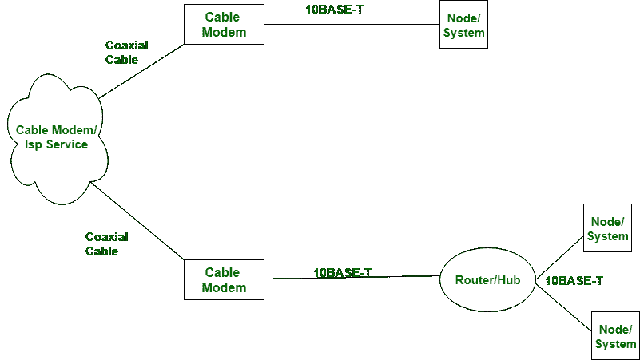

# 【ADSL 和电缆调制解调器的区别

> 原文:[https://www . geesforgeks . org/ADSL 和电缆调制解调器的区别/](https://www.geeksforgeeks.org/difference-between-adsl-and-cable-modem/)

**ADSL 调制解调器**和**有线调制解调器**似乎是提供宽带网络服务的高性价比策略。ADSL 电子设备和 Cable 电子设备的基本区别在于，ADSL 电子设备使用绞合组合电缆来提供各种语音和信息服务。另一方面，电缆调制解调器在线工作。

ASDL 调制解调器上的电缆调制解调器:

【ADSL 和有线调制解调器的区别:

| S.NO | ADSL 调制解调器 | 有线通 |
| 1. | ADSL 代表非对称数字用户线路。 | 它没有完整的形式。 |
| 2. | ADSL 调制解调器使用双绞线电缆。 | 而电缆调制解调器使用同轴电缆。 |
| 3. | 在 ADSL 调制解调器中，提供了安全性。 | 在电缆调制解调器中，不提供安全性。 |
| 4. | ADSL 调制解调器提供 200 Mbps 的峰值速度。 | 而电缆调制解调器提供 1.2 Gbps 的峰值速度。 |
| 5. | ADSL 调制解调器的可靠性更高。 | 而电缆调制解调器的可靠性不如 Adsl 调制解调器。 |
| 6. | ADSL 调制解调器的频率范围为 25 千赫至 1.1 兆赫。 | 而电缆调制解调器的频率范围从 54 兆赫兹到 1000 兆赫兹。 |

