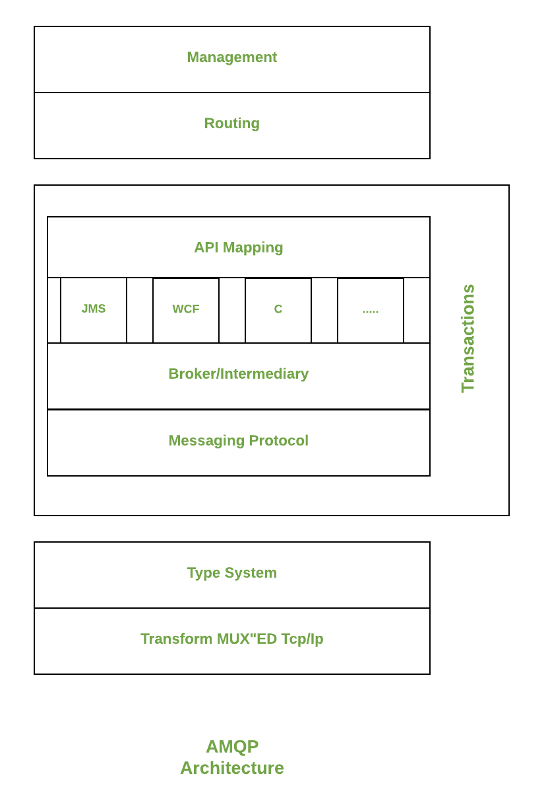
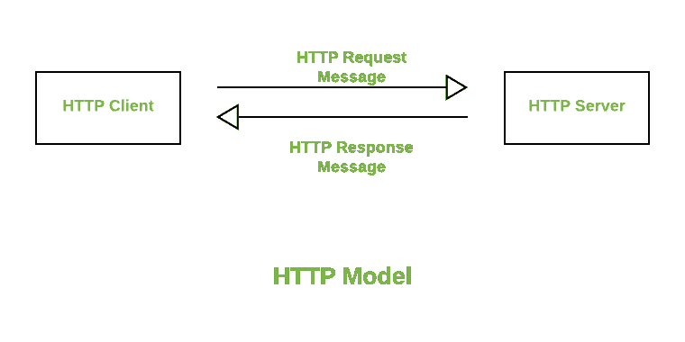

# AMQP 协议和 HTTP 协议的区别

> 原文:[https://www . geeksforgeeks . org/amqp 和 http 协议之间的区别/](https://www.geeksforgeeks.org/difference-between-amqp-and-http-protocols/)

**1。AMQP :**
AMQP 是高级消息队列协议的缩写。这是一种用于应用程序之间通信的协议。这是一个轻量级协议，支持数据传输应用。该协议用于技术的可扩展性和模块化。

**2。**[**HTTP**](https://www.geeksforgeeks.org/http-non-persistent-persistent-connection/)**:**
HTTP 是超文本传输协议的缩写。这是一种用于客户端和服务器之间通信的协议。该协议负责从服务器端到客户端的响应。它是 web 服务通信的基础协议。

**AMQP 和 HTTP 的区别:**

<figure class="table">

| 参数 | AMQP(美国食品及药物管理局) | 超文本传送协议 |
| --- | --- | --- |
| 完全形式 | 高级消息队列协议。 | 超文本标记协议。 |
| 开发人 | 它由摩根大通开发。 | 它是由蒂姆·伯纳斯·李开发的。 |
| 沟通本质 | 它具有异步通信性质。 | 它具有同步通信性质。 |
| 使用 | 它易于设置和管理。 | 它是以用户为中心的，可以用于各个方面。 |
| 消息传递 | 它保证了消息的传递。 | 它不能保证消息的传递。 |
| 连接 | 它提供发布/订阅接口。 | 它提供点对点接口。 |
| 容错 | AMQP 协议可以自行承担服务器崩溃问题。 | HTTP 协议不能对服务器故障问题做出反应。 |
| 分割 | 它具有分段的特性，可以将消息处理成槽。 | 它没有将每条消息视为段的能力。 |
| 协议特征 | 它是用于特定目的的特定协议。 | 它是通用协议，用于多种目的。 |
| 优势 | 这是一个快速、灵活、经济的协议。 | 它是众所周知的、高效的多用途协议。 |

</figure>