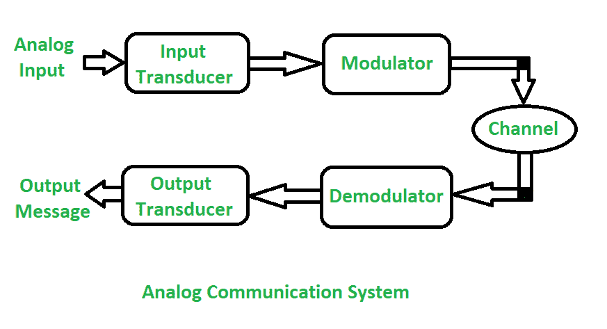
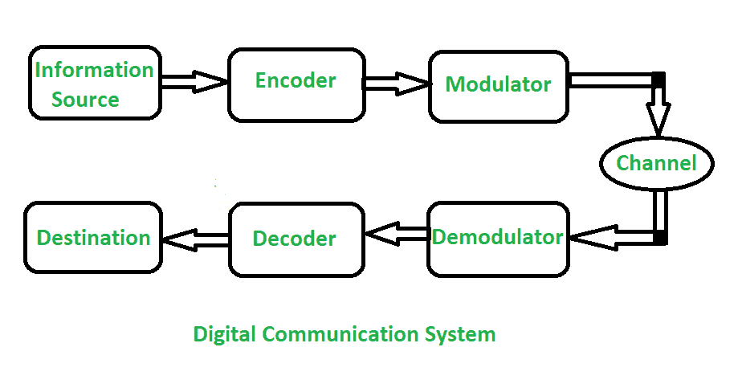

# 模拟通信和数字通信的区别

> 原文:[https://www . geesforgeks . org/模拟通信和数字通信的区别/](https://www.geeksforgeeks.org/difference-between-analog-communication-and-digital-communication/)

**1。模拟通信:**
在模拟通信中，数据在发送器和接收器之间借助模拟信号传输。任何类型的数据都是以模拟信号传输的。任何数据都是先转换成电子形式，然后通过通信通道传递的。模拟通信使用一个连续的信号，该信号的振幅、相位或其他特性随时间变化，与变量的变化成比例。

下图为**模拟通信系统:**

**2。数字通信:**
在数字通信中，源和目的地之间的通信使用数字信号，而不是模拟信号。数字信号由离散值而不是连续值组成。在数字通信中，数据的物理传输以数字比特流的形式发生，即通过[点对点或点对多点传输介质](https://www.geeksforgeeks.org/line-configuration-computer-networks/)传输 0 或 1。在数字通信中，数字传输数据可以被分解成离散的信息包，这在模拟通信中是不允许的。

下图为**数字通信系统**:

**模拟通信与数字通信的区别:**

<figure class="table">

| 没有。 | 模拟通信 | 数字通信系统 |
| --- | --- | --- |
| 01. | 在模拟通信中，模拟信号用于信息传输。 | 在数字通信中，数字信号用于信息传输。 |
| 02. | 模拟通信使用模拟信号，其幅度随时间从 0 到 100 连续变化。 | 数字通信使用幅度为两个电平的数字信号，低电平即 0，高电平即 1。 |
| 03. | 在通过通信信道传输的过程中，它会受到噪声的严重影响。 | 在通过通信信道传输的过程中，它受噪声的影响较小。 |
| 04. | 在模拟通信中，只能同时广播有限数量的频道。 | 它可以同时广播大量频道。 |
| 05. | 在模拟通信中，错误概率很高。 | 在数字通信中，出错概率很低。 |
| 06. | 在模拟通信中，抗噪声能力很差。 | 在数字通信中，抗噪声能力很好。 |
| 07. | 在模拟通信中，编码是不可能的。 | 在数字通信中，编码是可能的。可以使用不同的编码技术来检测和纠正错误。 |
| 08. | 在模拟通信中分离噪声和信号是不可能的。 | 在数字通信中分离噪声和信号是可能的。 |
| 09. | 模拟通信系统硬件复杂，灵活性差。 | 数字通信系统的硬件越来越简单，越来越灵活。 |
| 10. | In analog communication for multiplexing [使用频分复用(FDM)](https://www.geeksforgeeks.org/frequency-division-and-time-division-multiplexing/) 。 | In Digital communication for multiplexing [使用时分复用(TDM)](https://www.geeksforgeeks.org/frequency-division-and-time-division-multiplexing/) 。 |
| 11. | 模拟通信系统成本低。 | 数字通信系统成本高。 |
| 12. | 它需要低带宽。 | 它需要高带宽。 |
| 13. | 功耗高。 | 功耗低。 |
| 14. | 它不太便携。 | 便携性高。 |
| 15. | 没有隐私或隐私不那么安全。 | 私密性高，因此安全性高。 |
| 16. | 不能保证数据传输的准确性。 | 它保证了更准确的数据传输。 |
| 17. | 同步问题。 | 同步问题比较容易。 |

</figure>