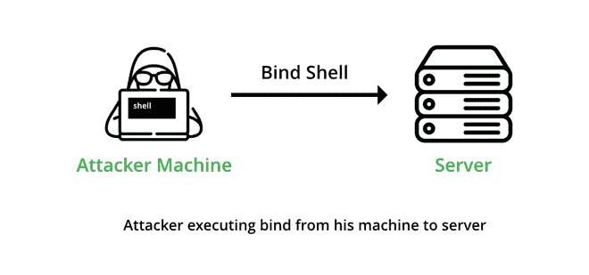
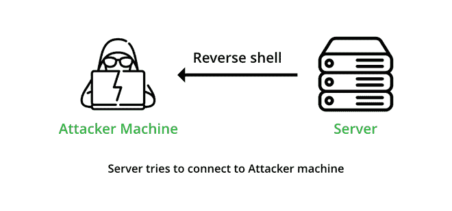

# 绑定外壳和反向外壳的区别

> 原文:[https://www . geesforgeks . org/bind-shell 和 reverse-shell 的区别/](https://www.geeksforgeeks.org/difference-between-bind-shell-and-reverse-shell/)

shell 是一个程序，它解释我们的命令，并将写好的命令提供给操作系统。它充当用户和操作系统之间的接口。它从键盘接收输入并将其提供给操作系统，终端允许您键入命令并与外壳交互。

**一些流行的贝壳:**

*   Windows PowerShell
*   Windows 命令提示符
*   尝试
*   嘘
*   破折号
*   出生的
*   科恩乐队

### 港口

简单地说，端口是一个可以进行连接的开口。

***例如*** ，对于访问像[https://geeksforgeeks.org](https://www.geeksforgeeks.org/)这样的网站，会建立到端口 443 的连接，因为 HTTPS 和服务器使用端口 443 进行连接。端口是与 IP 地址相关联的数字。

**一些常用端口有:**

*   端口 20–文件传输协议
*   端口 22–SSH
*   端口 25–SMTP
*   端口 80–HTTP
*   HTTPS 443 号港口
*   SMTPS 465 号港口
*   端口 587–SMTP
*   端口 993 – IMAP

## 绑定外壳:

绑定外壳

绑定外壳是一种通过网络与其他计算机建立远程控制台的设置。在 Bind shell 中，攻击者在目标计算机上启动服务，攻击者可以连接到该服务。在绑定外壳中，攻击者可以连接到目标计算机并在目标计算机上执行命令。要启动绑定外壳，攻击者必须拥有受害者的 IP 地址才能访问目标计算机。

## 反向外壳:

反向外壳

反向外壳或反向连接是一种设置，攻击者必须首先在他的机器上启动服务器，而目标机器必须充当连接到攻击者所服务的服务器的客户端。成功连接后，攻击者可以访问目标计算机的外壳。

要启动反向外壳，攻击者不需要知道受害者的 IP 地址就可以访问目标计算机。

### 绑定外壳和反向外壳的区别

<figure class="table">

| 没有 | 

绑定外壳

 | 

反向外壳

 |
| --- | --- | --- |
| 1. | Bind Shells 让侦听器在目标上运行，攻击者连接到侦听器，以便获得对目标系统的远程访问。 | 在反向 shell 中，攻击者让侦听器在他/她的机器上运行，目标通过 shell 连接到攻击者。以便攻击者能够访问目标系统。 |
| 2. | 在 Bind shell 中，攻击者在服务器/目标机器上找到一个打开的端口，然后尝试将其 shell 绑定到该端口。 | 在反向外壳中，攻击者打开自己的端口。以便受害者可以连接到该端口以成功连接。 |
| 3. | 在启动绑定外壳之前，攻击者必须知道受害者的 IP 地址。 | 攻击者不需要知道受害者的 IP 地址，因为攻击者要连接到我们的开放端口。 |
| 4. | 在 Bind shell 中，侦听器在目标机器上是打开的，攻击者连接到它。 | 反向外壳与绑定外壳相反，在反向外壳中，侦听器在攻击者机器上打开，目标机器与之连接。 |
| 5. | Bind Shell 有时会失败，因为现代防火墙不允许外人连接到开放端口。 | 反向外壳可以绕过防火墙问题，因为该目标机器试图连接到攻击者，因此防火墙不需要检查数据包。 |

</figure>