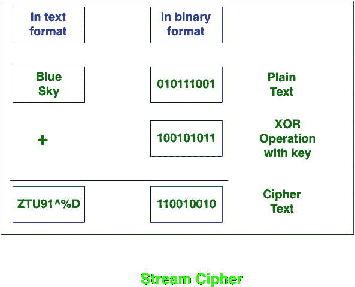

# 分组密码和流密码的区别

> 原文:[https://www . geesforgeks . org/分组密码和流密码的区别/](https://www.geeksforgeeks.org/difference-between-block-cipher-and-stream-cipher/)

先决条件–[分组密码操作模式](https://www.geeksforgeeks.org/computer-network-block-cipher-modes-of-operation/)
**分组密码****流密码**属于对称密钥密码。这两种分组密码和流密码是用于将明文转换成密文的方法。

**分组密码**和**流密码**的主要区别在于，分组密码通过一次取明文的块将明文转换为密文。而流密码通过一次获取 1 个字节的纯文本将纯文本转换为密码文本。

让我们看看它们的区别:

<figure class="table">

| S.NO | 分组密码 | 流密码 |
| 1. | 分组密码通过一次获取纯文本的块，将纯文本转换为密码文本。 | 流密码通过一次获取 1 字节的纯文本，将纯文本转换为密码文本。 |
| 2. | 分组密码使用 64 位或超过 64 位。 | 而流密码使用 8 位。 |
| 3. | 分组密码的复杂性很简单。 | 而流密码更复杂。 |
| 4. | 分组密码使用混淆和扩散。 | 而流密码只使用混淆。 |
| 5. | 在分组密码中，反向加密文本很难。 | 而流内密码，反向加密文本很容易。 |
| 6. | 分组密码中使用的算法模式有 ECB(电子码本)和 CBC(密码分组链)。 | 流密码中使用的算法模式有 CFB(密码反馈)和 OFB(输出反馈)。 |
| 7. | 分组密码的工作原理是换位技术，如栅栏技术、柱状换位技术等。 | 而流密码工作在替代技术上，如凯撒密码、polygram 替代密码等。 |
| 8. | 与流密码相比，分组密码速度较慢。 | 而流密码比分组密码快。 |

</figure>