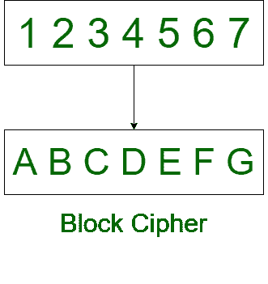
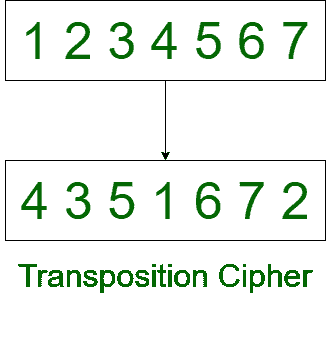

# 分组密码和换位密码的区别

> 原文:[https://www . geesforgeks . org/分组密码和换位密码的区别/](https://www.geeksforgeeks.org/difference-between-block-cipher-and-transposition-cipher/)

**1。[分组密码](https://www.geeksforgeeks.org/block-cipher-modes-of-operation/) :**
分组密码是用于将明文转换为密文的对称密钥密码。它使用一个简单的替换过程，或者有时是置换过程，在置换过程中，纯文本块被任意位的密文替换。

**2。[换位密码](https://www.geeksforgeeks.org/columnar-transposition-cipher/) :**
换位密码重新排列纯文本的字符位置。它改变角色的位置，但不改变角色的身份。

以下是分组密码和换位密码的区别:

| 分组密码 | 移位密码 |
| --- | --- |
| 在分组密码中，一个明文块被视为一个整体。 | 在换位密码中，纯文本被记为一个序列。 |
| 它产生等长纯文本的密文块。 | 它以行的形式读取序列。 |
| 在分组密码中，传输一个分组的错误不会影响其他分组。 | 换位密码中，一个字母的错误会影响整个密文。 |
| 分组密码的加密过程很慢。 | 加密过程是换位密码中的脂肪。 |
| 分组密码的安全性取决于加密函数的设计。 | 通过进行多次换位，可以使其更加安全。 |
| 纯文本被分成块，算法独立地对每个块进行操作。 | 纯文本被分解成字母，算法对每个字母独立操作。 |
| 分组密码的复杂性很简单。 | 而换位密码更复杂。 |
| 在分组密码中，字符会失去身份。 | 字符在换位密码中不会失去身份。 |

