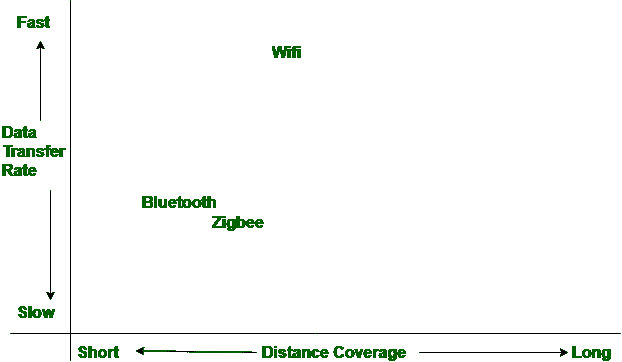

# 蓝牙和 Zigbee 的区别

> 原文:[https://www . geeksforgeeks . org/蓝牙和 zigbee 的区别/](https://www.geeksforgeeks.org/difference-between-bluetooth-and-zigbee/)

**蓝牙**是在 IEEE 802.15.1 下开发的，用于通过无线电信号提供无线通信。蓝牙支持的频率范围从 2.4 GHz 到 2.483 GHz 不等。它比紫蜂覆盖的距离更短。在蓝牙中，使用 GFSK 调制技术。

而在紫蜂中，BPSK 和 QPSK 调制技术像超宽带一样被使用。Zigbee 支持的频率范围在全球范围内大多为 2.4 GHz，这意味着 2.4 GHz 并不是一直都支持。与蓝牙相比，它覆盖的距离更远。

在上图中，我们可以看到蓝牙中的数据传输速率比 zigbee 更快，而 zigbee 比蓝牙覆盖的距离更大。

蓝牙和紫蜂有很多共同点，都是 IEEE 802.15 无线局域网的区域单元风格。每一个都运行在一对 0.4 千兆赫的非授权频段内，并且每一个都使用微小的因素和低功率。除了这些相似之处，还有一些不同之处，下面以表格形式给出。

| S.NO | 蓝牙 | Zigbee |
| --- | --- | --- |
| 1. | 蓝牙支持的频率范围从 2.4 GHz 到 2.483 GHz 不等。 | 而 Zigbee 支持的频率范围在全球范围内大多为 2.4 GHz。 |
| 2. | 蓝牙有七十九个射频通道。 | zigbee 中有 16 个射频通道。 |
| 3. | 它使用 GFSK 调制技术。 | 而它也使用 BPSK 和 QPSK 调制技术，如超宽带。 |
| 4. | 蓝牙最多有 8 个小区节点。 | 而 zigbee 中有超过六万五千(65000)个小区节点。 |
| 5. | 蓝牙要求低带宽。 | 而 zigbee 也需要较低的带宽，但大部分时间都大于蓝牙的带宽。 |
| 6. | 蓝牙的无线电信号范围是十米。 | 而 zigbee 的无线电信号范围是十到百米。 |
| 7. | 蓝牙是在 IEEE 802.15.1 下开发的。 | 而它是在 IEEE 802.15.4 下开发的。 |