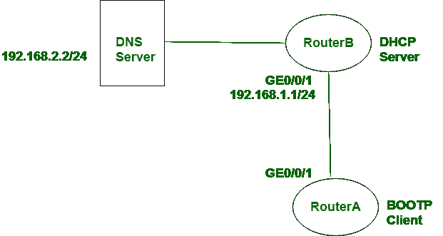

# 【BOOTP 和 DHCP 的区别

> 原文:[https://www . geesforgeks . org/BOOTP 和-dhcp 的区别/](https://www.geeksforgeeks.org/difference-between-bootp-and-dhcp/)

**BOOTP** 代表 **Bootstrap 协议**、 **DHCP** 代表 [**动态主机配置协议**](https://www.geeksforgeeks.org/computer-network-dynamic-host-configuration-protocol-dhcp/) 。这些协议用于获取主机的信息科学地址以及引导信息。每个协议的操作在某些方面完全不同。动态主机配置协议也是引导协议的扩展版本。

让我们看看 BOOTP 和 DHCP 的区别:

<figure class="table">

| S.NO | 引导协议(BOOTstrapping Protocol) | 动态主机配置协议 |
| --- | --- | --- |
| 1. | BOOTP 代表引导协议。 | 而 DHCP 代表动态主机配置协议。 |
| 2. | BOOTP 不提供临时 IP 寻址。 | 而 DHCP 只在有限的时间内提供临时的 IP 寻址。 |
| 3. | BOOTP 不支持 DHCP 客户端。 | 同时它支持 BOOTP 客户端。 |
| 4. | 在 BOOTP 中，进行手动配置。 | 在 DHCP 中，会进行自动配置。 |
| 5. | BOOTP 不支持移动机器。 | 而 DHCP 支持移动机器。 |
| 6. | 由于手动配置，BOOTP 可能会出现错误。 | 而在 DHCP 中，错误不会主要由于自动配置而发生。 |

</figure>