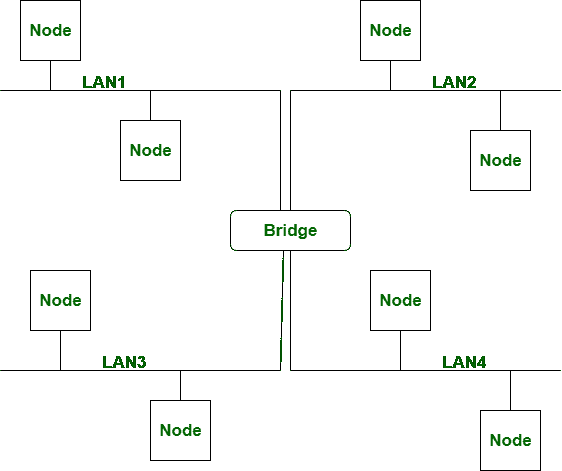
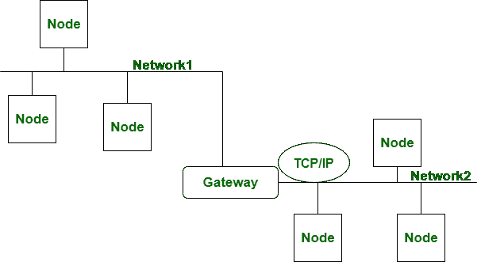

# 网桥和网关的区别

> 原文:[https://www . geesforgeks . org/网桥和网关的区别/](https://www.geeksforgeeks.org/difference-between-bridge-and-gateway/)

先决条件–[网络设备](https://www.geeksforgeeks.org/network-devices-hub-repeater-bridge-switch-router-gateways/)

**网桥:**
网桥是工作在数据链路层的网络设备。网桥连接两个使用相同协议的不同局域网。另外，在网桥中，数据包的格式不会改变。

**网关:**
网关工作在 OSI 模型的全层。它转换协议。网关将满足于使用完全不同的协议在网络间传输数据包。在网关中，与网桥相对的数据包格式被改变。

现在，我们将讨论网桥和网关之间的区别:

| S.NO | 桥 | 门 |
| 1. | 网桥工作在数据链路层。 | 而它在所有层都起作用。 |
| 2. | 网桥连接两个不同的局域网。 | 同时转换协议。 |
| 3. | 网桥连接两个使用相同协议的不同局域网。 | 而网关将满足于使用完全不同的协议在网络间传输数据包。 |
| 4. | 在网桥中，数据或信息是以数据包的形式出现的。 | 而在网关中，数据或信息也是分组的形式。 |
| 5. | 在网桥中，数据包的格式不会改变。 | 在网关中，包的格式被改变。 |
| 6. | 路由器中未安装网桥。 | 当它安装在路由器中时。 |

