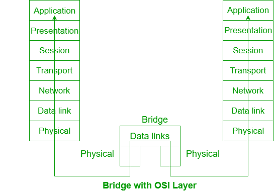

# 网桥和中继器的区别

> 原文:[https://www . geesforgeks . org/网桥和中继器之间的区别/](https://www.geeksforgeeks.org/difference-between-bridge-and-repeater/)

先决条件–[网络设备](https://www.geeksforgeeks.org/network-devices-hub-repeater-bridge-switch-router-gateways/)
**网桥:**
网桥在第二层运行，即 ISO-OSI 模型的数据链路层。它使用相同的协议将两个网络连接在一起。网桥相对容易配置，并且侧重于媒体访问控制地址。

**中继器:**
中继器是一种电子设备。它是用于扩展局域网的硬件设备。中继器仅在物理层运行，即现场视察模型的第一层。它再生弱信号并增加网络的范围。通过使用中继器，网络的功能保持不变。交换机可以用作中继器，但集线器不能用作中继器。

让我们看看网桥和中继器的区别:

| 没有。 | 桥 | 中继器 |
| --- | --- | --- |
| 1. | 网桥在现场视察模型的数据链路层运行。 | 中继器在现场视察模型的物理层运行。 |
| 2. | 完整的框架可以通过桥梁理解。 | 中继器不理解完整的帧。 |
| 3. | 目的地址在网桥中用于确定是否转发帧。 | 中继器无法识别目的地址。 |
| 4. | 在网络中，如果一个网段发生冲突，网桥不会将其转发到另一个网段。 | 中继器将冲突从一个网段转发到另一个网段，这将导致网络中的所有其他网段都出现相同的问题。 |
| 5. | 网桥以组织良好的方式连接两个网络。 | 中继器扩大了网络中信号的限制。 |
| 6. | 网络中数据包的过滤是通过网桥实现的。 | 中继器无法执行包过滤。 |
| 7. | 网桥相对昂贵，用于扩展局域网。 | 中继器也用于扩展局域网，但比网桥更经济。 |

