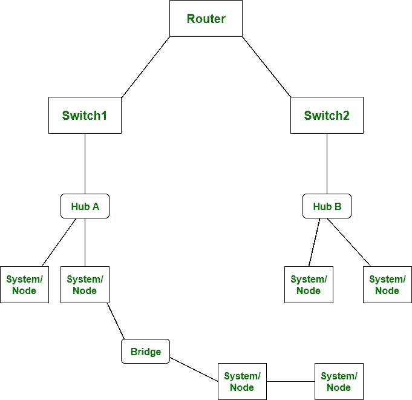

# 网桥和路由器的区别

> 原文:[https://www . geesforgeks . org/网桥和路由器的区别/](https://www.geeksforgeeks.org/difference-between-bridge-and-router/)

前提–[网络设备](https://www.geeksforgeeks.org/network-devices-hub-repeater-bridge-switch-router-gateways/)
**网桥**是网络设备，工作在数据链路层。通过网桥，数据或信息以数据包的形式存储和发送。而**路由器**也是工作在网络层的网络设备。通过路由器，数据或信息以数据包的形式存储和发送。

网桥和路由器的主要区别在于，网桥研究或扫描设备的 MAC 地址。另一方面，路由器研究或扫描设备的 IP 地址。

让我们看看下面给出的网桥和路由器之间的区别:

| S.NO | 桥 | 路由器 |
| 1. | 网桥工作在数据链路层。 | 而路由器工作在网络层。 |
| 2. | 通过网桥，数据或信息不以包的形式存储和发送。 | 而通过路由器，数据或信息以数据包的形式存储和发送。 |
| 3. | 桥上只有两个端口。 | 而路由器中有两个以上的端口。 |
| 4. | 网桥连接两个不同的局域网。 | 而路由器被局域网和城域网用来连接。 |
| 5. | 在网桥中，不使用路由表。 | 而在路由器中，则使用路由表。 |
| 6. | 网桥在单个广播域上工作。 | 而路由器工作在多个广播域上。 |
| 7. | 网桥很容易配置。 | 而路由器很难设置和配置。 |
| 8. | 网桥侧重于媒体访问控制地址。 | 而路由器侧重于协议地址。 |
| 9. | 桥相对便宜。 | 而路由器是相对昂贵的设备。 |
| 10. | 网桥有利于分段网络并扩展现有网络。 | 而路由器很适合加入远程网络。 |