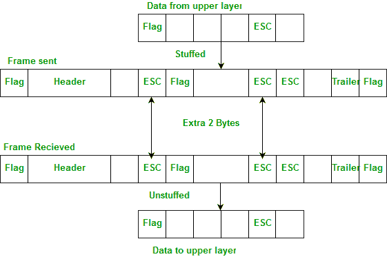
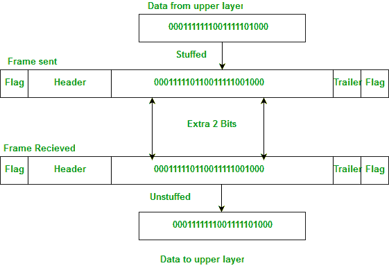

# 字节填充和位填充的区别

> 原文:[https://www . geesforgeks . org/字节填充和位填充的区别/](https://www.geeksforgeeks.org/difference-between-byte-stuffing-and-bit-stuffing/)

数据链路层负责所谓的成帧，它是将来自网络层的比特流分成可管理的单元(称为帧)。每个帧由发送者地址和目的地地址组成。目的地地址定义了数据包的去向，发送方的地址有助于接收方确认收到。

框架可以是固定大小或可变大小的。在固定大小的帧中，不需要定义帧的边界，因为大小本身可以用来定义帧的结束和下一帧的开始。但是，在可变尺寸框架中，我们需要一种方法来定义框架的结束和下一个框架的开始。

为了将一帧与下一帧分开，在帧的开头和结尾添加了一个 8 位(或 1 字节)标志。但问题是，用于标志的任何模式也可能是信息的一部分。所以，有两种方法可以克服这个问题:

1.  使用字节填充(或字符填充)
2.  使用位填充

**字节填充–**
当有一个字符与标志具有相同的模式时，具有预定义位模式的字节(通常是转义字符(ESC))被添加到帧的数据部分。每当接收器遇到 ESC 字符时，它就会从数据段中移除，并将下一个字符视为数据，而不是标志。

但是，当文本包含一个或多个转义字符后跟一个标志时，问题就出现了。为了解决这个问题，作为文本一部分的转义字符由另一个转义字符标记，即如果转义字符是文本的一部分，则添加一个额外的转义字符来显示第二个转义字符是文本的一部分。
例:

**注意–**点对点协议(PPP)是一种面向字节的协议。

**位填充–**
大部分标志是一个特殊的 8 位模式“01111110”，用于定义帧的开始和结束。
标志问题与字节填充情况下的问题相同。因此，在这个协议中，我们所做的是，如果我们遇到 0 和五个连续的 1 位，在这些位之后会添加一个额外的 0。接收器会从数据中移除多余的填充位。

不管下一位的值是多少，额外的位都是在一个 0 之后加上五个 1。此外，由于发送方总是知道哪个序列是数据，哪个是标志，所以它只会在数据序列中添加这个额外的位，而不会在标志序列中添加。
例:

**注意–**高级数据链路控制(HDLC)是一种面向比特的协议。

**参考资料–**
[【数据通信与网络】](https://www.amazon.in/COMMUNICATIONS-NETWORKING-UPDATE-Behrouz-Forouzan/dp/0070499357?tag=googinhydr18418-21&tag=googinkenshoo-21&ascsubtag=f648c41b-4e1c-497e-9a52-031912e87d54)作者:贝鲁兹·弗鲁赞(本书)。