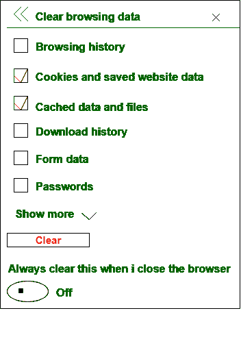

# 缓存和 Cookies 的区别

> 原文:[https://www . geeksforgeeks . org/缓存和 cookies 的区别/](https://www.geeksforgeeks.org/difference-between-cache-and-cookies/)

**[缓存](https://www.geeksforgeeks.org/cache-memory/)** 和**[cookie](https://www.geeksforgeeks.org/cookies-used-website/)**都是为了提高网站性能而制作的，并通过在客户端机器上存储一些数据来创建额外的可访问性。

缓存和 Cookie 的主要区别在于，缓存用于在浏览器运行期间存储在线页面资源，以达到长期运行的目的或减少加载时间。另一方面，cookies 用于存储用户选择，例如浏览会话，以跟踪用户偏好。

在上图中，我们可以看到有两个选项被选中(一个用于缓存，另一个用于 cookie)来从浏览器中删除缓存和 cookie。还有另一个选项*总是在我关闭浏览器时清除这个*，当这两个框都被选中时自动清除缓存和 cookies。

让我们看看缓存和 cookies 之间的区别:

| S.NO | 隐藏物 | 饼干 |
| --- | --- | --- |
| 1. | 缓存用于存储网站内容，以便长期使用。 | 而 cookie 用于存储用户选择。 |
| 2. | 缓存的网站内容只存储在浏览器中。 | 而 cookie 的内容存储在服务器和浏览器中。 |
| 3. | 它手动过期。 | 而它会自动过期。 |
| 4. | 就容量而言，它会消耗大量空间。 | 同时在容量方面消耗更少的空间。 |
| 5. | 缓存的类型有:浏览器缓存和代理缓存。 | 而 cookie 的类型有:短暂的和持久的 cookie。 |
| 6. | 缓存存储的内容有 html 页面、图像、Javascript、CSS 等。 | 而 cookie 存储浏览会话和临时跟踪数据等内容。 |
| 7. | 缓存不发送带有请求的响应。 | 而 cookie 发送带有请求的响应。 |

