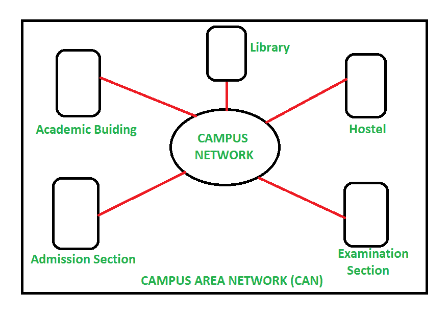
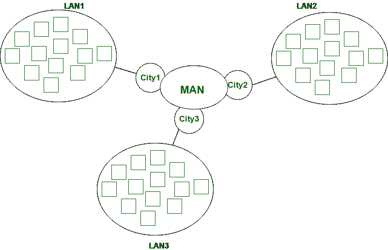

# CAN 和 MAN 的区别

> 原文:[https://www . geesforgeks . org/can-and-man 的区别/](https://www.geeksforgeeks.org/difference-between-can-and-man/)

**1。[校园网(CAN)](https://www.geeksforgeeks.org/overview-of-campus-area-network-can/) :**
校园网(CAN)是指在有限的地理区域内，如学校校园、大学校园、军事基地或组织校园、公司大楼等，相互连接的一组局域网(LAN)。校园网比局域网大，但比城域网和广域网小。

**2。[城域网(MAN)](https://www.geeksforgeeks.org/types-of-area-networks-lan-man-and-wan/) :**
城域网覆盖面积比局域网最大的如:小城镇、城市等。城域网连接 2 台或多台计算机，这些计算机以区域为单位分开，但位于相同或完全不同的城市。MAN 是昂贵的，应该或不应该由一个组织拥有。

**CAN 和 MAN 的区别:**

| 没有。 | 能 | 男人 |
| 1. | CAN 代表校园网。 | 城域网代表城域网。 |
| 2. | 连接校园内的两个或多个局域网。 | 城镇或城市中的互联网络。 |
| 3. | 它涵盖了一个私人拥有的校园，面积为 5 至 10 公里。 | 它覆盖的区域比局域网大，但面积比广域网小，只有 2 到 100 公里。 |
| 4. | 贵则揽。 | 比局域网和 CAN 还贵。 |
| 5. | 数据传输速率是可变的。 | 数据传输速率是可变的。 |
| 6. | 它不使用 IEEE 802 标准。 | 采用 IEEE 802 标准。 |
| 7. | 使用集线器、交换机、网桥和网关等网络设备。 | 使用网络设备，如集线器、交换机、网关、路由器和路由器。 |
| 8. | 比局域网更拥挤。 | 局域网和城域网相比，拥塞更严重。 |

