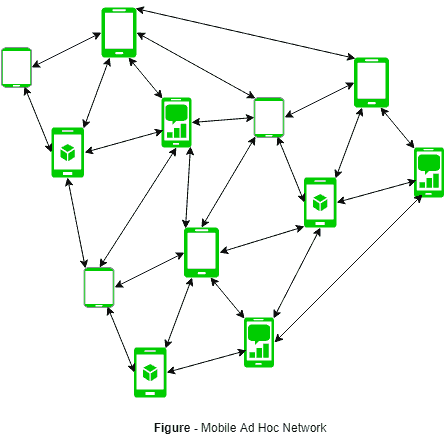
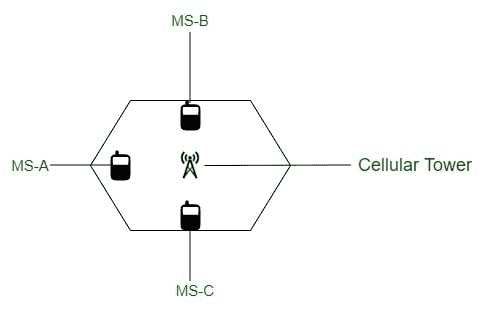

# 蜂窝网络和自组织网络的区别

> 原文:[https://www . geeksforgeeks . org/蜂窝网络和自组织网络的区别/](https://www.geeksforgeeks.org/difference-between-cellular-and-ad-hoc-network/)

**1。[自组织网络](https://www.geeksforgeeks.org/introduction-of-mobile-ad-hoc-network-manet/) :**
自组织网络是由相互直接通信的各个设备组成的网络。该术语意味着自发或即兴的构建，因为这些网络通常绕过守门
硬件或中央接入点，如路由器。许多自组织网络是局域网，其中计算机或其他设备能够直接向彼此发送数据，而不是通过集中式接入点。

**2。[蜂窝网络](https://www.geeksforgeeks.org/cellular-networks) :**
蜂窝网络或移动网络是分布在称为小区的陆地区域上的无线电网络，每个小区由至少一个固定位置收发器服务，称为小区站点或基站。目前发送小区远程系统，例如，GSM/CDMA/HSPA/LTE 都是基础类型。蜂窝组织由被称为基站的核心单元和被称为移动用户的蜂窝电话组成。在移动台需要与移动台通话的情况下，通过基站进行通信，如图所示。它遵循六边形模式。

我们来看看蜂窝网络和自组织网络的区别:

| S.NO | 细胞网络 | 特设网络 |
| --- | --- | --- |
| 1. | 蜂窝网络的网络路由是集中的，所有的流量都经过基站。 | 自组网的网络路由是分布式的，不需要基站等集中式系统。 |
| 2. | 使用电路切换。 | 使用分组交换。 |
| 3. | 它有单跳类型。 | 它有多重希望 |
| 4. | 使用星形拓扑。 | 使用网状拓扑。 |
| 5. | 它需要更高的成本和更多的部署时间。 | 它需要更低的成本，并且不需要更多的部署时间。 |
| 6. | 它用于为语音流量而设计和开发的。 | 它用于“设计”中，以尽最大努力满足数据流量要求。 |
| 7. | 这里，由于跨区域无缝连接，在移动过程中呼叫减少。 | 这里是移动过程中路径上的较高断点。 |
| 8. | 它需要定期维护，因此成本很高。 | 这里的节点是自组织的，因此成本较低。 |
| 9. | 分配带宽有保证且容易。 | 带宽的分配是基于使用复杂的媒体访问控制算法的共享信道。 |
| 10. | 使用的是 IS-95、IS-136、GSM、移动 WiMAX、CDMA、LTE 技术。 | 使用了无线局域网 802.11e 技术。 |